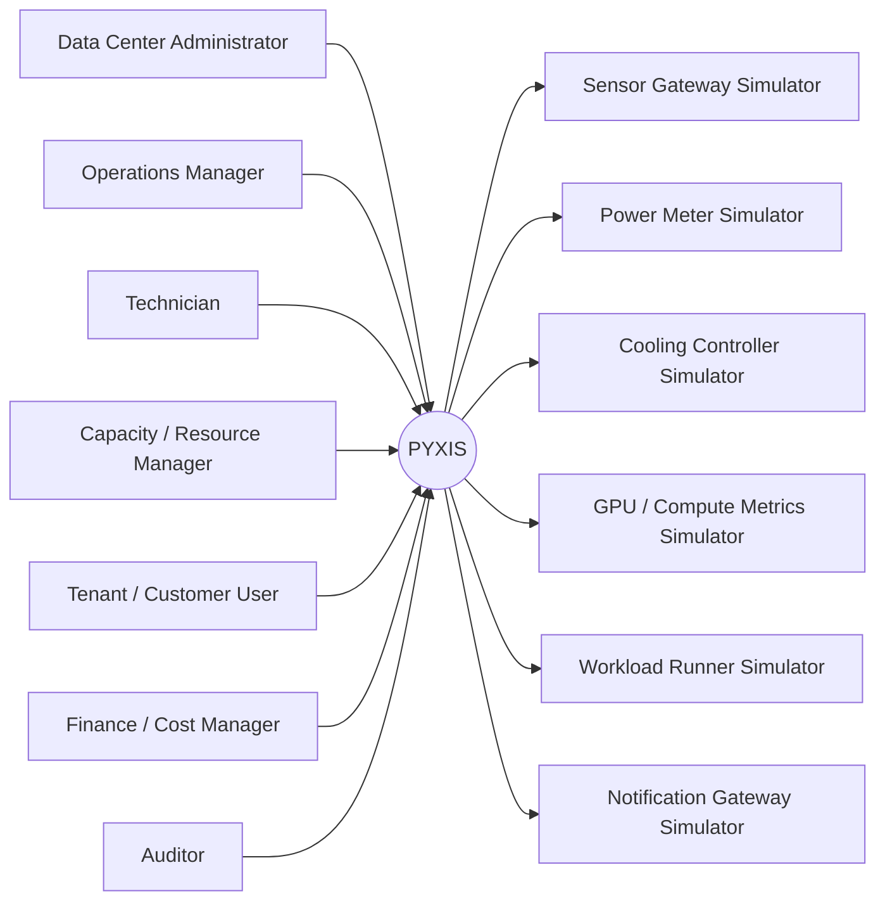
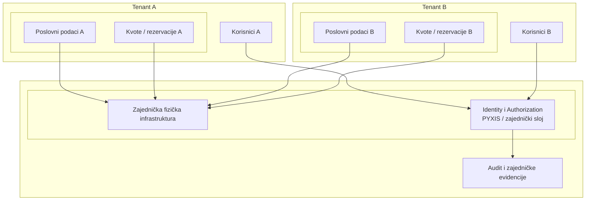
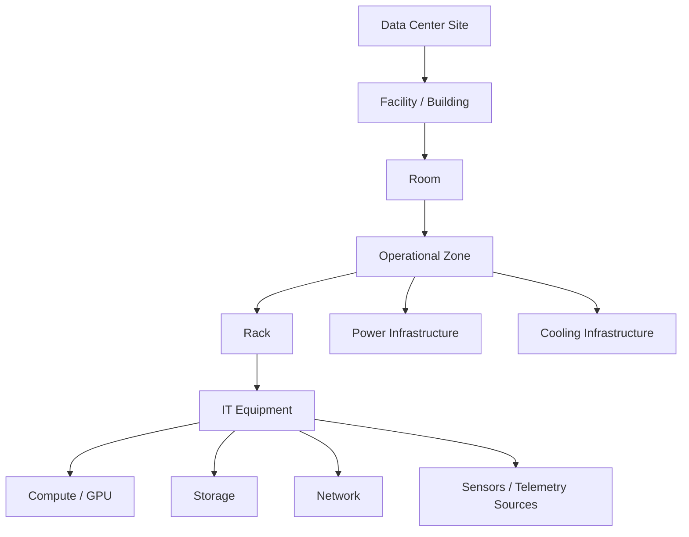
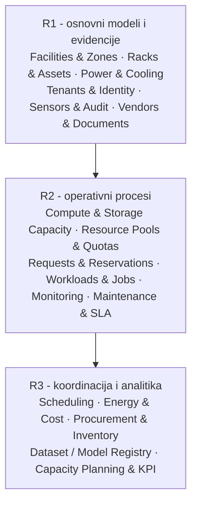
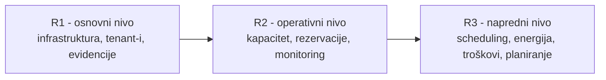
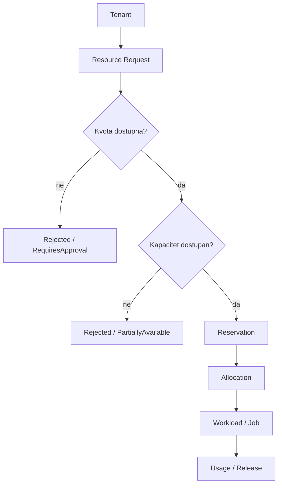
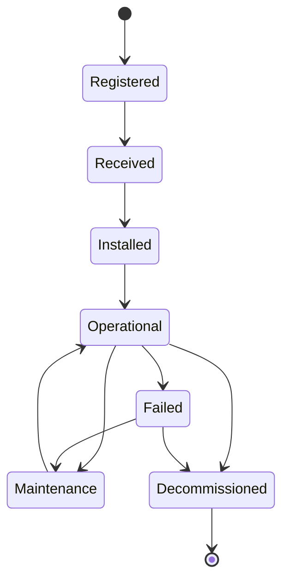
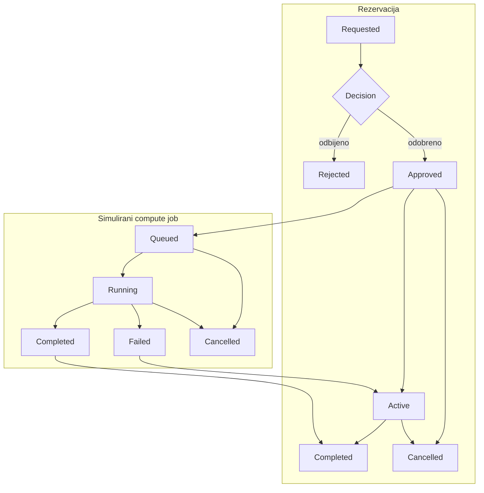
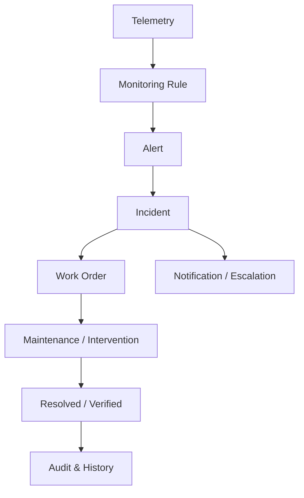

# PYXIS

## Informacioni sistem za upravljanje Data centrom

**Projektna specifikacija za predmet Elementi razvoja softvera**  
Fakultet tehničkih nauka - Primenjeno softversko inženjerstvo  

---

<style>
@media print {
  h1, h2, h3 { break-after: avoid-page; page-break-after: avoid; }
  h1 + *, h2 + *, h3 + * { break-before: avoid-page; page-break-before: avoid; }
  p, li { orphans: 3; widows: 3; }
  blockquote, pre, .callout { break-inside: avoid; page-break-inside: avoid; }
  table { break-inside: auto; page-break-inside: auto; }
  thead { display: table-header-group; }
  tr { break-inside: avoid; page-break-inside: avoid; }
  .page-break { break-before: page; page-break-before: always; }
}
</style>

## Osnovni podaci

| Stavka | Vrednost |
|---|---|
| Naziv projekta | **PYXIS - Informacioni sistem za upravljanje Data centrom** |
| Predmet | Elementi razvoja softvera |
| Tip rada | Timski razvoj zajedničkog softverskog proizvoda |
| Veličina tima | 6-10 studenata |
| Broj projektnih celina | 90 (30 na nivou R1, 30 na nivou R2 i 30 na nivou R3) |
| Tipičan obim izvođenja | približno 200 studenata; broj timova zavisi od formirane veličine timova |
| Referentna tehnologija | .NET / C#; druge tehnologije uz odobrenje i dokaz interoperabilnosti |
| Organizacija rada | Git, feature grane, Pull Request, code review, CI i Tapiz Boards |
| Arhitektonski principi | modularnost, Clean Architecture, SOLID, testabilnost i eksplicitni ugovori između celina |

## Normativne konvencije i sledljivost

Specifikacija koristi sledeća normativna značenja kako bi se smanjila
mogućnost različitog tumačenja zahteva:

- **mora / nije dozvoljeno** - obavezan zahtev; neispunjenje znači da zahtev nije realizovan;
- **treba / očekuje se** - podrazumevano očekivanje koje može biti odstupanje samo uz obrazloženu i dokumentovanu odluku;
- **može / moguće proširenje** - opciono; nije deo minimalnog scope-a osim ako ga nastavni tim eksplicitno dodeli;
- **obavezni use-case** - ponašanje koje mora biti demonstrabilno i pokriveno odgovarajućim testovima;
- **ključna poslovna pravila** - invariants/ograničenja koja implementacija mora sačuvati nezavisno od UI-a i tehničkog rešenja.

### Sledljivost zahteva

- oznaka projektne celine, npr. `R2-05`, predstavlja stabilan identifikator njenog funkcionalnog scope-a;
- zahtevi u Tapiz-u, testovima, ADR zapisima i Pull Request opisima treba da referenciraju oznaku celine i konkretan use-case ili poslovno pravilo;
- za cross-team i sistemske zahteve koriste se eksplicitni identifikatori oblika `SYS-<oblast>-NN`, navedeni u ovoj specifikaciji;
- jednom objavljen identifikator se ne koristi za drugo značenje; promena semantike zahteva evidentira se kroz kontrolisanu reviziju specifikacije;
- breaking promena javnog ugovora mora imati sledljiv Tapiz task, review consumer tima i ažurirane contract testove.


---

# 1. Svrha, cilj i granice projekta

PYXIS je informacioni sistem namenjen modelovanju i podršci operativnim
procesima savremenog Data centra. Sistem obuhvata fizičku
infrastrukturu, IT resurse, korisničke organizacije, kapacitete,
rezervacije, računarska radna opterećenja, monitoring, incidente,
održavanje i odabrane poslovne procese koji su neposredno povezani sa
radom data centra.

Projekat nije simulator elektronskih komponenti, mrežnih protokola niti
stvarnog AI trening okruženja. Fizički i infrastrukturni procesi
modeluju se na nivou koji je dovoljan da nastanu realistična poslovna
pravila, ograničenja, konflikti i međuzavisnosti između timova.

| **Cilj projektnog okvira:** Projektne celine su dovoljno povezane da zahtevaju saradnju više timova, ali se ne propisuje gotovo projektantsko rešenje. Studenti samostalno modeluju domen, strukturu koda i tehničke odluke uz poštovanje pravila ove specifikacije. |
|--------------------------------------------------------------------------------------------------------------------------------------------------------------------------------------------------------------------------------------------------------------|

## 1.1. Obuhvat sistema

- fizička topologija data centra: lokacije, prostorije, zone, rack-ovi i
  oprema;

- napajanje, hlađenje, senzori i operativna merenja na konceptualnom
  nivou;

- serveri, GPU resursi, memorija, storage i logički resource pool-ovi;

- multi-tenant korisnički model i pristup resursima;

- zahtevi za resursima, rezervacije, alokacije i jednostavni compute/AI
  workload-i;

- monitoring, alert-i, incidenti, održavanje i SLA;

- troškovi, energija, nabavka, dobavljači i kapacitetno planiranje;

- audit, obaveštenja, dokumenti i izveštaji kao horizontalne funkcije.

## 1.2. Van obuhvata

- stvarno upravljanje ventilatorima, UPS uređajima, PDU uređajima ili
  mrežnim switch-evima;

- treniranje realnih AI modela kao obavezan deo projekta;

- implementacija hipervizora, scheduler-a operativnog sistema ili
  storage drajvera;

- realni billing i poresko/računovodstveno knjigovodstvo;

- potpuna DCIM/BMS industrijska kompatibilnost; spoljne sisteme je
  dozvoljeno modelovati simulatorima.

<!-- diagram:system-context -->


*Slika 1. Kontekst sistema PYXIS: tipični korisnici i spoljni simulatori.*

# 2. Kontekst Data centra i korisnici sistema

Data centar se posmatra kao organizovana infrastruktura u kojoj više
korisničkih organizacija koristi zajedničke fizičke i računarske
resurse. PYXIS ne upravlja stvarnim hardverom direktno, već čuva
poslovno relevantan model stanja i komunicira sa simulatorima spoljnog
okruženja preko jasno definisanih adaptera.

## 2.1. Primarne uloge

| **Uloga**                    | **Tipične odgovornosti**                                                         |
|------------------------------|----------------------------------------------------------------------------------|
| Data Center Administrator    | konfiguracija lokacija, opreme, referentnih podataka i administratorskih pravila |
| Operations Manager           | pregled operativnog stanja, prioriteta, incidenata, maintenance-a i SLA          |
| Technician                   | radni nalozi, intervencije, status opreme i tehnička dokumentacija               |
| Capacity / Resource Manager  | kapacitet, pool-ovi, kvote, rezervacije i planiranje resursa                     |
| Tenant / Customer User       | zahtevi za resursima, rezervacije, workload-i i pregled sopstvene potrošnje      |
| Finance / Cost Manager       | troškovi korišćenja, tarifne kartice i agregirani izveštaji                      |
| Auditor / Read-only Operator | kontrolisan pregled audit traga, događaja i izveštaja                            |

## 2.2. Multi-tenant model

Sistem mora podržati više nezavisnih organizacija koje koriste istu
fizičku infrastrukturu. Svaki poslovni podatak za koji je relevantno
vlasništvo mora imati jasan tenant kontekst. Multi-tenant zahtev nije
samo UI filter, već poslovno i bezbednosno pravilo koje se proverava u
aplikacionom sloju.

<!-- diagram:multitenant -->


*Slika 2. Konceptualna multi-tenant granica nad zajedničkom infrastrukturom.*

| **Pravilo izolacije:** Poznavanje identifikatora resursa drugog tenant-a ne daje pravo pristupa tom resursu. Svaka operacija mora proveriti odgovarajući scope i poslovno vlasništvo. |
|----------------------------------------------------------------------------------------------------------------------------------------------------------------------------------------------|

## 2.3. Spoljni sistemi i simulatori

Realni senzori i infrastrukturni kontroleri nisu uslov za realizaciju
projekta. Kada je projektnoj celini potreban spoljni izvor podataka ili
izvršni sistem, student implementira odgovarajući simulator i adapter.
Simulator se tretira kao spoljni sistem i ne sme preuzeti poslovnu
logiku PYXIS-a.

| **Simulator**                   | **Primer podataka / operacija**                            |
|---------------------------------|------------------------------------------------------------|
| Sensor Gateway Simulator        | temperatura, vlaga, status senzora                         |
| Power Meter Simulator           | trenutna snaga, energija po vremenskom intervalu           |
| Cooling Controller Simulator    | status rashladne jedinice, zadati režim, alarm             |
| GPU / Compute Metrics Simulator | iskorišćenost GPU/CPU/RAM, dostupnost resursa              |
| Workload Runner Simulator       | queued/running/completed/failed događaji za simulirani job |
| Notification Gateway Simulator  | simulirano slanje e-mail/SMS/in-app obaveštenja            |

<div class="page-break"></div>

# 3. Konceptualni model i glavne domenske oblasti

Konceptualni model služi za razumevanje domena i međuzavisnosti, ali
nije UML klasni dijagram niti propisana struktura implementacije. Timovi
samostalno određuju aggregate granice, value objekte, aplikacione
use-case-ove, interfejse i persistence model.

<!-- diagram:physical-hierarchy -->


*Slika 3. Pojednostavljena fizička hijerarhija Data centra.*

<!-- diagram:domain-map -->


*Slika 4. Mapa glavnih domenskih oblasti i njihovih razvojnih nivoa.*

## 3.1. Vlasništvo nad podacima

- svaka projektna celina mora imati jasno definisan skup podataka nad
  kojima ima primarno vlasništvo;

- druga celina ne pristupa internim tabelama/repozitorijumima vlasnika
  bez eksplicitno dogovorene granice;

- shared/common sloj ne sme postati mesto za proizvoljno deljenje
  poslovne logike;

- cross-team promena ugovora zahteva koordinaciju i review pogođenih
  timova;

- baza može biti zajednička na fizičkom nivou, ali vlasništvo nad
  šemom/tabelama ostaje modularno.

## 3.2. Primer fizičkih ograničenja

Poslovna pravila treba da proizilaze iz modelovanog realnog sistema. Na
primer, instalacija GPU servera može biti odbijena i kada postoji
dovoljno slobodnih rack unit pozicija, ukoliko bi nominalna potrošnja
prekoračila dozvoljeni power budget rack-a ili zone.

> **Primer poslovnog ograničenja**
>
> - Rack: 42U; zauzeto 30U; power budget 20 kW.
> - Novi GPU server: 4U; nominalna potrošnja 4,5 kW.
> - Trenutna nominalna potrošnja rack-a: 17 kW.
> - Prostorni kapacitet: dovoljan.
> - Energetski kapacitet: nedovoljan.
> - Ishod: `InstallationRejected / InsufficientPowerCapacity`.

# 4. Razvojni nivoi i dodela projektnih celina

Projektne celine imaju oznaku R1, R2 ili R3. Oznaka predstavlja nivo
funkcionalnih preduslova i zrelosti sistema, a ne akademsku godinu,
težinu zadatka niti pravo tima da sam izabere temu.

<!-- diagram:development-levels -->


*Slika 5. Razvojni nivoi projektnih celina; oznake predstavljaju funkcionalne preduslove, ne akademsku godinu.*

| **Nivo**        | **Značenje**                                                                                 | **Tipični sadržaj**                                                    |
|-----------------|----------------------------------------------------------------------------------------------|------------------------------------------------------------------------|
| R1 - Osnovni    | može se razvijati sa minimalnim brojem prethodnih funkcionalnih preduslova                   | fizička infrastruktura, tenant-i, platforma, senzori i evidencije      |
| R2 - Operativni | oslanja se na stabilne R1 modele i uvodi svakodnevne operativne procese                      | kapacitet, rezervacije, workload-i, monitoring, incidenti i održavanje |
| R3 - Napredni   | gradi nad R1/R2 podacima i procesima i uvodi analitičke ili složenije koordinacione funkcije | scheduling, energija, troškovi, nabavka, registri i planiranje         |

| **Dodela projektnih celina:** Projektne celine dodeljuje nastavni tim. U zavisnosti od broja timova i stvarnog stanja repozitorijuma, moguće je dodeliti celinu višeg nivoa ranije ako su njeni preduslovi dostupni ili kontrolisano simulirani. |
|--------------------------------------------------------------------------------------------------------------------------------------------------------------------------------------------------------------------------------|

## 4.1. Tim i obim celine

Tim ima 6-10 studenata. Jedna projektna celina je zamišljena kao
primarna odgovornost jednog tima, ali široke celine mogu biti podeljene
na dva jasno razdvojena epika ako broj timova to zahteva. Nastavni tim
tada definiše granicu i ugovor između epika pre početka implementacije.

- tim može razvijati novu celinu, nadograđivati postojeću ili
  kombinovati oba tipa rada;

- refaktorisanje postojećeg dela dozvoljeno je i očekivano kada je
  potrebno za kvalitetnu izmenu;

- postojeće ponašanje ne sme biti proizvoljno uklonjeno zbog lakše
  implementacije novog zahteva;

- najmanje jedna značajna integracija sa drugom celinom očekuje se tokom
  semestra kada domen to omogućava; kada tim smatra da značajna integracija
  nije primenljiva, razlog mora biti eksplicitno potvrđen sa nastavnim timom.

# 5. Opšti tehnički i procesni zahtevi

## 5.1. Tehnološki okvir

Podrazumevana i preporučena tehnologija za poslovne module je .NET / C#,
zbog jedinstvenog build-a, integracije i nastavne podrške. Druga
tehnologija može biti odobrena kada postoji jasan razlog i kada tim
obezbedi interoperabilnost sa ostatkom sistema. Izbor tehnologije ne
menja zahteve za arhitekturu, testiranje, dokumentaciju i kvalitet.

- alternativni modul mora imati eksplicitno dokumentovan ugovor sa
  ostatkom sistema;

- lokalno pokretanje i CI ne smeju zavisiti od ručnih koraka poznatih
  samo jednom članu tima;

- frontend, simulatori i adapterske komponente mogu koristiti
  tehnologiju prikladnu nameni;

- tehnologija se ne ocenjuje sama po sebi; ocenjuju se dizajn,
  ispravnost, testabilnost i integracija.

## 5.2. Arhitektura i dizajn

- Clean Architecture ili ekvivalentno jasno razdvajanje poslovnog
  jezgra, aplikacionih use-case-ova, infrastrukture i ulazno/izlaznih
  adaptera;

- SOLID principi primenjuju se tamo gde smanjuju spregnutost i
  povećavaju razumljivost/testabilnost;

- poslovna pravila ne smeju biti skrivena u kontrolerima, UI
  komponentama, ORM konfiguraciji ili simulatorima;

- očekivani poslovni neuspeh modeluje se eksplicitno kada predstavlja
  normalan ishod procesa;

- značajne arhitektonske odluke dokumentuju se kratkim ADR zapisima.

## 5.3. Testiranje

Svaka projektna celina mora imati automatizovane testove koji dokazuju
ključna poslovna pravila i regresione rizike. Framework zavisi od
tehnologije: NUnit/Moq za .NET, Vitest/Jest za TypeScript ili
ekvivalentan alat za odobrenu tehnologiju.

- pozitivni, negativni i relevantni granični scenariji;

- unit testovi poslovnog jezgra;

- integration testovi persistence/adapterskih granica gde su relevantni;

- testovi ugovora između timova kada promena može da utiče na
  consumer-a;

- novootkriven bug treba, gde je razumno, prvo reprodukovati testom pa
  zatim ispraviti.

## 5.4. Git, Pull Request i Tapiz Boards

```text
Tapiz task -> feature branch -> commits -> Pull Request -> CI + review -> VERIFY / QA -> DONE
```

- direktan push na main nije dozvoljen;

- svaka značajna promena mora biti povezana sa Tapiz task-om i
  acceptance kriterijumima;

- Pull Request mora imati review; cross-team ugovor traži review
  pogođenog tima;

- CI mora najmanje da izvrši build, statičke provere i relevantne
  testove;

- istorija commit-a mora omogućiti rekonstrukciju razvoja i
  individualnog doprinosa.

## 5.5. Definition of Done

- acceptance kriterijumi su ispunjeni;

- poslovna pravila i negativni ishodi su provereni;

- arhitektonske granice i ownership pravila su poštovani;

- testovi postoje i prolaze;

- CI prolazi;

- PR je pregledan i komentari su rešeni;

- dokumentacija, contract i ADR su ažurirani kada je potrebno;

- javni ugovori koje koriste drugi timovi nalaze se u važećem lifecycle stanju i odgovarajući consumer-i nisu prekinuti promenom;

- lokalno okruženje, migracije i seed/demo podaci mogu se ponovljivo pokrenuti po dokumentovanom postupku;

- nema hard-coded tajni niti očiglednih tenant isolation propusta;

- tenant-aware celina ima najmanje jedan negativni automatizovani test koji pokušava nedozvoljen pristup resursu drugog tenant-a;

- tim može demonstrirati funkcionalnost i objasniti ključne odluke.

## 5.6. Zajedničke tehničke konvencije

Sledeća pravila važe na granicama između projektnih celina. Ona ne propisuju
konkretan framework, bazu ili transportni protokol, već zajednički jezik koji
smanjuje slučajne integracione probleme.

- `SYS-CONV-01` - identifikatori izloženi preko javnog ugovora moraju imati dokumentovan tip, format i pravilo jedinstvenosti; consumer ne sme zavisiti od internog načina generisanja ID-a;
- `SYS-CONV-02` - vreme se čuva i razmenjuje sa eksplicitnom vremenskom zonom ili u UTC-u; lokalna zona se koristi samo kada je poslovno značenje lokalnog vremena deo zahteva;
- `SYS-CONV-03` - jedinice mere moraju biti eksplicitne i konzistentne; konverzije se obavljaju na kontrolisanoj granici, a ne implicitno u UI-u;
- `SYS-CONV-04` - očekivani poslovni neuspeh mora imati stabilan, mašinski prepoznatljiv kod/vrstu i čitljivu poruku; consumer ne sme parsirati proizvoljan tekst greške;
- `SYS-CONV-05` - kolekcioni API/ugovori koji mogu rasti moraju definisati ograničenje veličine odgovora i, gde je relevantno, pagination/filter semantiku;
- `SYS-CONV-06` - tenant kontekst i authorization scope moraju biti eksplicitni na aplikacionoj granici; nije dozvoljeno oslanjanje samo na UI filter;
- `SYS-CONV-07` - breaking promena javnog DTO/event/contract modela zahteva novu kompatibilnu verziju, migracioni period ili koordinisanu promenu svih aktivnih consumer-a;
- `SYS-CONV-08` - operacije koje mogu biti bezbedno ponovljene treba da imaju definisanu idempotency semantiku; duplirana poruka ne sme nekontrolisano duplirati poslovni efekat;
- `SYS-CONV-09` - konkurentne izmene poslovno značajnog stanja moraju imati definisanu strategiju konflikta, npr. optimistic concurrency, eksplicitno zaključavanje ili drugi obrazloženi mehanizam;
- `SYS-CONV-10` - vlasnik projektne celine upravlja svojim persistence modelom i migracijama; druga celina ne menja njegove tabele bez dogovorene cross-team promene.

## 5.7. Životni ciklus javnih ugovora i cross-team promena

Javni ugovor je API, event/message schema, interfejs, shared schema ili drugi
formalni oblik komunikacije koji koristi druga projektna celina.

```text
DRAFT -> ACCEPTED -> DEPRECATED -> RETIRED
```

- `SYS-CONTRACT-01` - svaki javni ugovor ima jasno navedenog owner-a i poznate consumer-e;
- `SYS-CONTRACT-02` - stanje `DRAFT` može da se menja bez kompatibilnosti samo dok ga nijedan drugi tim ne koristi kao prihvaćenu granicu;
- `SYS-CONTRACT-03` - prelazak u `ACCEPTED` zahteva najmanje jedan reprezentativan contract test ili drugi izvršiv dokaz dogovorene semantike;
- `SYS-CONTRACT-04` - breaking promena `ACCEPTED` ugovora zahteva koordinaciju sa pogođenim consumer-ima pre merge-a;
- `SYS-CONTRACT-05` - `DEPRECATED` ugovor ostaje podržan tokom dogovorenog migracionog perioda; razlog i zamena moraju biti dokumentovani;
- `SYS-CONTRACT-06` - `RETIRED` ugovor se uklanja tek kada nema aktivnih consumer-a ili kada je nastavni tim eksplicitno odobrio koordinisano uklanjanje.

## 5.8. Rad sa nedostupnim preduslovima

Projektna celina višeg nivoa može početi pre pune implementacije preduslova samo
ako je granica kontrolisano simulirana.

- `SYS-DEP-01` - owner zavisne celine dokumentuje minimalni contract koji očekuje od nedostupnog preduslova;
- `SYS-DEP-02` - simulator/stub mora podržati najmanje normalan ishod i relevantne negativne/failure ishode potrebne za razvoj;
- `SYS-DEP-03` - simulator ne sme sadržati poslovnu logiku koja pripada upstream celini; on samo reprodukuje dogovoreno spoljašnje ponašanje;
- `SYS-DEP-04` - kada stvarna implementacija postane dostupna, isti contract testovi treba da mogu da se izvrše nad stvarnim adapterom ili odgovarajućim integracionim okruženjem;
- `SYS-DEP-05` - razlika između simulatora i stvarne implementacije tretira se kao integracioni problem i mora biti rešena pre zatvaranja zavisne celine.

## 5.9. Bezbednosni acceptance baseline

- `SYS-SEC-01` - authorization se proverava serverski/aplikaciono na svakoj operaciji koja menja ili čita zaštićen poslovni resurs;
- `SYS-SEC-02` - tenant-aware celina mora imati automatizovan negativni test koji dokazuje da korisnik jednog tenant-a ne može pristupiti resursu drugog tenant-a samo poznavanjem identifikatora;
- `SYS-SEC-03` - privilegovane i administrativne promene moraju proizvesti audit trag sa identitetom izvršioca i relevantnim kontekstom;
- `SYS-SEC-04` - tajne, tokeni i kredencijali ne smeju biti commit-ovani u repozitorijum niti hard-coded u izvorni kod;
- `SYS-SEC-05` - ulazi koji utiču na poslovna pravila ili persistence moraju biti validirani na odgovarajućoj aplikacionoj granici;
- `SYS-SEC-06` - odgovor prema consumer-u ne sme izlagati interne podatke drugog tenant-a ili tehničke detalje koji nisu deo javnog ugovora.

## 5.10. Operativni i NFR baseline

Ovi zahtevi nisu performance benchmark industrijskog data centra; cilj je da
zajednički studentski proizvod bude ponovljiv, dijagnostikabilan i održiv.

- `SYS-OPS-01` - clean clone repozitorijuma mora moći da se build-uje i pokrene po dokumentovanom postupku bez ručnih koraka poznatih samo jednom članu tima;
- `SYS-OPS-02` - migracije moraju moći da formiraju potrebnu šemu nad praznom bazom ili drugim čistim persistence okruženjem;
- `SYS-OPS-03` - seed/demo podaci moraju omogućiti ponovljiv prikaz ključnog demo i integracionog scenarija;
- `SYS-OPS-04` - aplikacija i adapteri moraju emitovati dovoljno strukturisanih log informacija da se može pratiti neuspešan integracioni tok bez debugger-a na računaru autora;
- `SYS-OPS-05` - eksterni pozivi moraju imati razumno ponašanje pri timeout-u/nedostupnosti; failure spoljnog simulatora ne sme proizvesti nekontrolisano nekonzistentno poslovno stanje;
- `SYS-OPS-06` - konfiguracija okruženja mora biti odvojena od koda i bez tajni u repozitorijumu;
- `SYS-OPS-07` - CI mora proveriti build, testove i statičke provere na način koji ne zavisi od lokalnog IDE okruženja.

<div class="page-break"></div>

# 6. Ključni poslovni tokovi i životni ciklusi

## 6.1. Zahtev za resursima

Jedan od centralnih cross-team tokova počinje zahtevom tenant-a za
računarskim resursima i završava se rezervacijom, alokacijom i
eventualnim pokretanjem simuliranog workload-a.

<!-- diagram:resource-request -->


*Slika 6. Referentni poslovni tok zahteva za resursima.*

## 6.2. Životni ciklus opreme

<!-- diagram:asset-lifecycle -->


*Slika 7. Referentni životni ciklus IT asset-a.*

## 6.3. Rezervacija i izvršavanje zadatka

<!-- diagram:reservation-job -->


*Slika 8. Pojednostavljen odnos rezervacije i simuliranog compute zadatka.*


## Pregled projektnih celina

| **Oznaka** | **Projektna celina**                           | **Glavni preduslovi** |
|------------|------------------------------------------------|-----------------------|
| R1-01      | Lokacije i objekti data centra                 | nema obaveznih        |
| R1-02      | Prostorije i operativne zone                   | R1-01                 |
| R1-03      | Rack-ovi i prostorni kapacitet                 | R1-02                 |
| R1-04      | Životni ciklus IT opreme                       | R1-03                 |
| R1-05      | Mrežna oprema i logičke veze                   | R1-04                 |
| R1-06      | Napajanje i elektroenergetska infrastruktura   | R1-01, R1-03, R1-04   |
| R1-07      | Hlađenje i termalni kontekst                   | R1-02                 |
| R1-08      | Tenant-i i korisničke organizacije             | nema obaveznih        |
| R1-09      | Identitet, uloge i dozvole                     | R1-08                 |
| R1-10      | Referentni katalozi i konfiguracija            | nema obaveznih        |
| R1-11      | Senzori, merenja i telemetry registry          | R1-04, R1-10          |
| R1-12      | Audit i istorija aktivnosti                    | R1-09                 |
| R1-13      | Obaveštenja i eskalacije                       | R1-08, R1-09          |
| R1-14      | Dokumenti i tehnička dokumentacija resursa     | R1-08, R1-09          |
| R1-15      | Dobavljači, garancije i servisni ugovori       | R1-04                 |
| R1-16      | IP plan i mrežni segmenti                      | R1-05, R1-10          |
| R1-17      | Katalog poslovnih servisa i vlasništvo         | R1-08, R1-04          |
| R1-18      | Safety sistemi i fizičke zaštitne zone         | R1-01, R1-02, R1-11   |
| R1-19      | Fizički pristup i akreditacije                  | R1-02, R1-09, R1-18 |
| R1-20      | Kablovska infrastruktura i patch evidencija     | R1-03, R1-05 |
| R1-21      | Operativni timovi, kontaktne grupe i dežurstva | R1-08, R1-09 |
| R1-22      | Inventarske oznake i fizička identifikacija resursa | R1-04, R1-10 |
| R1-23      | Tačke fizičkog pristupa i kontroleri vrata | R1-02, R1-18, R1-19 |
| R1-24      | Eksterni carrier-i, WAN veze i telekom circuit-i | R1-01, R1-05, R1-15, R1-16 |
| R1-25      | Merni uređaji, brojila i utility metering points | R1-06, R1-07, R1-11 |
| R1-26      | Zone policies i infrastrukturni constraint profili | R1-02, R1-07, R1-10, R1-18 |
| R1-27      | Servisni kalendari i poslovni vremenski prozori | R1-10, R1-17 |
| R1-28      | Ownership i odgovornost nad infrastrukturnim resursima | R1-04, R1-08, R1-09, R1-17 |
| R1-29      | Sertifikati, dozvole i rokovi važenja | R1-01, R1-04, R1-14, R1-15 |
| R1-30      | Registry infrastrukturnih zavisnosti i veza resursa | R1-04, R1-05, R1-06, R1-07 |
| R2-01      | Compute i GPU kapacitet                        | R1-04, R1-10          |
| R2-02      | Storage kapacitet i volumeni                   | R1-04, R1-08          |
| R2-03      | Resource pool-ovi i kvote                      | R1-08, R2-01, R2-02   |
| R2-04      | Zahtevi za resursima                           | R1-08, R2-03          |
| R2-05      | Rezervacije i alokacija resursa                | R2-04, R2-01, R2-02   |
| R2-06      | Definicije AI/compute workload-a               | R2-05, R1-10          |
| R2-07      | Životni ciklus zadatka i simulator izvršavanja | R2-06, R1-11          |
| R2-08      | Monitoring i pragovi                           | R1-11                 |
| R2-09      | Alert-i i incidenti                            | R2-08, R1-13          |
| R2-10      | Održavanje i radni nalozi                      | R1-04, R2-09, R2-05   |
| R2-11      | SLA i raspoloživost usluge                     | R1-08, R2-09          |
| R2-12      | Change management i planirane intervencije     | R1-09, R1-12, R2-10   |
| R2-13      | Backup, restore i zaštita podataka             | R2-02, R2-07, R1-12   |
| R2-14      | Tenant usage metering i potrošnja resursa      | R1-08, R2-03, R2-05   |
| R2-15      | Upravljanje fizičkim pristupom i posetama       | R1-19, R1-09, R1-13 |
| R2-16      | Alokacija energetskog kapaciteta i balansiranje opterećenja | R1-06, R1-04, R2-05 |
| R2-17      | Termalni incidenti i plan korektivnih akcija    | R1-07, R1-11, R2-08, R2-09 |
| R2-18      | Service desk i remote-hands zahtevi             | R1-08, R1-17, R2-10, R1-13 |
| R2-19      | Mrežni kapacitet, bandwidth rezervacije i QoS profili | R1-05, R1-16, R1-17, R2-05 |
| R2-20      | Konfiguraciona usklađenost i drift infrastrukture | R1-04, R1-10, R1-12, R2-12 |
| R2-21      | Power incidenti i switching procedure | R1-06, R1-11, R2-08, R2-09 |
| R2-22      | Asset move/add/change i fizičko premeštanje opreme | R1-03, R1-04, R1-20, R2-10, R2-12 |
| R2-23      | Prijem, staging i tehnički acceptance opreme | R1-04, R1-14, R1-15 |
| R2-24      | Mrežni provisioning i aktivacija konektivnosti | R1-05, R1-16, R1-20, R2-12, R2-19 |
| R2-25      | Obnova sertifikata, dozvola i licenci | R1-13, R1-14, R1-29, R2-12 |
| R2-26      | Istraga anomalija fizičkog pristupa | R1-12, R1-19, R2-09, R2-15 |
| R2-27      | Problem management i post-incident analiza | R1-12, R2-09, R2-10 |
| R2-28      | Operativna primopredaja smene i shift logbook | R1-12, R1-22, R2-09, R2-10 |
| R2-29      | Admission control nad infrastrukturnim ograničenjima | R2-03, R2-05, R2-16, R2-17, R2-19 |
| R2-30      | Koordinacija vendor intervencija na lokaciji | R1-15, R1-19, R2-10, R2-15, R2-18 |
| R3-01      | Scheduling i placement workload-a              | R2-03, R2-05, R2-06   |
| R3-02      | Energetska analitika                           | R1-06, R1-11          |
| R3-03      | Troškovi i interni obračun korišćenja          | R1-08, R2-05, R3-02   |
| R3-04      | Nabavka opreme                                 | R1-15, R1-04          |
| R3-05      | Rezervni delovi i operativni inventar          | R2-10, R1-15          |
| R3-06      | Registry skupova podataka                      | R2-02, R1-08, R2-06   |
| R3-07      | Registry modela i artefakata                   | R2-07, R1-08          |
| R3-08      | Planiranje kapaciteta i prognoza potreba       | R2-01, R2-02, R2-05   |
| R3-09      | Operativni izveštaji i KPI pregled             | R2-01, R2-05, R2-09   |
| R3-10      | Planiranje mrežnog kapaciteta                  | R1-05, R1-16, R2-08   |
| R3-11      | Sustainability i carbon-footprint analitika    | R3-02, R1-01          |
| R3-12      | Business continuity i disaster recovery        | R1-17, R2-13, R2-11   |
| R3-13      | Optimizacija troška i rightsizing resursa       | R2-14, R3-03, R3-08 |
| R3-14      | Reliability scoring i prediktivno održavanje    | R1-11, R2-09, R2-10 |
| R3-15      | Thermal-aware placement i balansiranje workload-a | R1-07, R1-11, R3-01, R2-17 |
| R3-16      | Analiza redundanse i failure-domain otpornosti  | R1-06, R1-17, R1-20, R3-12 |
| R3-17      | Service impact i dependency analiza             | R1-17, R2-09, R2-12 |
| R3-18      | Portfolio planiranje zahteva i prioriteta kapaciteta | R2-04, R2-05, R3-08 |
| R3-19      | SLA credits i customer service reporting        | R2-11, R2-14, R3-03 |
| R3-20      | Digitalni scenario Data centra i what-if analiza promena | R1-03, R1-04, R2-16, R2-19, R3-08 |
| R3-21      | Root-cause korelacija i dependency-aware incident analiza | R1-30, R2-09, R3-17 |
| R3-22      | Objašnjiva detekcija anomalija u telemetry podacima | R1-11, R2-08, R3-09 |
| R3-23      | Optimizacija maintenance portfolija i prozora | R2-10, R2-12, R3-08, R3-14 |
| R3-24      | Prognoza potreba za rezervnim delovima | R2-10, R3-05, R3-14 |
| R3-25      | Planiranje energetskog pika i demand management | R2-16, R3-02, R3-08 |
| R3-26      | Carbon-aware scheduling workload-a | R3-01, R3-11, R3-15 |
| R3-27      | Multi-site placement i planiranje otpornosti workload-a | R3-01, R3-12, R3-16, R3-20 |
| R3-28      | Prognoza rizika SLA breach-a | R2-11, R3-09, R3-17, R3-19 |
| R3-29      | TCO i plan osvežavanja životnog ciklusa opreme | R1-04, R1-15, R3-03, R3-08 |
| R3-30      | Analiza rizika change-a i predikcija konflikata | R2-12, R3-17, R3-20 |

## 6.4. Incident i održavanje

<!-- diagram:incident-maintenance -->


*Slika 9. Veza telemetry signala, alert-a, incidenta, intervencije i održavanja.*

| **Napomena:** Dijagrami u ovom poglavlju predstavljaju referentne poslovne tokove. Tim može unaprediti model stanja ako ne naruši zadate poslovne zahteve i ako odluku dokumentuje i testira. |
|-----------------------------------------------------------------------------------------------------------------------------------------------------------------------------------------------|


# 7. Projektne celine nivoa R1

Celine R1 formiraju osnovni model infrastrukture, korisnika i
horizontalnih evidencija. Mogu se dodeljivati sa malim brojem
funkcionalnih preduslova i pogodne su za paralelni početak većeg broja
timova.

## R1-01. Lokacije i objekti data centra

Evidencija fizičkih lokacija na kojima se pružaju usluge data centra i
njihove osnovne organizacione strukture.

| **Element**     | **Specifikacija**                                                        |
|-----------------|--------------------------------------------------------------------------|
| Ključni pojmovi | DataCenterSite, Facility, Building, OperationalStatus, Address, ZoneCode |
| Preduslovi      | Nema obaveznih funkcionalnih preduslova.                                 |

### Obavezni use-case-ovi

- kreiranje i izmena lokacije data centra

- aktiviranje i privremeno zatvaranje lokacije

- evidencija objekata unutar lokacije

- pregled kapaciteta po lokaciji na zbirnom nivou

- povezivanje lokacije sa odgovornim operativnim osobama

### Ključna poslovna pravila

- identifikator lokacije mora biti jedinstven

- zatvorena lokacija ne prima novu opremu ili rezervacije

- brisanje lokacije nije dozvoljeno ako postoje aktivni resursi; koristi
  se deaktivacija

### Moguća proširenja

- više geografskih regiona

- klasifikacija kritičnosti lokacije

- plan kontinuiteta rada po lokaciji

| **Dokaz završetka:** Celina mora imati izvršive ključne use-case-ove, automatizovane testove poslovnih pravila, dokumentovanu javnu granicu prema drugim celinama i najmanje jedan reprezentativan demo scenario. |
|-------------------------------------------------------------------------------------------------------------------------------------------------------------------------------------------------------------------|

## R1-02. Prostorije i operativne zone

Modelovanje prostorija i zona sa ograničenjima relevantnim za smeštaj
opreme i operativni rad.

| **Element**     | **Specifikacija**                                    |
|-----------------|------------------------------------------------------|
| Ključni pojmovi | Room, Zone, Purpose, EnvironmentalClass, AccessClass |
| Preduslovi      | R1-01                                                |

### Obavezni use-case-ovi

- dodavanje prostorije i zone

- definisanje namene zone

- promena statusa prostorije

- evidencija ograničenja temperature, vlage ili pristupa

- pregled rack-ova i opreme po zoni

### Ključna poslovna pravila

- zona pripada tačno jednoj lokaciji/objektu

- deaktivirana prostorija ne može dobiti novi rack

- promena namene mora proveriti postojeću opremu

### Moguća proširenja

- hot/cold aisle oznake

- kontrolisane zone pristupa

- planirana proširenja prostora

| **Dokaz završetka:** Celina mora imati izvršive ključne use-case-ove, automatizovane testove poslovnih pravila, dokumentovanu javnu granicu prema drugim celinama i najmanje jedan reprezentativan demo scenario. |
|-------------------------------------------------------------------------------------------------------------------------------------------------------------------------------------------------------------------|

## R1-03. Rack-ovi i prostorni kapacitet

Upravljanje rack-ovima, rack unit kapacitetom i fizičkim rasporedom
opreme.

| **Element**     | **Specifikacija**                                  |
|-----------------|----------------------------------------------------|
| Ključni pojmovi | Rack, RackUnit, RackPosition, HeightU, WeightLimit |
| Preduslovi      | R1-02                                              |

### Obavezni use-case-ovi

- registracija rack-a

- rezervacija U pozicije

- instalacija opreme u rack

- premeštanje opreme između rack-ova

- pregled zauzetosti rack-a

### Ključna poslovna pravila

- oprema ne sme zauzimati preklapajuće U pozicije

- instalacija nije dozvoljena ako nema dovoljno prostora

- ograničenje mase ne sme biti prekoračeno kada je modelovano

- deaktiviran rack ne prima novu opremu

### Moguća proširenja

- grafički prikaz rack rasporeda

- rezervacija budućeg prostora

- optimalno raspoređivanje po težini

| **Dokaz završetka:** Celina mora imati izvršive ključne use-case-ove, automatizovane testove poslovnih pravila, dokumentovanu javnu granicu prema drugim celinama i najmanje jedan reprezentativan demo scenario. |
|-------------------------------------------------------------------------------------------------------------------------------------------------------------------------------------------------------------------|

## R1-04. Životni ciklus IT opreme

Centralna evidencija servera, GPU servera, storage i druge IT opreme
kroz njen životni ciklus.

| **Element**     | **Specifikacija**                                                                 |
|-----------------|-----------------------------------------------------------------------------------|
| Ključni pojmovi | Asset, Server, GpuServer, StorageDevice, AssetType, SerialNumber, LifecycleStatus |
| Preduslovi      | R1-03                                                                             |

### Obavezni use-case-ovi

- prijem nove opreme

- instalacija i puštanje u rad

- promena operativnog statusa

- premeštanje opreme

- povlačenje i dekomisija

- pregled istorije promena

### Ključna poslovna pravila

- serijski broj mora biti jedinstven kada postoji

- dekomisionirana oprema ne može biti alocirana

- premeštanje zahteva validnu ciljnu lokaciju

- promena životnog ciklusa mora poštovati dozvoljene tranzicije

### Moguća proširenja

- bulk import opreme

- komponentni inventar servera

- RMA proces

| **Dokaz završetka:** Celina mora imati izvršive ključne use-case-ove, automatizovane testove poslovnih pravila, dokumentovanu javnu granicu prema drugim celinama i najmanje jedan reprezentativan demo scenario. |
|-------------------------------------------------------------------------------------------------------------------------------------------------------------------------------------------------------------------|

## R1-05. Mrežna oprema i logičke veze

Evidencija mrežnih uređaja i osnovnih logičkih veza potrebnih za
razumevanje zavisnosti infrastrukture.

| **Element**     | **Specifikacija**                                         |
|-----------------|-----------------------------------------------------------|
| Ključni pojmovi | NetworkDevice, Switch, Router, Port, Link, NetworkSegment |
| Preduslovi      | R1-04                                                     |

### Obavezni use-case-ovi

- registracija mrežnog uređaja

- evidencija portova

- povezivanje dva porta

- deaktivacija veze

- pregled osnovne topologije

### Ključna poslovna pravila

- port ne može imati dve fizičke veze istog tipa ako model to ne
  dozvoljava

- veza mora povezivati kompatibilne krajeve

- dekomisioniran uređaj ne sme imati aktivne veze

### Moguća proširenja

- VLAN katalog

- redundantne veze

- mrežne zone i segmentacija

| **Dokaz završetka:** Celina mora imati izvršive ključne use-case-ove, automatizovane testove poslovnih pravila, dokumentovanu javnu granicu prema drugim celinama i najmanje jedan reprezentativan demo scenario. |
|-------------------------------------------------------------------------------------------------------------------------------------------------------------------------------------------------------------------|

## R1-06. Napajanje i elektroenergetska infrastruktura

Modelovanje kapaciteta napajanja relevantnog za instalaciju i rad
opreme.

| **Element**     | **Specifikacija**                                   |
|-----------------|-----------------------------------------------------|
| Ključni pojmovi | PowerFeed, UPS, PDU, PowerCapacityKw, PowerConsumer |
| Preduslovi      | R1-01, R1-03, R1-04                                 |

### Obavezni use-case-ovi

- evidencija izvora i distribucije napajanja

- dodela naponske grane rack-u/opremi

- evidencija nominalne potrošnje opreme

- provera dostupnog power kapaciteta

- promena statusa izvora napajanja

### Ključna poslovna pravila

- nova oprema ne sme prekoračiti definisani kapacitet napajanja

- kritična infrastruktura može zahtevati redundantno napajanje

- deaktiviran izvor ne računa se kao raspoloživ kapacitet

### Moguća proširenja

- A/B feed redundansa

- UPS autonomija

- simulacija nestanka jedne grane

| **Dokaz završetka:** Celina mora imati izvršive ključne use-case-ove, automatizovane testove poslovnih pravila, dokumentovanu javnu granicu prema drugim celinama i najmanje jedan reprezentativan demo scenario. |
|-------------------------------------------------------------------------------------------------------------------------------------------------------------------------------------------------------------------|

## R1-07. Hlađenje i termalni kontekst

Evidencija rashladnih zona, jedinica i osnovnih ograničenja relevantnih
za bezbedan rad opreme.

| **Element**     | **Specifikacija**                                                               |
|-----------------|---------------------------------------------------------------------------------|
| Ključni pojmovi | CoolingZone, CoolingUnit, CoolingCapacity, TargetTemperature, OperationalStatus |
| Preduslovi      | R1-02                                                                           |

### Obavezni use-case-ovi

- registracija rashladne zone i jedinice

- povezivanje prostorije/rack-a sa rashladnom zonom

- promena operativnog statusa

- evidencija ciljnog temperaturnog opsega

- pregled opreme pogođene kvarom hlađenja

### Ključna poslovna pravila

- rashladna zona pripada određenom prostoru

- neaktivna jedinica ne doprinosi dostupnom kapacitetu

- promena granica temperature mora biti validna i auditovana

### Moguća proširenja

- N+1 redundansa

- hot-spot evidencija

- free cooling režimi

| **Dokaz završetka:** Celina mora imati izvršive ključne use-case-ove, automatizovane testove poslovnih pravila, dokumentovanu javnu granicu prema drugim celinama i najmanje jedan reprezentativan demo scenario. |
|-------------------------------------------------------------------------------------------------------------------------------------------------------------------------------------------------------------------|

## R1-08. Tenant-i i korisničke organizacije

Multi-tenant model poslovnih korisnika koji koriste zajedničku
infrastrukturu data centra.

| **Element**     | **Specifikacija**                                           |
|-----------------|-------------------------------------------------------------|
| Ključni pojmovi | Tenant, Organization, Contact, TenantStatus, ServiceProfile |
| Preduslovi      | Nema obaveznih funkcionalnih preduslova.                    |

### Obavezni use-case-ovi

- registracija tenant-a

- upravljanje kontaktima

- aktiviranje/suspenzija tenant-a

- pregled resursa i zahteva tenant-a

- povezivanje korisnika sa tenant-om

### Ključna poslovna pravila

- svaki poslovni zahtev mora imati tenant kontekst

- suspendovan tenant ne može praviti nove zahteve

- podaci jednog tenant-a ne smeju biti dostupni drugom bez eksplicitnog
  ovlašćenja

### Moguća proširenja

- hijerarhija organizacija

- više billing jedinica

- tenant kvote

| **Dokaz završetka:** Celina mora imati izvršive ključne use-case-ove, automatizovane testove poslovnih pravila, dokumentovanu javnu granicu prema drugim celinama i najmanje jedan reprezentativan demo scenario. |
|-------------------------------------------------------------------------------------------------------------------------------------------------------------------------------------------------------------------|

## R1-09. Identitet, uloge i dozvole

Upravljanje identitetima korisnika i osnovnim pravilima pristupa
funkcionalnostima sistema.

| **Element**     | **Specifikacija**                         |
|-----------------|-------------------------------------------|
| Ključni pojmovi | User, Role, Permission, Membership, Scope |
| Preduslovi      | R1-08                                     |

### Obavezni use-case-ovi

- kreiranje/aktiviranje korisnika

- dodela uloga

- povezivanje sa tenant-om

- provera dozvole nad operacijom

- ukidanje pristupa

### Ključna poslovna pravila

- dozvole se proveravaju serverski

- ukidanje članstva mora odmah onemogućiti pristup tenant resursima

- privilegovane promene moraju biti auditovane

### Moguća proširenja

- scope-based permissions

- privremene uloge

- delegacija odgovornosti

| **Dokaz završetka:** Celina mora imati izvršive ključne use-case-ove, automatizovane testove poslovnih pravila, dokumentovanu javnu granicu prema drugim celinama i najmanje jedan reprezentativan demo scenario. |
|-------------------------------------------------------------------------------------------------------------------------------------------------------------------------------------------------------------------|

## R1-10. Referentni katalozi i konfiguracija

Centralizovani katalog šifarnika i konfiguracionih vrednosti koje
koriste različite projektne celine.

| **Element**     | **Specifikacija**                                                      |
|-----------------|------------------------------------------------------------------------|
| Ključni pojmovi | AssetModel, GpuModel, Severity, Priority, UnitOfMeasure, StatusCatalog |
| Preduslovi      | Nema obaveznih funkcionalnih preduslova.                               |

### Obavezni use-case-ovi

- upravljanje katalogom tipova opreme

- evidencija GPU/CPU modela i karakteristika

- upravljanje prioritetima i severity nivoima

- verzionisanje referentne vrednosti gde je potrebno

- validacija da aktivni podaci koriste dozvoljene vrednosti

### Ključna poslovna pravila

- šifarnik u aktivnoj upotrebi se ne briše fizički

- promena semantike postojeće vrednosti mora biti kontrolisana

- jedinice mere moraju biti konzistentne

### Moguća proširenja

- uvoz kataloga

- lokalizacija naziva

- valid-from/valid-to periodi

| **Dokaz završetka:** Celina mora imati izvršive ključne use-case-ove, automatizovane testove poslovnih pravila, dokumentovanu javnu granicu prema drugim celinama i najmanje jedan reprezentativan demo scenario. |
|-------------------------------------------------------------------------------------------------------------------------------------------------------------------------------------------------------------------|

## R1-11. Senzori, merenja i telemetry registry

Registracija izvora merenja i prijem simuliranih telemetry podataka iz
data centra.

| **Element**     | **Specifikacija**                                                      |
|-----------------|------------------------------------------------------------------------|
| Ključni pojmovi | Sensor, MetricType, Measurement, Timestamp, QualityFlag, SourceAdapter |
| Preduslovi      | R1-04, R1-10                                                           |

### Obavezni use-case-ovi

- registracija senzora

- povezivanje senzora sa prostorom ili opremom

- prijem merenja

- validacija vremena i tipa merenja

- pregled istorije merenja

### Ključna poslovna pravila

- merenja moraju imati poznat tip i jedinicu

- nevalidna/nelogična merenja se označavaju, ne moraju se automatski
  odbaciti

- simulator je spoljni sistem; student implementira adapter i/ili
  simulator prema dodeljenom zadatku

### Moguća proširenja

- batch ingest

- quality scoring

- telemetry retention politike

| **Dokaz završetka:** Celina mora imati izvršive ključne use-case-ove, automatizovane testove poslovnih pravila, dokumentovanu javnu granicu prema drugim celinama i najmanje jedan reprezentativan demo scenario. |
|-------------------------------------------------------------------------------------------------------------------------------------------------------------------------------------------------------------------|

## R1-12. Audit i istorija aktivnosti

Sledljiva evidencija značajnih poslovnih i administrativnih promena.

| **Element**     | **Specifikacija**                                              |
|-----------------|----------------------------------------------------------------|
| Ključni pojmovi | AuditEvent, Actor, Action, ResourceRef, Outcome, CorrelationId |
| Preduslovi      | R1-09                                                          |

### Obavezni use-case-ovi

- beleženje kritične promene

- pretraga po korisniku/resursu/vremenu

- prikaz pre/posle vrednosti kada je opravdano

- korelacija događaja sa poslovnim zahtevom

- izvoz ograničenog audit izveštaja

### Ključna poslovna pravila

- audit zapis se ne menja nakon upisa

- tajni podaci se ne smeju zapisivati

- audit mora razlikovati poslovni događaj od tehničkog loga

### Moguća proširenja

- retention politika

- tamper-evident evidencija

- audit po tenant-u

| **Dokaz završetka:** Celina mora imati izvršive ključne use-case-ove, automatizovane testove poslovnih pravila, dokumentovanu javnu granicu prema drugim celinama i najmanje jedan reprezentativan demo scenario. |
|-------------------------------------------------------------------------------------------------------------------------------------------------------------------------------------------------------------------|

## R1-13. Obaveštenja i eskalacije

Kreiranje i praćenje poslovnih obaveštenja prema korisnicima i
operativnim ulogama.

| **Element**     | **Specifikacija**                                                          |
|-----------------|----------------------------------------------------------------------------|
| Ključni pojmovi | Notification, Recipient, Channel, Template, DeliveryStatus, EscalationRule |
| Preduslovi      | R1-08, R1-09                                                               |

### Obavezni use-case-ovi

- kreiranje obaveštenja iz poslovnog događaja

- slanje kroz simulirani gateway

- praćenje statusa isporuke

- ponovni pokušaj slanja

- eskalacija po pravilima

### Ključna poslovna pravila

- obaveštenje ne sme blokirati osnovni poslovni use-case kada kanal nije
  dostupan

- duplirana poslovna poruka ne treba nekontrolisano da proizvede više
  istih obaveštenja

- tenant kontekst mora biti očuvan

### Moguća proširenja

- više kanala

- digest obaveštenja

- pravila tišine/suppression

| **Dokaz završetka:** Celina mora imati izvršive ključne use-case-ove, automatizovane testove poslovnih pravila, dokumentovanu javnu granicu prema drugim celinama i najmanje jedan reprezentativan demo scenario. |
|-------------------------------------------------------------------------------------------------------------------------------------------------------------------------------------------------------------------|

## R1-14. Dokumenti i tehnička dokumentacija resursa

Evidencija tehničkih dokumenata, sertifikata, procedura i priloga
vezanih za resurse i operacije.

| **Element**     | **Specifikacija**                                     |
|-----------------|-------------------------------------------------------|
| Ključni pojmovi | Document, DocumentType, Attachment, Version, OwnerRef |
| Preduslovi      | R1-08, R1-09                                          |

### Obavezni use-case-ovi

- dodavanje dokumenta uz asset/lokaciju/tenant

- verzionisanje dokumenta

- preuzimanje aktivne verzije

- arhiviranje

- pretraga po tipu i povezanoj celini

### Ključna poslovna pravila

- jedna verzija mora biti označena kao važeća

- pristup dokumentu prati pristup povezanom resursu

- veličina i tip fajla moraju biti validirani

### Moguća proširenja

- retention

- digitalni potpis kao koncept

- automatizovana provera isteka sertifikata

| **Dokaz završetka:** Celina mora imati izvršive ključne use-case-ove, automatizovane testove poslovnih pravila, dokumentovanu javnu granicu prema drugim celinama i najmanje jedan reprezentativan demo scenario. |
|-------------------------------------------------------------------------------------------------------------------------------------------------------------------------------------------------------------------|

## R1-15. Dobavljači, garancije i servisni ugovori

Evidencija dobavljača opreme, garancija i servisnih uslova relevantnih
za održavanje.

| **Element**     | **Specifikacija**                                         |
|-----------------|-----------------------------------------------------------|
| Ključni pojmovi | Vendor, Warranty, SupportContract, AssetCoverage, Contact |
| Preduslovi      | R1-04                                                     |

### Obavezni use-case-ovi

- registracija dobavljača

- povezivanje opreme sa garancijom

- provera statusa garancije

- evidencija kontakt tačke za servis

- pregled opreme po dobavljaču

### Ključna poslovna pravila

- period garancije mora biti validan

- isti asset može imati više istorijskih pokrića, ali pravila aktivnog
  pokrića moraju biti jasna

- deaktiviran vendor ostaje u istoriji

### Moguća proširenja

- SLA dobavljača

- RMA zahtev

- ocena dobavljača

| **Dokaz završetka:** Celina mora imati izvršive ključne use-case-ove, automatizovane testove poslovnih pravila, dokumentovanu javnu granicu prema drugim celinama i najmanje jedan reprezentativan demo scenario. |
|-------------------------------------------------------------------------------------------------------------------------------------------------------------------------------------------------------------------|

## R1-16. IP plan i mrežni segmenti

Centralna evidencija adresnih prostora, subnet-a i logičkih mrežnih segmenata koji povezuju fizičku mrežnu opremu sa resursima Data centra.

| Element | Specifikacija |
|---|---|
| Ključni pojmovi | IpAddressPool, Subnet, Vlan, NetworkSegment, IpAssignment, AddressStatus |
| Preduslovi | R1-05, R1-10 |

### Obavezni use-case-ovi

- definisanje mrežnog segmenta, subnet-a i adresnog pool-a
- rezervacija dela adresnog prostora za određenu namenu ili tenant-a
- dodela IP adrese asset-u ili mrežnom portu
- oslobađanje i ponovno korišćenje adrese uz istoriju prethodne dodele
- detekcija konflikta, duplikata i preklapanja adresnih opsega
- pregled iskorišćenosti adresnog prostora po lokaciji, segmentu i tenant-u

### Ključna poslovna pravila

- adresni opsezi unutar istog administrativnog scope-a ne smeju se preklapati
- aktivna IP adresa ne može istovremeno biti dodeljena dvema nekompatibilnim krajnjim tačkama
- dekomisioniran asset ne može dobiti novu adresnu dodelu
- istorijske dodele ostaju sledljive i nakon oslobađanja adrese

### Moguća proširenja

- IPv6 adresni plan i dual-stack režim
- simulator DHCP/IPAM importa
- tagovanje segmenata po nameni, kritičnosti ili sigurnosnoj zoni

| **Dokaz završetka:** Celina mora imati izvršive ključne use-case-ove, automatizovane testove poslovnih pravila, dokumentovanu javnu granicu prema drugim celinama i najmanje jedan reprezentativan demo scenario. |
|-------------------------------------------------------------------------------------------------------------------------------------------------------------------------------------------------------------------|


## R1-17. Katalog poslovnih servisa i vlasništvo

Evidencija aplikativnih i poslovnih servisa koji koriste Data centar, njihovih vlasnika, kritičnosti i zavisnosti od infrastrukturnih resursa.

| Element | Specifikacija |
|---|---|
| Ključni pojmovi | BusinessService, Application, ServiceOwner, ServiceDependency, Criticality, LifecycleStatus |
| Preduslovi | R1-08, R1-04 |

### Obavezni use-case-ovi

- registracija poslovnog ili aplikativnog servisa
- dodela tenant-a, vlasnika i operativno odgovorne osobe
- povezivanje servisa sa serverima, storage resursima i drugim servisima
- promena kritičnosti i životnog ciklusa servisa
- pregled infrastrukturnih zavisnosti i mogućeg impact-a kvara
- deaktivacija servisa uz očuvanje istorije i zavisnosti

### Ključna poslovna pravila

- aktivan servis mora imati definisanog vlasnika i tenant scope
- zavisnost prema dekomisioniranom resursu mora biti označena kao nevalidna ili pokrivena odobrenim izuzetkom
- promena kritičnosti mora biti auditovana
- brisanje servisa nije dozvoljeno ako postoji relevantna istorija incidenata ili obračuna; koristi se deaktivacija

### Moguća proširenja

- graf zavisnosti i service map
- RTO/RPO profil po servisu
- uvoz iz spoljnog CMDB kataloga

| **Dokaz završetka:** Celina mora imati izvršive ključne use-case-ove, automatizovane testove poslovnih pravila, dokumentovanu javnu granicu prema drugim celinama i najmanje jedan reprezentativan demo scenario. |
|-------------------------------------------------------------------------------------------------------------------------------------------------------------------------------------------------------------------|


## R1-18. Safety sistemi i fizičke zaštitne zone

Modelovanje protivpožarnih, detekcionih i drugih safety sistema relevantnih za bezbedan rad prostorija i opreme Data centra.

| Element | Specifikacija |
|---|---|
| Ključni pojmovi | SafetyZone, SmokeDetector, SuppressionSystem, SafetyDevice, Inspection, SafetyStatus |
| Preduslovi | R1-01, R1-02, R1-11 |

### Obavezni use-case-ovi

- definisanje safety zone i njeno povezivanje sa prostorijom
- registracija detektora, alarmnog ili suppression uređaja
- evidencija periodične inspekcije i rezultata provere
- privremeno stavljanje zaštitnog sistema van funkcije uz razlog i rok
- pregled coverage-a prostorija i kritične opreme zaštitnim sistemima
- povezivanje telemetry signala sa safety uređajem bez preuzimanja incident logike

### Ključna poslovna pravila

- aktivna kritična zona mora imati definisan minimum zaštitnog coverage-a
- uređaj van funkcije mora imati odgovornu osobu i planirani rok povratka
- istorija inspekcija ne sme se fizički brisati
- promena statusa safety sistema mora biti auditovana

### Moguća proširenja

- periodični plan inspekcija
- simulator smoke/fire signala
- heat-map pokrivenosti zaštitnim uređajima

| **Dokaz završetka:** Celina mora imati izvršive ključne use-case-ove, automatizovane testove poslovnih pravila, dokumentovanu javnu granicu prema drugim celinama i najmanje jedan reprezentativan demo scenario. |
|-------------------------------------------------------------------------------------------------------------------------------------------------------------------------------------------------------------------|


## R1-19. Fizički pristup i akreditacije

Evidencija fizičkog pristupa za zaposlene, tehničare, posetioce i spoljne saradnike u kontrolisanim prostorima Data centra.

| Element | Specifikacija |
|---|---|
| Ključni pojmovi | AccessProfile, Badge, AccessZone, Visitor, Escort, AccessEvent |
| Preduslovi | R1-02, R1-09, R1-18 |

### Obavezni use-case-ovi

- kreiranje profila fizičkog pristupa i povezivanje sa korisnikom ili eksternim licem
- dodela dozvoljenih zona i perioda važenja akreditacije
- registracija posete sa domaćinom, razlogom i vremenskim prozorom
- evidencija ulaska/izlaska kroz simulirani access-control gateway
- privremena suspenzija ili opoziv akreditacije
- pregled pristupa kritičnim zonama po osobi, zoni i periodu
- detekcija pokušaja ulaska u nedozvoljenu zonu uz audit događaj

### Ključna poslovna pravila

- aktivna akreditacija mora imati vlasnika, scope i period važenja
- pristup zoni višeg nivoa zaštite zahteva odgovarajući profil i, kada je definisano, pratnju
- opozvana ili istekla akreditacija ne sme omogućiti novi ulazak
- istorija pristupa se ne briše fizički tokom definisanog retention perioda
- promene privilegovanog pristupa moraju biti auditovane

### Moguća proširenja

- anti-passback pravila kao simulacija
- privremene emergency dozvole sa dodatnim odobrenjem
- integracija sa incidentima i safety evakuacionim scenarijima

| **Dokaz završetka:** Celina mora imati izvršive ključne use-case-ove, automatizovane testove poslovnih pravila, dokumentovanu javnu granicu prema drugim celinama i najmanje jedan reprezentativan demo scenario. |
|-------------------------------------------------------------------------------------------------------------------------------------------------------------------------------------------------------------------|


## R1-20. Kablovska infrastruktura i patch evidencija

Modelovanje fizičkih kablova, patch panela, portova i veza između rack-ova i uređaja radi sledljivosti infrastrukturnih promena.

| Element | Specifikacija |
|---|---|
| Ključni pojmovi | Cable, PatchPanel, PatchPort, Endpoint, ConnectionPath, CableType |
| Preduslovi | R1-03, R1-05 |

### Obavezni use-case-ovi

- registracija patch panela, portova i kablova
- povezivanje dva fizička endpoint-a kablom odgovarajućeg tipa
- evidencija trase ili međupovezivanja kroz više patch tačaka
- premeštanje ili raskid postojeće veze uz očuvanje istorije
- provera zauzetosti porta i kompatibilnosti konektora
- pregled end-to-end fizičkog puta između dva uređaja
- označavanje oštećenog ili neupotrebljivog kabla/porta

### Ključna poslovna pravila

- jedan fizički port ne može biti istovremeno zauzet nekompatibilnim aktivnim vezama
- tip kabla i endpoint interfejsi moraju biti kompatibilni
- dekomisioniran uređaj ne može biti krajnja tačka nove aktivne veze
- promena veze mora ostaviti sledljiv prethodni i novi put
- neispravan port ili kabl ne sme se koristiti za novu aktivnu konekciju

### Moguća proširenja

- grafički prikaz patch putanje
- bulk import kablovske evidencije
- rezervisane trase za redundantne A/B mrežne puteve

| **Dokaz završetka:** Celina mora imati izvršive ključne use-case-ove, automatizovane testove poslovnih pravila, dokumentovanu javnu granicu prema drugim celinama i najmanje jedan reprezentativan demo scenario. |
|-------------------------------------------------------------------------------------------------------------------------------------------------------------------------------------------------------------------|


## R1-21. Operativni timovi, kontaktne grupe i dežurstva

Evidencija operativnih timova, kontaktnih grupa i osnovnih rasporeda dežurstva koji se koriste za ownership, eskalacije i svakodnevni rad.

| **Element**     | **Specifikacija** |
|-----------------|-------------------|
| Ključni pojmovi | OperationalTeam, TeamMembership, ContactGroup, OnCallRotation, DutyWindow |
| Preduslovi      | R1-08, R1-09 |

### Obavezni use-case-ovi

- kreiranje i izmena operativnog tima

- dodela i uklanjanje članova tima

- definisanje kontaktne grupe i kanala kontakta

- definisanje rasporeda dežurstva po vremenskim intervalima

- pronalaženje trenutno odgovorne osobe/grupe za operativni domen

- deaktivacija tima uz očuvanje istorije

### Ključna poslovna pravila

- članstvo mora imati period važenja kada je vremenski ograničeno

- aktivni raspored ne sme referencirati deaktiviranog korisnika

- promena dežurstva mora ostaviti auditabilnu istoriju

- tim ili grupa korišćena kao aktivni owner ne može biti obrisana bez zamene/deaktivacije

### Moguća proširenja

- rotacije po vremenskim zonama

- fallback/on-call escalation chain

- calendar import kao adapter

| **Dokaz završetka:** Celina mora imati izvršive ključne use-case-ove, automatizovane testove poslovnih pravila, dokumentovanu javnu granicu prema drugim celinama i najmanje jedan reprezentativan demo scenario. |
|-------------------------------------------------------------------------------------------------------------------------------------------------------------------------------------------------------------------|

## R1-22. Inventarske oznake i fizička identifikacija resursa

Upravljanje inventarskim oznakama, serijskim brojevima i alias identifikatorima koji omogućavaju pouzdano fizičko prepoznavanje opreme.

| **Element**     | **Specifikacija** |
|-----------------|-------------------|
| Ključni pojmovi | AssetTag, SerialNumber, Barcode, IdentifierAlias, LabelStatus |
| Preduslovi      | R1-04, R1-10 |

### Obavezni use-case-ovi

- dodela inventarske oznake asset-u

- evidencija proizvođačkog serijskog broja

- dodavanje alternativnog/legacy identifikatora

- zamena oštećene oznake uz očuvanje istorije

- pretraga asset-a po bilo kom važećem identifikatoru

- povlačenje oznake iz upotrebe

### Ključna poslovna pravila

- aktivna inventarska oznaka mora biti jedinstvena

- jedan alias ne sme istovremeno identifikovati dva aktivna asset-a

- zamena oznake ne sme izgubiti vezu sa prethodnim identifikatorom

- dekomisioniran asset može zadržati identifikatore samo kao istorijsku evidenciju

### Moguća proširenja

- QR/barcode generator simulator

- bulk import oznaka

- pravila formata po lokaciji

| **Dokaz završetka:** Celina mora imati izvršive ključne use-case-ove, automatizovane testove poslovnih pravila, dokumentovanu javnu granicu prema drugim celinama i najmanje jedan reprezentativan demo scenario. |
|-------------------------------------------------------------------------------------------------------------------------------------------------------------------------------------------------------------------|

## R1-23. Tačke fizičkog pristupa i kontroleri vrata

Model fizičkih ulaznih tačaka, vrata i readers/controllers uređaja koji povezuju zaštitne zone sa pravilima pristupa.

| **Element**     | **Specifikacija** |
|-----------------|-------------------|
| Ključni pojmovi | AccessPoint, Door, Reader, AccessDirection, AccessPointStatus |
| Preduslovi      | R1-02, R1-18, R1-19 |

### Obavezni use-case-ovi

- registracija vrata ili druge pristupne tačke

- povezivanje pristupne tačke sa izvorom i odredišnom zonom

- evidencija reader/controller uređaja

- promena operativnog statusa pristupne tačke

- označavanje smera prolaza i vrste kontrole

- pregled pristupnih tačaka kritične zone

### Ključna poslovna pravila

- pristupna tačka mora povezivati validne fizičke zone

- deaktivirana tačka ne može prihvatati nove politike pristupa

- kritična zona mora imati poznat kontrolni mehanizam za svaki aktivni ulaz

- promena zone ili smera pristupa mora biti auditovana

### Moguća proširenja

- turnstile/mantrap tipovi

- anti-passback atribut kao koncept

- simulator reader događaja

| **Dokaz završetka:** Celina mora imati izvršive ključne use-case-ove, automatizovane testove poslovnih pravila, dokumentovanu javnu granicu prema drugim celinama i najmanje jedan reprezentativan demo scenario. |
|-------------------------------------------------------------------------------------------------------------------------------------------------------------------------------------------------------------------|

## R1-24. Eksterni carrier-i, WAN veze i telekom circuit-i

Evidencija eksternih telekom provajdera, demarkacionih tačaka i ugovorenih WAN/circuit veza koje ulaze u data centar.

| **Element**     | **Specifikacija** |
|-----------------|-------------------|
| Ključni pojmovi | Carrier, CarrierCircuit, DemarcationPoint, CircuitId, CapacityClass, CircuitStatus |
| Preduslovi      | R1-01, R1-05, R1-15, R1-16 |

### Obavezni use-case-ovi

- registracija carrier-a i kontakt podataka

- registracija circuit-a i njegovog provajderskog identifikatora

- povezivanje circuit-a sa lokacijom i demarkacionom tačkom

- evidencija nominalnog kapaciteta i osnovnog statusa

- povezivanje circuit-a sa internim mrežnim endpoint-om

- deaktivacija circuit-a uz očuvanje istorije

### Ključna poslovna pravila

- provajderski circuit ID mora biti jedinstven u okviru carrier-a

- aktivni circuit mora imati poznatu lokaciju i demarkacionu tačku

- kapacitet mora biti izražen eksplicitnom jedinicom

- deaktiviran circuit ne sme biti ponuđen kao aktivna mrežna veza

### Moguća proširenja

- dual-carrier klasifikacija

- carrier SLA reference

- simulator statusa spoljne veze

| **Dokaz završetka:** Celina mora imati izvršive ključne use-case-ove, automatizovane testove poslovnih pravila, dokumentovanu javnu granicu prema drugim celinama i najmanje jedan reprezentativan demo scenario. |
|-------------------------------------------------------------------------------------------------------------------------------------------------------------------------------------------------------------------|

## R1-25. Merni uređaji, brojila i utility metering points

Evidencija brojila i mernih tačaka za energiju i druge infrastrukturne veličine, odvojena od samih telemetry očitavanja.

| **Element**     | **Specifikacija** |
|-----------------|-------------------|
| Ključni pojmovi | Meter, MeteringPoint, MeasureType, MeasurementUnit, CalibrationStatus |
| Preduslovi      | R1-06, R1-07, R1-11 |

### Obavezni use-case-ovi

- registracija mernog uređaja

- definisanje fizičke/logičke merne tačke

- povezivanje mernog uređaja sa infrastrukturnim resursom

- definisanje merne veličine i jedinice

- evidencija statusa i perioda kalibracije

- zamena uređaja na istoj mernoj tački uz očuvanje kontinuiteta

### Ključna poslovna pravila

- merna tačka mora imati jednoznačno značenje merene veličine

- jedinica mere mora biti eksplicitna

- nevažeća ili istekla kalibracija mora biti vidljiva consumer-u podataka

- zamena uređaja ne sme retroaktivno promeniti poreklo istorijskih merenja

### Moguća proširenja

- više tarifa/kanala po brojilu

- vodomeri kao konceptualno proširenje

- kalibracioni sertifikat dokument

| **Dokaz završetka:** Celina mora imati izvršive ključne use-case-ove, automatizovane testove poslovnih pravila, dokumentovanu javnu granicu prema drugim celinama i najmanje jedan reprezentativan demo scenario. |
|-------------------------------------------------------------------------------------------------------------------------------------------------------------------------------------------------------------------|

## R1-26. Zone policies i infrastrukturni constraint profili

Centralna evidencija važećih ograničenja zone relevantnih za smeštaj i rad opreme, bez preuzimanja operativnog odlučivanja drugih celina.

| **Element**     | **Specifikacija** |
|-----------------|-------------------|
| Ključni pojmovi | ZonePolicy, ConstraintProfile, EnvironmentalLimit, CapacityLimit, ValidityPeriod |
| Preduslovi      | R1-02, R1-07, R1-10, R1-18 |

### Obavezni use-case-ovi

- kreiranje constraint profila

- dodela profila zoni

- definisanje temperaturnih/vlažnosnih granica

- definisanje dozvoljenih klasa opreme ili pristupa

- verzionisanje profila sa periodom važenja

- pregled važećeg profila za izabranu zonu i vreme

### Ključna poslovna pravila

- u jednom trenutku mora biti jednoznačno koji je profil važeći za isti scope

- donja granica mora biti manja od gornje gde interval ima takvu semantiku

- promena profila ne sme retroaktivno menjati istorijsku evaluaciju

- konflikt dve politike istog prioriteta mora biti eksplicitno prijavljen

### Moguća proširenja

- nasleđivanje politike sa lokacije

- policy template-i

- policy diff prikaz

| **Dokaz završetka:** Celina mora imati izvršive ključne use-case-ove, automatizovane testove poslovnih pravila, dokumentovanu javnu granicu prema drugim celinama i najmanje jedan reprezentativan demo scenario. |
|-------------------------------------------------------------------------------------------------------------------------------------------------------------------------------------------------------------------|

## R1-27. Servisni kalendari i poslovni vremenski prozori

Zajednički model poslovnih kalendara, vremenskih zona i servisnih prozora koji druge celine mogu koristiti za SLA, rezervacije i održavanje.

| **Element**     | **Specifikacija** |
|-----------------|-------------------|
| Ključni pojmovi | BusinessCalendar, ServiceWindow, HolidayRule, TimeZone, CalendarException |
| Preduslovi      | R1-10, R1-17 |

### Obavezni use-case-ovi

- kreiranje poslovnog kalendara

- definisanje radnih dana i vremenskih prozora

- dodavanje praznika i izuzetaka

- povezivanje kalendara sa servisom ili organizacijom

- izračunavanje da li je trenutak u aktivnom poslovnom prozoru

- verzionisanje promene kalendara

### Ključna poslovna pravila

- vremenska zona mora biti eksplicitna

- preklapajući izuzeci moraju imati determinističan prioritet

- promena kalendara ne sme retroaktivno promeniti već izračunate SLA činjenice bez eksplicitne re-evaluacije

- nevažeći vremenski interval mora biti odbijen

### Moguća proširenja

- regionalni kalendari

- 24x7 template

- uvoz kalendarskih izuzetaka

| **Dokaz završetka:** Celina mora imati izvršive ključne use-case-ove, automatizovane testove poslovnih pravila, dokumentovanu javnu granicu prema drugim celinama i najmanje jedan reprezentativan demo scenario. |
|-------------------------------------------------------------------------------------------------------------------------------------------------------------------------------------------------------------------|

## R1-28. Ownership i odgovornost nad infrastrukturnim resursima

Evidencija tehničkog, poslovnog i operativnog ownership-a nad resursima, sa periodom važenja i jasnom odgovornošću.

| **Element**     | **Specifikacija** |
|-----------------|-------------------|
| Ključni pojmovi | ResourceOwnership, TechnicalOwner, BusinessOwner, Custodian, ValidityPeriod |
| Preduslovi      | R1-04, R1-08, R1-09, R1-17 |

### Obavezni use-case-ovi

- dodela tehničkog owner-a resursu

- dodela poslovnog owner-a gde je relevantno

- dodela operativnog custodian-a

- promena ownership-a sa datumom važenja

- pregled resursa bez aktivnog owner-a

- pregled istorije odgovornosti

### Ključna poslovna pravila

- aktivni kritični resurs mora imati najmanje jednog odgovornog owner-a prema definisanoj politici

- ownership se vezuje za identitet/tim, ne za proizvoljan tekst

- periodi istog tipa ownership-a ne smeju biti nedeterministički preklopljeni

- promena owner-a mora biti auditovana

### Moguća proširenja

- delegacija tokom odsustva

- bulk reassignment

- ownership coverage KPI kao proširenje

| **Dokaz završetka:** Celina mora imati izvršive ključne use-case-ove, automatizovane testove poslovnih pravila, dokumentovanu javnu granicu prema drugim celinama i najmanje jedan reprezentativan demo scenario. |
|-------------------------------------------------------------------------------------------------------------------------------------------------------------------------------------------------------------------|

## R1-29. Sertifikati, dozvole i rokovi važenja

Evidencija sertifikata, dozvola i drugih vremenski ograničenih potvrda vezanih za lokacije, opremu ili dobavljače.

| **Element**     | **Specifikacija** |
|-----------------|-------------------|
| Ključni pojmovi | Certificate, Permit, LicenseRecord, ValidityPeriod, RenewalOwner |
| Preduslovi      | R1-01, R1-04, R1-14, R1-15 |

### Obavezni use-case-ovi

- registracija sertifikata/dozvole

- povezivanje sa lokacijom, asset-om ili vendor-om

- evidencija datuma izdavanja i isteka

- povezivanje aktivnog dokumenta/dokaza

- dodela odgovorne osobe za obnovu

- pregled stavki koje uskoro ističu

### Ključna poslovna pravila

- datum isteka mora biti posle datuma početka važenja kada oba postoje

- istekao zapis ne sme biti prikazan kao važeći

- jedna aktivna verzija istog tipa potvrde mora biti jednoznačno određena za isti scope

- promena važenja mora ostati auditabilna

### Moguća proširenja

- reminder politika

- klasifikacija regulatornog značaja

- template-i po tipu opreme

| **Dokaz završetka:** Celina mora imati izvršive ključne use-case-ove, automatizovane testove poslovnih pravila, dokumentovanu javnu granicu prema drugim celinama i najmanje jedan reprezentativan demo scenario. |
|-------------------------------------------------------------------------------------------------------------------------------------------------------------------------------------------------------------------|

## R1-30. Registry infrastrukturnih zavisnosti i veza resursa

Generička, kontrolisana evidencija infrastrukturnih zavisnosti između resursa kada takva veza nije vlasništvo specifičnije projektne celine.

| **Element**     | **Specifikacija** |
|-----------------|-------------------|
| Ključni pojmovi | InfrastructureDependency, DependencyType, SourceRef, TargetRef, Criticality |
| Preduslovi      | R1-04, R1-05, R1-06, R1-07 |

### Obavezni use-case-ovi

- kreiranje zavisnosti između dva resursa

- klasifikacija vrste zavisnosti

- označavanje kritičnosti veze

- deaktivacija veze uz očuvanje istorije

- pregled neposrednih upstream/downstream zavisnosti

- detekcija očiglednog self-reference ili nedozvoljenog ciklusa za tip veze

### Ključna poslovna pravila

- source i target moraju postojati u odgovarajućem registry-ju

- self-dependency nije dozvoljen osim ako tip eksplicitno definiše drugačije

- brisanje resursa ne sme ostaviti nevažeću aktivnu zavisnost

- vlasnik specifične domenske veze ima prednost nad generičkim dupliranjem iste semantike

### Moguća proširenja

- graf zavisnosti

- import iz topologije

- impact pretraga do zadate dubine

| **Dokaz završetka:** Celina mora imati izvršive ključne use-case-ove, automatizovane testove poslovnih pravila, dokumentovanu javnu granicu prema drugim celinama i najmanje jedan reprezentativan demo scenario. |
|-------------------------------------------------------------------------------------------------------------------------------------------------------------------------------------------------------------------|

<div class="page-break"></div>

# 8. Projektne celine nivoa R2

Celine R2 koriste stabilne R1 podatke i uvode operativne procese:
kapacitet, rezervacije, workload-e, monitoring, incidente i održavanje.

## R2-01. Compute i GPU kapacitet

Izračunavanje raspoloživih računarskih resursa na osnovu instalirane i
operativne opreme.

| **Element**     | **Specifikacija**                                                                     |
|-----------------|---------------------------------------------------------------------------------------|
| Ključni pojmovi | ComputeResource, CpuCapacity, MemoryCapacity, GpuCapacity, VramCapacity, Availability |
| Preduslovi      | R1-04, R1-10                                                                          |

### Obavezni use-case-ovi

- izračunavanje ukupnog kapaciteta

- izračunavanje raspoloživog kapaciteta

- isključivanje neoperativne opreme

- pregled kapaciteta po lokaciji/modelu

- rezervisanje dela kapaciteta za potrebe sistema

### Ključna poslovna pravila

- kapacitet se ne izvodi iz dekomisionirane ili maintenance opreme

- raspoloživi kapacitet ne sme biti negativan

- GPU model/VRAM zahtevi moraju biti eksplicitni

### Moguća proširenja

- MIG/logičke GPU particije kao apstrakcija

- heterogeni pool-ovi

- kapacitet po tenant-u

| **Dokaz završetka:** Celina mora imati izvršive ključne use-case-ove, automatizovane testove poslovnih pravila, dokumentovanu javnu granicu prema drugim celinama i najmanje jedan reprezentativan demo scenario. |
|-------------------------------------------------------------------------------------------------------------------------------------------------------------------------------------------------------------------|

## R2-02. Storage kapacitet i volumeni

Modelovanje raspoloživog storage kapaciteta i logičkih volumena bez
implementacije realnog storage sistema.

| **Element**     | **Specifikacija**                                                |
|-----------------|------------------------------------------------------------------|
| Ključni pojmovi | StoragePool, StorageVolume, CapacityGb, StorageClass, Allocation |
| Preduslovi      | R1-04, R1-08                                                     |

### Obavezni use-case-ovi

- registracija storage pool-a

- izračunavanje slobodnog prostora

- kreiranje logičke alokacije

- oslobađanje alokacije

- pregled storage potrošnje tenant-a

### Ključna poslovna pravila

- alokacija ne sme prekoračiti raspoloživ kapacitet

- storage klasa mora zadovoljiti zahtev workload-a/dataset-a

- brisanje pool-a nije moguće dok postoje aktivne alokacije

### Moguća proširenja

- replication factor kao apstrakcija

- retention klase

- storage tiering

| **Dokaz završetka:** Celina mora imati izvršive ključne use-case-ove, automatizovane testove poslovnih pravila, dokumentovanu javnu granicu prema drugim celinama i najmanje jedan reprezentativan demo scenario. |
|-------------------------------------------------------------------------------------------------------------------------------------------------------------------------------------------------------------------|

## R2-03. Resource pool-ovi i kvote

Grupisanje fizičkih resursa u logičke pool-ove i ograničavanje
korišćenja po tenant-u ili nameni.

| **Element**     | **Specifikacija**                                                |
|-----------------|------------------------------------------------------------------|
| Ključni pojmovi | ResourcePool, Quota, ResourceType, TenantQuota, ReservedCapacity |
| Preduslovi      | R1-08, R2-01, R2-02                                              |

### Obavezni use-case-ovi

- kreiranje resource pool-a

- dodavanje/uklanjanje resursa

- dodela kvote tenant-u

- provera preostale kvote

- privremeno rezervisanje kapaciteta

### Ključna poslovna pravila

- resurs ne sme istovremeno pripadati nekompatibilnim ekskluzivnim
  pool-ovima

- zahtev preko kvote se odbija ili šalje na odobrenje

- promena kvote mora biti auditovana

### Moguća proširenja

- burst kvote

- prioritetni pool

- rezervisani kapacitet za kritične korisnike

| **Dokaz završetka:** Celina mora imati izvršive ključne use-case-ove, automatizovane testove poslovnih pravila, dokumentovanu javnu granicu prema drugim celinama i najmanje jedan reprezentativan demo scenario. |
|-------------------------------------------------------------------------------------------------------------------------------------------------------------------------------------------------------------------|

## R2-04. Zahtevi za resursima

Formalizovanje korisničkog zahteva za CPU/GPU/RAM/storage resursima u
određenom periodu.

| **Element**     | **Specifikacija**                                                        |
|-----------------|--------------------------------------------------------------------------|
| Ključni pojmovi | ResourceRequest, RequestedResource, TimeWindow, Priority, RequestOutcome |
| Preduslovi      | R1-08, R2-03                                                             |

### Obavezni use-case-ovi

- podnošenje zahteva

- izmena nacrta zahteva

- validacija zahteva

- provera kvote i dostupnosti

- odobravanje/odbijanje

- povlačenje zahteva

### Ključna poslovna pravila

- zahtev mora pripadati tenant-u

- početak mora prethoditi kraju

- nepodržan GPU model ili nedovoljna kvota daju eksplicitan poslovni
  ishod

- odobren zahtev se ne menja proizvoljno

### Moguća proširenja

- partial availability

- approval workflow

- alternativni predlog resursa

| **Dokaz završetka:** Celina mora imati izvršive ključne use-case-ove, automatizovane testove poslovnih pravila, dokumentovanu javnu granicu prema drugim celinama i najmanje jedan reprezentativan demo scenario. |
|-------------------------------------------------------------------------------------------------------------------------------------------------------------------------------------------------------------------|

## R2-05. Rezervacije i alokacija resursa

Pretvaranje odobrenog zahteva u vremenski ograničenu rezervaciju i
konkretnu alokaciju resursa.

| **Element**     | **Specifikacija**                                                           |
|-----------------|-----------------------------------------------------------------------------|
| Ključni pojmovi | Reservation, Allocation, ResourceRef, StartTime, EndTime, ReservationStatus |
| Preduslovi      | R2-04, R2-01, R2-02                                                         |

### Obavezni use-case-ovi

- kreiranje rezervacije iz odobrenog zahteva

- provera konflikta

- aktiviranje rezervacije

- otkazivanje

- istek i oslobađanje resursa

- pregled buduće zauzetosti

### Ključna poslovna pravila

- double booking nije dozvoljen za ekskluzivne resurse

- maintenance interval može blokirati rezervaciju

- otkazivanje aktivne rezervacije mora definisati posledice po workload

- vremenski intervali se moraju tretirati konzistentno

### Moguća proširenja

- recurring reservation

- waitlist

- partial allocation

- prioritetno premeštanje

| **Dokaz završetka:** Celina mora imati izvršive ključne use-case-ove, automatizovane testove poslovnih pravila, dokumentovanu javnu granicu prema drugim celinama i najmanje jedan reprezentativan demo scenario. |
|-------------------------------------------------------------------------------------------------------------------------------------------------------------------------------------------------------------------|

## R2-06. Definicije AI/compute workload-a

Opis računarskog zadatka koji zahteva resurse, bez potrebe za stvarnim
treniranjem AI modela.

| **Element**     | **Specifikacija**                                                             |
|-----------------|-------------------------------------------------------------------------------|
| Ključni pojmovi | Workload, WorkloadType, ResourceProfile, ExpectedDuration, Priority, InputRef |
| Preduslovi      | R2-05, R1-10                                                                  |

### Obavezni use-case-ovi

- kreiranje workload definicije

- izbor resource profila

- povezivanje sa tenant-om i rezervacijom

- validacija zahteva

- procena da li rezervacija zadovoljava workload

### Ključna poslovna pravila

- workload ne sme tražiti više resursa od povezane rezervacije

- resource profil mora koristiti podržane modele/klase

- workload mora imati vlasnika i tenant kontekst

### Moguća proširenja

- template workload-i

- dependency između workload-a

- deadline/priority klase

| **Dokaz završetka:** Celina mora imati izvršive ključne use-case-ove, automatizovane testove poslovnih pravila, dokumentovanu javnu granicu prema drugim celinama i najmanje jedan reprezentativan demo scenario. |
|-------------------------------------------------------------------------------------------------------------------------------------------------------------------------------------------------------------------|

## R2-07. Životni ciklus zadatka i simulator izvršavanja

Upravljanje redom i statusima računarskih zadataka preko simuliranog
spoljnog izvršnog sistema.

| **Element**     | **Specifikacija**                                              |
|-----------------|----------------------------------------------------------------|
| Ključni pojmovi | Job, JobStatus, ExecutionAttempt, ExternalJobId, FailureReason |
| Preduslovi      | R2-06, R1-11                                                   |

### Obavezni use-case-ovi

- slanje zadatka simulatoru

- praćenje queued/running/completed/failed statusa

- otkazivanje

- retry neuspelog pokušaja

- korelacija spoljnog i internog identifikatora

### Ključna poslovna pravila

- job može startovati samo uz validnu aktivnu alokaciju

- završni status se ne menja bez eksplicitne politike

- dupliran callback/event ne sme duplirati stanje

- simulator ne sme biti deo poslovnog domena

### Moguća proširenja

- progress procenat

- checkpoint metadata

- simulacija sporog/kvarnog izvršavanja

| **Dokaz završetka:** Celina mora imati izvršive ključne use-case-ove, automatizovane testove poslovnih pravila, dokumentovanu javnu granicu prema drugim celinama i najmanje jedan reprezentativan demo scenario. |
|-------------------------------------------------------------------------------------------------------------------------------------------------------------------------------------------------------------------|

## R2-08. Monitoring i pragovi

Praćenje operativnih telemetry vrednosti i definisanje pragova za
značajna odstupanja.

| **Element**     | **Specifikacija**                                                      |
|-----------------|------------------------------------------------------------------------|
| Ključni pojmovi | MonitorRule, MetricSelector, Threshold, EvaluationWindow, MonitorState |
| Preduslovi      | R1-11                                                                  |

### Obavezni use-case-ovi

- kreiranje monitoring pravila

- evaluacija dolaznih merenja

- detekcija prekoračenja praga

- normalizacija nakon oporavka

- pregled aktivnih problema

### Ključna poslovna pravila

- prag mora imati jedinicu kompatibilnu sa metrikom

- jedno merenje ne mora automatski značiti incident; pravilo može
  koristiti prozor/ponavljanje

- stanje pravila mora biti determinističko

### Moguća proširenja

- moving average

- hysteresis

- složena pravila više metrika

| **Dokaz završetka:** Celina mora imati izvršive ključne use-case-ove, automatizovane testove poslovnih pravila, dokumentovanu javnu granicu prema drugim celinama i najmanje jedan reprezentativan demo scenario. |
|-------------------------------------------------------------------------------------------------------------------------------------------------------------------------------------------------------------------|

## R2-09. Alert-i i incidenti

Pretvaranje relevantnih operativnih signala u alert-e i vođenje životnog
ciklusa incidenta.

| **Element**     | **Specifikacija**                                                   |
|-----------------|---------------------------------------------------------------------|
| Ključni pojmovi | Alert, Incident, Severity, Impact, IncidentStatus, AffectedResource |
| Preduslovi      | R2-08, R1-13                                                        |

### Obavezni use-case-ovi

- kreiranje alert-a

- grupisanje/deduplikacija

- otvaranje incidenta

- procena severity/impact

- dodela odgovorne osobe

- rešavanje i zatvaranje

- pregled vremenske linije

### Ključna poslovna pravila

- incident mora imati pogođeni resurs ili servisni kontekst kada je
  poznat

- zatvaranje zahteva opis rešenja

- kritičan incident pokreće odgovarajuću eskalaciju

- duplirani alert-i ne treba da proizvode nekontrolisan broj incidenata

### Moguća proširenja

- incident correlation

- major incident režim

- post-incident analiza

| **Dokaz završetka:** Celina mora imati izvršive ključne use-case-ove, automatizovane testove poslovnih pravila, dokumentovanu javnu granicu prema drugim celinama i najmanje jedan reprezentativan demo scenario. |
|-------------------------------------------------------------------------------------------------------------------------------------------------------------------------------------------------------------------|

## R2-10. Održavanje i radni nalozi

Planiranje preventivnog i korektivnog održavanja fizičke i IT
infrastrukture.

| **Element**     | **Specifikacija**                                                            |
|-----------------|------------------------------------------------------------------------------|
| Ključni pojmovi | MaintenancePlan, WorkOrder, MaintenanceWindow, Technician, MaintenanceStatus |
| Preduslovi      | R1-04, R2-09, R2-05                                                          |

### Obavezni use-case-ovi

- kreiranje radnog naloga

- zakazivanje maintenance prozora

- dodela tehničara

- početak/završetak intervencije

- evidencija utrošenih delova/radnji

- povezivanje sa incidentom

### Ključna poslovna pravila

- maintenance ne sme početi bez važećeg naloga kada je procedura
  obavezna

- planirani prozor mora proveriti aktivne rezervacije

- oprema u maintenance stanju ne učestvuje u raspoloživom kapacitetu

### Moguća proširenja

- preventivni raspored

- checklist procedure

- vendor servisni nalog

| **Dokaz završetka:** Celina mora imati izvršive ključne use-case-ove, automatizovane testove poslovnih pravila, dokumentovanu javnu granicu prema drugim celinama i najmanje jedan reprezentativan demo scenario. |
|-------------------------------------------------------------------------------------------------------------------------------------------------------------------------------------------------------------------|

## R2-11. SLA i raspoloživost usluge

Evidencija nivoa usluge i računanje osnovnih pokazatelja dostupnosti i
vremena odgovora.

| **Element**     | **Specifikacija**                                                     |
|-----------------|-----------------------------------------------------------------------|
| Ključni pojmovi | ServiceLevel, SlaPolicy, AvailabilityTarget, ResponseTarget, SlaEvent |
| Preduslovi      | R1-08, R2-09                                                          |

### Obavezni use-case-ovi

- definisanje SLA profila

- povezivanje tenant-a/usluge sa profilom

- računanje perioda nedostupnosti iz incidenta

- provera response/resolution cilja

- generisanje SLA pregleda

### Ključna poslovna pravila

- SLA pravila važe u definisanom vremenskom periodu

- planirano održavanje može biti izuzeto samo ako je ugovorom definisano

- promena SLA profila ne menja istorijska merenja

### Moguća proširenja

- service credits kao evidencija

- više service tier-ova

- SLA po lokaciji

| **Dokaz završetka:** Celina mora imati izvršive ključne use-case-ove, automatizovane testove poslovnih pravila, dokumentovanu javnu granicu prema drugim celinama i najmanje jedan reprezentativan demo scenario. |
|-------------------------------------------------------------------------------------------------------------------------------------------------------------------------------------------------------------------|

## R2-12. Change management i planirane intervencije

Kontrolisan proces predlaganja, procene, odobravanja i izvršavanja promena koje mogu uticati na raspoloživost ili konfiguraciju Data centra.

| Element | Specifikacija |
|---|---|
| Ključni pojmovi | ChangeRequest, ChangeWindow, RiskLevel, Approval, BackoutPlan, ChangeOutcome |
| Preduslovi | R1-09, R1-12, R2-10 |

### Obavezni use-case-ovi

- kreiranje change request-a sa opisom, razlogom i obuhvatom
- povezivanje promene sa resursima, servisima i radnim nalozima
- procena rizika i određivanje change window-a
- odobravanje ili odbijanje promene prema definisanoj politici
- početak, završetak, prekid ili rollback planirane promene
- post-change verifikacija i evidentiranje stvarnog ishoda

### Ključna poslovna pravila

- promena visokog rizika ne može preći u izvršavanje bez potrebnog odobrenja
- change window ne sme nekontrolisano preklopiti kritičnu rezervaciju ili maintenance zabranu
- rollback/backout plan je obavezan za definisane klase rizika
- svaka promena statusa i odluka mora ostati auditovana

### Moguća proširenja

- standard/normal/emergency change klasifikacija
- change calendar sa detekcijom konflikata
- automatska procena impact-a preko service dependency grafa

| **Dokaz završetka:** Celina mora imati izvršive ključne use-case-ove, automatizovane testove poslovnih pravila, dokumentovanu javnu granicu prema drugim celinama i najmanje jedan reprezentativan demo scenario. |
|-------------------------------------------------------------------------------------------------------------------------------------------------------------------------------------------------------------------|


## R2-13. Backup, restore i zaštita podataka

Operativna evidencija backup politika, izvršenja, restore point-ova i kontrolisanih provera oporavka za storage i servisne podatke.

| Element | Specifikacija |
|---|---|
| Ključni pojmovi | BackupPolicy, BackupJob, RestorePoint, RetentionRule, RestoreTest, RecoveryStatus |
| Preduslovi | R2-02, R2-07, R1-12 |

### Obavezni use-case-ovi

- definisanje backup politike za storage volumen ili servis
- planiranje i evidencija simuliranog backup izvršenja
- registracija restore point-a i perioda zadržavanja
- pokretanje kontrolisanog restore testa u izolovanom okruženju
- označavanje neuspešnog ili zastarelog restore point-a
- pregled backup coverage-a i poslednjeg uspešnog restore testa

### Ključna poslovna pravila

- backup zapis ne sme se smatrati upotrebljivim bez poznatog ishoda izvršenja
- istek retention perioda ne sme ukloniti zapis koji je pod aktivnim hold/exception pravilom kada je takvo pravilo modelovano
- restore test ne sme menjati produkciono stanje
- rezultat restore testa i razlog neuspeha moraju ostati sledljivi

### Moguća proširenja

- više backup tier-ova
- simulator korumpiranog backup-a
- RPO/RTO provera prema katalogu poslovnih servisa

| **Dokaz završetka:** Celina mora imati izvršive ključne use-case-ove, automatizovane testove poslovnih pravila, dokumentovanu javnu granicu prema drugim celinama i najmanje jedan reprezentativan demo scenario. |
|-------------------------------------------------------------------------------------------------------------------------------------------------------------------------------------------------------------------|


## R2-14. Tenant usage metering i potrošnja resursa

Prikupljanje i agregacija merljivog korišćenja compute, GPU, storage i drugih resursa po tenant-u i vremenskom periodu.

| Element | Specifikacija |
|---|---|
| Ključni pojmovi | UsageRecord, Meter, ResourceDimension, AggregationPeriod, UsageCorrection, MeteringStatus |
| Preduslovi | R1-08, R2-03, R2-05 |

### Obavezni use-case-ovi

- prijem usage zapisa iz rezervacija, alokacija ili izvršenih job-ova
- agregacija potrošnje po tenant-u, resource pool-u i obračunskom periodu
- pregled dnevne i mesečne potrošnje po dimenziji resursa
- kontrolisana korekcija pogrešnog usage zapisa uz razlog
- zatvaranje obračunskog perioda i zamrzavanje potvrđenih agregata
- detekcija neuobičajenog skoka ili nedostatka podataka za tenant

### Ključna poslovna pravila

- usage zapis mora imati stabilan izvor i vremenski interval na koji se odnosi
- korekcija ne briše originalni zapis već ostavlja sledljivu vezu
- zatvoren obračunski period ne menja se bez eksplicitne korektivne procedure
- tenant može videti samo sopstvenu detaljnu potrošnju osim administrativnih uloga

### Moguća proširenja

- streaming metering sa near-real-time agregacijom
- budžetski pragovi i upozorenja
- izvoz usage podataka za eksterni billing simulator

| **Dokaz završetka:** Celina mora imati izvršive ključne use-case-ove, automatizovane testove poslovnih pravila, dokumentovanu javnu granicu prema drugim celinama i najmanje jedan reprezentativan demo scenario. |
|-------------------------------------------------------------------------------------------------------------------------------------------------------------------------------------------------------------------|


## R2-15. Upravljanje fizičkim pristupom i posetama

Operativni proces odobravanja, korišćenja i nadzora privremenog fizičkog pristupa kritičnim zonama.

| Element | Specifikacija |
|---|---|
| Ključni pojmovi | AccessRequest, Approval, VisitWindow, EscortAssignment, AccessViolation, CheckIn |
| Preduslovi | R1-19, R1-09, R1-13 |

### Obavezni use-case-ovi

- podnošenje zahteva za privremeni ili prošireni fizički pristup
- odobravanje/odbijanje prema zoni, ulozi i razlogu
- zakazivanje posete i dodela domaćina ili pratnje
- check-in/check-out posetioca i aktiviranje vremenski ograničene akreditacije
- automatski opoziv privilegije nakon isteka prozora
- otvaranje operativnog događaja nakon pokušaja nedozvoljenog ulaska
- pregled aktivnih poseta i privilegovanih akreditacija u realnom vremenu

### Ključna poslovna pravila

- zahtev za kritičnu zonu ne može biti samoodobren od podnosioca kada politika zahteva separation of duties
- privremeni pristup mora imati početak, kraj i poslovni razlog
- pristup van odobrenog prozora mora biti odbijen ili označen kao kontrolisan izuzetak
- zatvorena poseta ne sme ostaviti aktivnu privremenu akreditaciju
- incident ili safety stanje može suspendovati novu dodelu pristupa određenoj zoni

### Moguća proširenja

- pre-approval za servisne vendore
- evakuaciona lista prisutnih osoba
- QR/one-time visitor credential simulator

| **Dokaz završetka:** Celina mora imati izvršive ključne use-case-ove, automatizovane testove poslovnih pravila, dokumentovanu javnu granicu prema drugim celinama i najmanje jedan reprezentativan demo scenario. |
|-------------------------------------------------------------------------------------------------------------------------------------------------------------------------------------------------------------------|


## R2-16. Alokacija energetskog kapaciteta i balansiranje opterećenja

Operativno upravljanje dostupnim power budget-om po feed-u, PDU-u, rack-u i rezervaciji opreme.

| Element | Specifikacija |
|---|---|
| Ključni pojmovi | PowerAllocation, Circuit, Feed, LoadBudget, Headroom, RedundancyClass |
| Preduslovi | R1-06, R1-04, R2-05 |

### Obavezni use-case-ovi

- izračunavanje raspoloživog energetskog headroom-a po rack-u i grani
- rezervisanje power kapaciteta za planiranu instalaciju ili workload infrastrukturu
- provera A/B redundanse za kritičnu opremu
- prebacivanje planirane alokacije na alternativni feed kada je dozvoljeno
- detekcija prekoračenja planiranog ili operativnog budžeta
- oslobađanje rezervisanog kapaciteta nakon otkazivanja ili dekomisije
- pregled najvećih potrošača i rizičnih rack-ova

### Ključna poslovna pravila

- alokacija ne sme prekoračiti efektivni kapacitet aktivnog izvora
- kritična redundantna oprema ne sme zavisiti samo od jedne failure domene kada je zahtevana A/B zaštita
- rezervisani kapacitet mora imati vlasnika i rok isteka
- neaktivan feed ne ulazi u raspoloživi headroom
- promena kapaciteta mora ponovo proveriti aktivne rezervacije i planirane instalacije

### Moguća proširenja

- load balancing preporuke
- simulacija ispada PDU/UPS grane
- policy različitog sigurnosnog headroom-a po zoni

| **Dokaz završetka:** Celina mora imati izvršive ključne use-case-ove, automatizovane testove poslovnih pravila, dokumentovanu javnu granicu prema drugim celinama i najmanje jedan reprezentativan demo scenario. |
|-------------------------------------------------------------------------------------------------------------------------------------------------------------------------------------------------------------------|


## R2-17. Termalni incidenti i plan korektivnih akcija

Operativno povezivanje temperature, hlađenja, monitoring signala i kontrolisanih korektivnih akcija nad pogođenom opremom.

| Element | Specifikacija |
|---|---|
| Ključni pojmovi | ThermalEvent, HotSpot, CoolingImpact, MitigationPlan, ThermalRisk, RecoveryCheck |
| Preduslovi | R1-07, R1-11, R2-08, R2-09 |

### Obavezni use-case-ovi

- detekcija termalnog događaja iz monitoring pravila
- identifikacija rack-ova i asset-a pogođenih hot-spot stanjem
- kreiranje plana korektivnih akcija sa prioritetom i vlasnikom
- privremeno ograničavanje nove alokacije u pogođenoj zoni
- evidencija intervencije na rashladnoj jedinici ili rasporedu opreme
- verifikacija oporavka kroz stabilan interval merenja
- zatvaranje termalnog događaja uz dokumentovan uzrok i posledice

### Ključna poslovna pravila

- jedno kratkotrajno merenje ne mora proizvesti kritičan termalni incident ako pravilo zahteva prozor
- pogođena zona može blokirati novu instalaciju ili scheduling dok rizik traje
- recovery mora koristiti merljiv kriterijum, ne samo ručnu promenu statusa
- mitigacija ne sme sakriti izvorni incident i telemetry istoriju
- kritičan hot-spot mora imati eksplicitnu eskalaciju

### Moguća proširenja

- heat-map prikaz
- automatska preporuka smanjenja workload-a
- korelacija sa power potrošnjom i fan/cooling statusom

| **Dokaz završetka:** Celina mora imati izvršive ključne use-case-ove, automatizovane testove poslovnih pravila, dokumentovanu javnu granicu prema drugim celinama i najmanje jedan reprezentativan demo scenario. |
|-------------------------------------------------------------------------------------------------------------------------------------------------------------------------------------------------------------------|


## R2-18. Service desk i remote-hands zahtevi

Upravljanje korisničkim i internim operativnim zahtevima za fizičke intervencije, provere i pomoć u Data centru.

| Element | Specifikacija |
|---|---|
| Ključni pojmovi | ServiceRequest, RemoteHandsTask, RequestCategory, Assignment, WorkLog, RequestSla |
| Preduslovi | R1-08, R1-17, R2-10, R1-13 |

### Obavezni use-case-ovi

- otvaranje service request-a za tenant ili poslovni servis
- klasifikacija zahteva i određivanje prioriteta
- dodela tehničaru ili operativnoj grupi
- kreiranje remote-hands zadatka vezanog za konkretan asset/rack
- evidencija rada, utrošenog vremena i rezultata
- komunikacija statusa i zahteva za dodatne informacije
- zatvaranje zahteva uz potvrdu ishoda ili obrazloženo odbijanje

### Ključna poslovna pravila

- svaki zahtev mora imati vlasnika, scope i jasan očekivani ishod
- rad nad fizičkom opremom mora poštovati maintenance/change pravila kada su relevantna
- kritičan zahtev ne sme biti zatvoren bez rezultata i odgovorne osobe
- tenant može videti samo sopstvene zahteve i dozvoljene operativne detalje
- SLA merenje mora razlikovati čekanje na korisnika od aktivnog rada kada politika to definiše

### Moguća proširenja

- katalog standardnih zahteva
- customer satisfaction evidencija
- automatsko kreiranje work order-a za odabrane kategorije

| **Dokaz završetka:** Celina mora imati izvršive ključne use-case-ove, automatizovane testove poslovnih pravila, dokumentovanu javnu granicu prema drugim celinama i najmanje jedan reprezentativan demo scenario. |
|-------------------------------------------------------------------------------------------------------------------------------------------------------------------------------------------------------------------|


## R2-19. Mrežni kapacitet, bandwidth rezervacije i QoS profili

Operativno upravljanje logičkim mrežnim kapacitetom, rezervacijama bandwidth-a i osnovnim QoS zahtevima servisa.

| Element | Specifikacija |
|---|---|
| Ključni pojmovi | BandwidthPool, LinkReservation, QosProfile, NetworkDemand, CapacityWindow, NetworkAllocation |
| Preduslovi | R1-05, R1-16, R1-17, R2-05 |

### Obavezni use-case-ovi

- definisanje raspoloživog bandwidth kapaciteta po linku ili segmentu
- podnošenje mrežnog zahteva za servis, tenant ili workload
- rezervisanje kapaciteta u vremenskom prozoru
- provera konflikta sa postojećim rezervacijama i maintenance intervalima
- dodela QoS profila i prioriteta saobraćaja
- oslobađanje ili izmena rezervacije uz proveru zavisnosti
- pregled buduće zauzetosti i najopterećenijih segmenata

### Ključna poslovna pravila

- zbir garantovanih rezervacija ne sme prekoračiti raspoloživ kapacitet prema izabranoj politici
- rezervacija mora referencirati poznat servis/tenant i mrežni segment
- promena topologije mora označiti rezervacije koje više nisu ostvarive
- QoS prioritet ne sme automatski zaobići tenant ili service policy
- maintenance period mora biti uračunat u dostupnost linka

### Moguća proširenja

- burst kapacitet
- redundantna primary/backup putanja
- simulirani bandwidth telemetry i automatsko upozorenje

| **Dokaz završetka:** Celina mora imati izvršive ključne use-case-ove, automatizovane testove poslovnih pravila, dokumentovanu javnu granicu prema drugim celinama i najmanje jedan reprezentativan demo scenario. |
|-------------------------------------------------------------------------------------------------------------------------------------------------------------------------------------------------------------------|


## R2-20. Konfiguraciona usklađenost i drift infrastrukture

Praćenje očekivane konfiguracije infrastrukturnih resursa i otkrivanje odstupanja između odobrenog baseline-a i zatečenog stanja.

| Element | Specifikacija |
|---|---|
| Ključni pojmovi | ConfigurationBaseline, ConfigSnapshot, DriftFinding, ComplianceRule, RemediationTask, Exception |
| Preduslovi | R1-04, R1-10, R1-12, R2-12 |

### Obavezni use-case-ovi

- definisanje baseline profila za tip opreme ili servis
- prijem simuliranog configuration snapshot-a
- poređenje snapshot-a sa važećim baseline-om
- otvaranje drift nalaza sa severity nivoom
- odobravanje kontrolisanog izuzetka sa rokom važenja
- kreiranje change/remediation zadatka za neusaglašen resurs
- ponovna provera i zatvaranje nalaza nakon korekcije

### Ključna poslovna pravila

- baseline mora biti verzionisan i imati period važenja
- drift nalaz mora referencirati konkretnu razliku, resurs i proverenu verziju baseline-a
- izuzetak mora imati vlasnika, razlog i rok isteka
- remediation promena mora proći odgovarajući change proces kada je potreban
- zatvaranje nalaza zahteva novu proveru ili dokaz korekcije

### Moguća proširenja

- batch compliance scan simulator
- compliance score po lokaciji
- automatsko prioritizovanje drift-a po kritičnosti servisa

| **Dokaz završetka:** Celina mora imati izvršive ključne use-case-ove, automatizovane testove poslovnih pravila, dokumentovanu javnu granicu prema drugim celinama i najmanje jedan reprezentativan demo scenario. |
|-------------------------------------------------------------------------------------------------------------------------------------------------------------------------------------------------------------------|


## R2-21. Power incidenti i switching procedure

Operativno vođenje događaja vezanih za gubitak, degradaciju ili prebacivanje elektroenergetskog napajanja.

| **Element**     | **Specifikacija** |
|-----------------|-------------------|
| Ključni pojmovi | PowerEvent, SwitchingPlan, FeedState, IsolationStep, RestorationStep |
| Preduslovi      | R1-06, R1-11, R2-08, R2-09 |

### Obavezni use-case-ovi

- otvaranje power događaja iz alert-a ili ručnog nalaza

- identifikovanje pogođenih feed/PDU/rack resursa

- kreiranje kontrolisanog switching plana

- odobravanje i izvršavanje koraka kroz simulirani adapter

- praćenje stanja tokom prebacivanja

- verifikacija oporavka i zatvaranje događaja

### Ključna poslovna pravila

- switching koraci moraju imati definisan redosled kada redosled utiče na bezbednost

- kritična promena feed-a mora evidentirati ko je odobrio i izvršio korak

- neuspešan korak ne sme automatski označiti ceo plan kao uspešan

- stanje pogođenih resursa mora ostati konzistentno sa ishodom operacije

### Moguća proširenja

- A/B failover vežba

- UPS battery event simulator

- rollback plan switching procedure

| **Dokaz završetka:** Celina mora imati izvršive ključne use-case-ove, automatizovane testove poslovnih pravila, dokumentovanu javnu granicu prema drugim celinama i najmanje jedan reprezentativan demo scenario. |
|-------------------------------------------------------------------------------------------------------------------------------------------------------------------------------------------------------------------|

## R2-22. Asset move/add/change i fizičko premeštanje opreme

Kontrolisan proces dodavanja, premeštanja i uklanjanja opreme uz proveru prostora, kablova, održavanja i change pravila.

| **Element**     | **Specifikacija** |
|-----------------|-------------------|
| Ključni pojmovi | IMACRequest, MovePlan, SourcePosition, TargetPosition, MoveStatus |
| Preduslovi      | R1-03, R1-04, R1-20, R2-10, R2-12 |

### Obavezni use-case-ovi

- otvaranje move/add/change zahteva

- izbor source i target lokacije/rack pozicije

- provera prostornog i osnovnog infrastrukturnog konflikta

- planiranje prekida i potrebnih radnih naloga

- evidencija fizičkog izvršenja premeštanja

- verifikacija nove pozicije i zatvaranje zahteva

### Ključna poslovna pravila

- aktivna oprema ne sme promeniti fizičku lokaciju bez dozvoljenog lifecycle/change prelaza

- target pozicija mora biti dostupna u trenutku izvršenja

- neuspešno premeštanje mora sačuvati poslednje potvrđeno fizičko stanje

- kablovske veze koje više nisu validne moraju biti eksplicitno rešene ili označene kao otvoren problem

### Moguća proširenja

- bulk rack migration

- move dependency plan

- barcode check pri izvršenju

| **Dokaz završetka:** Celina mora imati izvršive ključne use-case-ove, automatizovane testove poslovnih pravila, dokumentovanu javnu granicu prema drugim celinama i najmanje jedan reprezentativan demo scenario. |
|-------------------------------------------------------------------------------------------------------------------------------------------------------------------------------------------------------------------|

## R2-23. Prijem, staging i tehnički acceptance opreme

Operativni tok od fizičkog prijema opreme do tehničkog prihvatanja i spremnosti za instalaciju.

| **Element**     | **Specifikacija** |
|-----------------|-------------------|
| Ključni pojmovi | ReceivingRecord, StagingArea, InspectionResult, AcceptanceStatus, DeliveryRef |
| Preduslovi      | R1-04, R1-14, R1-15 |

### Obavezni use-case-ovi

- evidencija prijema isporuke

- povezivanje primljene stavke sa vendor-om i očekivanim asset-om

- smeštanje u staging zonu

- vizuelna/tehnička provera serijskog broja i osnovnog stanja

- evidencija nedostatka ili oštećenja

- prihvatanje ili odbijanje stavke za dalju instalaciju

### Ključna poslovna pravila

- primljena stavka mora biti sledljiva do izvora isporuke ili obrazloženog ručnog prijema

- odbijena stavka ne sme postati Operational bez novog acceptance ishoda

- serijski/inventarski identitet ne sme biti tiho zamenjen tokom prijema

- oštećenje ili mismatch mora ostati evidentiran i nakon eventualnog prihvatanja

### Moguća proširenja

- foto-prilog kao dokument

- partial delivery

- RMA handoff prema vendor-u

| **Dokaz završetka:** Celina mora imati izvršive ključne use-case-ove, automatizovane testove poslovnih pravila, dokumentovanu javnu granicu prema drugim celinama i najmanje jedan reprezentativan demo scenario. |
|-------------------------------------------------------------------------------------------------------------------------------------------------------------------------------------------------------------------|

## R2-24. Mrežni provisioning i aktivacija konektivnosti

Operativno sprovođenje mrežnog zahteva od planiranog segmenta/porta do aktivirane i proverene konektivnosti.

| **Element**     | **Specifikacija** |
|-----------------|-------------------|
| Ključni pojmovi | NetworkProvisioningRequest, PortAssignment, IpAssignment, ActivationCheck, ProvisioningStatus |
| Preduslovi      | R1-05, R1-16, R1-20, R2-12, R2-19 |

### Obavezni use-case-ovi

- otvaranje provisioning zahteva

- rezervacija odgovarajućeg porta/segmenta/adrese

- provera kablovske i logičke dostupnosti

- planiranje change prozora kada je potreban

- simulirana aktivacija mrežne konfiguracije

- verifikacija očekivane konektivnosti i zatvaranje

### Ključna poslovna pravila

- ista adresa/port ne sme biti aktivno dodeljen konfliktno

- aktivacija mora poštovati segment i QoS/capacity pravila kada su primenljiva

- neuspešna verifikacija ne sme automatski označiti zahtev kao uspešan

- rollback ili bezbedno privremeno stanje mora biti definisano za promenu koja može prekinuti servis

### Moguća proširenja

- dual-homing provisioning

- template standardne konekcije

- bulk server onboarding

| **Dokaz završetka:** Celina mora imati izvršive ključne use-case-ove, automatizovane testove poslovnih pravila, dokumentovanu javnu granicu prema drugim celinama i najmanje jedan reprezentativan demo scenario. |
|-------------------------------------------------------------------------------------------------------------------------------------------------------------------------------------------------------------------|

## R2-25. Obnova sertifikata, dozvola i licenci

Operativni workflow kojim se vremenski ograničene potvrde obnavljaju pre isteka uz odgovornost, dokumentaciju i change gde je potreban.

| **Element**     | **Specifikacija** |
|-----------------|-------------------|
| Ključni pojmovi | RenewalCase, RenewalDeadline, Approval, EvidenceDocument, RenewalStatus |
| Preduslovi      | R1-13, R1-14, R1-29, R2-12 |

### Obavezni use-case-ovi

- otvaranje renewal slučaja za stavku koja ističe

- dodela odgovornog lica

- prikupljanje potrebnih dokaza/dokumenata

- odobravanje i evidentiranje nove verzije potvrde

- zamena važeće verzije sa kontrolisanim periodom

- eskalacija prekoračenog roka

### Ključna poslovna pravila

- renewal mora referencirati prethodnu potvrdu kada predstavlja nastavak iste obaveze

- nova potvrda ne sme postati važeća bez poznatog perioda važenja kada ga tip zahteva

- istek bez obnove mora proizvesti jasno operativno stanje/rizik

- promena koja zahteva change proces ne sme ga zaobići

### Moguća proširenja

- automatski reminder intervali

- renewal workload dashboard

- vendor portal simulator

| **Dokaz završetka:** Celina mora imati izvršive ključne use-case-ove, automatizovane testove poslovnih pravila, dokumentovanu javnu granicu prema drugim celinama i najmanje jedan reprezentativan demo scenario. |
|-------------------------------------------------------------------------------------------------------------------------------------------------------------------------------------------------------------------|

## R2-26. Istraga anomalija fizičkog pristupa

Kontrolisan proces obrade sumnjivih ili nedozvoljenih događaja fizičkog pristupa povezivanjem akreditacija, audit traga i operativnih incidenata.

| **Element**     | **Specifikacija** |
|-----------------|-------------------|
| Ključni pojmovi | AccessAnomaly, AccessEvent, InvestigationCase, EvidenceRef, InvestigationOutcome |
| Preduslovi      | R1-12, R1-19, R2-09, R2-15 |

### Obavezni use-case-ovi

- otvaranje istrage iz access događaja

- povezivanje osobe, akreditacije, zone i pristupne tačke

- prikupljanje relevantnog audit traga

- klasifikacija događaja i rizika

- suspenzija privilegije kada je odobrena

- zatvaranje istrage sa obrazloženim ishodom

### Ključna poslovna pravila

- sumnjivi događaj ne sme menjati istorijski access log

- suspenzija pristupa mora imati identitet izvršioca i razlog

- tenant/vendor korisnik sme videti samo dozvoljeni deo istrage

- zatvorena istraga mora imati eksplicitan ishod ili označenu nedovoljnost dokaza

### Moguća proširenja

- korelacija više pokušaja

- badge cloning scenario simulator

- evakuacioni kontekst

| **Dokaz završetka:** Celina mora imati izvršive ključne use-case-ove, automatizovane testove poslovnih pravila, dokumentovanu javnu granicu prema drugim celinama i najmanje jedan reprezentativan demo scenario. |
|-------------------------------------------------------------------------------------------------------------------------------------------------------------------------------------------------------------------|

## R2-27. Problem management i post-incident analiza

Upravljanje dugotrajnim uzrocima ponavljajućih incidenata i post-incident analizama koje proizvode proverljive korektivne akcije.

| **Element**     | **Specifikacija** |
|-----------------|-------------------|
| Ključni pojmovi | ProblemRecord, RootCauseHypothesis, PostIncidentReview, CorrectiveAction, KnownError |
| Preduslovi      | R1-12, R2-09, R2-10 |

### Obavezni use-case-ovi

- kreiranje problem record-a iz jednog ili više incidenata

- evidencija hipoteze uzroka i dokaza

- vođenje post-incident review-a

- definisanje korektivnih/preventivnih akcija

- povezivanje known-error/workaround informacije

- zatvaranje problema nakon verifikacije dogovorenih uslova

### Ključna poslovna pravila

- problem ne sme biti zatvoren samo zato što je poslednji incident zatvoren

- root cause mora biti označen kao potvrđen, verovatan ili nepoznat

- korektivna akcija mora imati owner-a i proverljiv ishod

- post-incident zapis ne sme retroaktivno menjati činjenice originalnog incidenta

### Moguća proširenja

- problem trend dashboard

- template PIR dokumenta

- automatsko grupisanje kandidata po simptomu

| **Dokaz završetka:** Celina mora imati izvršive ključne use-case-ove, automatizovane testove poslovnih pravila, dokumentovanu javnu granicu prema drugim celinama i najmanje jedan reprezentativan demo scenario. |
|-------------------------------------------------------------------------------------------------------------------------------------------------------------------------------------------------------------------|

## R2-28. Operativna primopredaja smene i shift logbook

Strukturisana predaja otvorenih operativnih obaveza, rizika i važnih događaja između smena ili dežurnih timova.

| **Element**     | **Specifikacija** |
|-----------------|-------------------|
| Ključni pojmovi | ShiftLog, HandoverItem, OpenRisk, DutyTeam, HandoverStatus |
| Preduslovi      | R1-12, R1-22, R2-09, R2-10 |

### Obavezni use-case-ovi

- otvaranje zapisa smene

- dodavanje otvorenog incidenta/radnog naloga kao handover stavke

- evidencija privremenog workaround-a ili rizika

- predaja sledećem dežurnom timu

- potvrda prijema kritičnih stavki

- zatvaranje zapisa smene uz očuvanje istorije

### Ključna poslovna pravila

- kritična otvorena stavka ne sme nestati zatvaranjem smene

- handover mora imati poznatog predavaoca i primaoca/grupu

- izmene nakon potvrđene primopredaje moraju biti sledljive

- osetljivi tenant detalji ne smeju biti izloženi timu bez odgovarajućeg scope-a

### Moguća proširenja

- checklist po tipu smene

- daily operations summary

- handover reminder

| **Dokaz završetka:** Celina mora imati izvršive ključne use-case-ove, automatizovane testove poslovnih pravila, dokumentovanu javnu granicu prema drugim celinama i najmanje jedan reprezentativan demo scenario. |
|-------------------------------------------------------------------------------------------------------------------------------------------------------------------------------------------------------------------|

## R2-29. Admission control nad infrastrukturnim ograničenjima

Objedinjena operativna provera da li nova rezervacija/placement može biti prihvaćen kada istovremeno postoje compute, power, thermal i network ograničenja.

| **Element**     | **Specifikacija** |
|-----------------|-------------------|
| Ključni pojmovi | AdmissionDecision, ConstraintCheck, HeadroomSnapshot, RejectionReason, DecisionPolicy |
| Preduslovi      | R2-03, R2-05, R2-16, R2-17, R2-19 |

### Obavezni use-case-ovi

- formiranje skupa relevantnih constraint provera

- prikupljanje snapshot-a raspoloživog headroom-a

- izvršavanje determinističkih hard-check pravila

- vraćanje odobrenja ili strukturisanog skupa razloga odbijanja

- rezervisanje potrebnog headroom-a kada se zahtev prihvati

- ponovna evaluacija nakon promene ključnog kapaciteta

### Ključna poslovna pravila

- hard constraint se ne sme ignorisati zbog boljeg soft score-a

- odluka mora referencirati snapshot ili verzije podataka na kojima je doneta

- nepoznat kritičan podatak mora biti eksplicitno tretiran kao unknown/risk, ne kao dovoljno kapaciteta

- odobrenje ne sme proizvesti negativan headroom u kontrolišanom modelu

### Moguća proširenja

- policy profile-i po tenant-u

- partial admission

- explainable decision report

| **Dokaz završetka:** Celina mora imati izvršive ključne use-case-ove, automatizovane testove poslovnih pravila, dokumentovanu javnu granicu prema drugim celinama i najmanje jedan reprezentativan demo scenario. |
|-------------------------------------------------------------------------------------------------------------------------------------------------------------------------------------------------------------------|

## R2-30. Koordinacija vendor intervencija na lokaciji

Operativna koordinacija spoljnog servisera od zahteva do fizičkog pristupa, izvršenja rada i verifikacije rezultata.

| **Element**     | **Specifikacija** |
|-----------------|-------------------|
| Ključni pojmovi | VendorVisit, ServiceEngineer, WorkScope, AccessWindow, VendorWorkResult |
| Preduslovi      | R1-15, R1-19, R2-10, R2-15, R2-18 |

### Obavezni use-case-ovi

- otvaranje vendor intervencije

- izbor ugovora/vendor-a i scope-a rada

- registracija servisera i potrebnog access window-a

- povezivanje sa work order-om i pogođenim asset-om

- check-in/check-out i evidencija izvršenog rada

- verifikacija rezultata i zatvaranje intervencije

### Ključna poslovna pravila

- vendor pristup mora biti vremenski i prostorno ograničen na odobreni scope

- serviser bez važeće akreditacije ne sme započeti evidentirano izvođenje rada

- kritičan rad mora imati internog owner-a ili pratioca kada politika to zahteva

- zatvaranje intervencije mora navesti rezultat i otvorene posledice/ograničenja

### Moguća proširenja

- vendor SLA merenje

- pre-approved engineer lista

- RMA/parts handoff

| **Dokaz završetka:** Celina mora imati izvršive ključne use-case-ove, automatizovane testove poslovnih pravila, dokumentovanu javnu granicu prema drugim celinama i najmanje jedan reprezentativan demo scenario. |
|-------------------------------------------------------------------------------------------------------------------------------------------------------------------------------------------------------------------|

<div class="page-break"></div>

# 9. Projektne celine nivoa R3

Celine R3 koriste podatke i procese nižih nivoa za koordinaciju,
analitiku i naprednije poslovne funkcije. Ne zahtevaju stvarni AI/ML
trening; algoritmi treba da budu objašnjivi i testabilni.

## R3-01. Scheduling i placement workload-a

Izbor odgovarajućeg resource pool-a ili konkretne alokacije za workload
na osnovu jednostavnih, objašnjivih strategija.

| **Element**     | **Specifikacija**                                                  |
|-----------------|--------------------------------------------------------------------|
| Ključni pojmovi | Scheduler, PlacementCandidate, SchedulingPolicy, Score, Constraint |
| Preduslovi      | R2-03, R2-05, R2-06                                                |

### Obavezni use-case-ovi

- generisanje kandidata

- filtriranje po hard constraint-ima

- rangiranje kandidata

- izbor placement-a

- objašnjenje razloga izbora

- ponovno planiranje nakon failure-a

### Ključna poslovna pravila

- scheduler ne sme ignorisati kvote, rezervacije i maintenance

- odluka mora biti reprodukovljiva za iste ulaze i politiku

- strategija se bira iza jasne apstrakcije

### Moguća proširenja

- FIFO/priority/deadline strategije

- energy-aware skor

- anti-affinity pravila

| **Dokaz završetka:** Celina mora imati izvršive ključne use-case-ove, automatizovane testove poslovnih pravila, dokumentovanu javnu granicu prema drugim celinama i najmanje jedan reprezentativan demo scenario. |
|-------------------------------------------------------------------------------------------------------------------------------------------------------------------------------------------------------------------|

## R3-02. Energetska analitika

Analiza potrošnje i energetskog kapaciteta na osnovu simuliranih merenja
i infrastrukturnog modela.

| **Element**     | **Specifikacija**                                                           |
|-----------------|-----------------------------------------------------------------------------|
| Ključni pojmovi | PowerReading, EnergyUsage, PowerBudget, EfficiencyMetric, AggregationPeriod |
| Preduslovi      | R1-06, R1-11                                                                |

### Obavezni use-case-ovi

- agregacija potrošnje po rack-u/lokaciji

- poređenje sa power budget-om

- detekcija trenda prekoračenja

- pregled potrošnje po tenant/resource pool-u gde je moguće

- izveštaj po periodu

### Ključna poslovna pravila

- merenja moraju koristiti konzistentne jedinice i vremenske intervale

- nedostajuća merenja se eksplicitno označavaju

- procena ne sme biti predstavljena kao stvarno merenje

### Moguća proširenja

- PUE-like pokazatelj kao edukativna aproksimacija

- energy-aware capacity alert

- peak/off-peak analiza

| **Dokaz završetka:** Celina mora imati izvršive ključne use-case-ove, automatizovane testove poslovnih pravila, dokumentovanu javnu granicu prema drugim celinama i najmanje jedan reprezentativan demo scenario. |
|-------------------------------------------------------------------------------------------------------------------------------------------------------------------------------------------------------------------|

## R3-03. Troškovi i interni obračun korišćenja

Procena i obračun troška korišćenja resursa po tenant-u bez razvoja
kompletnog računovodstvenog sistema.

| **Element**     | **Specifikacija**                                               |
|-----------------|-----------------------------------------------------------------|
| Ključni pojmovi | RateCard, UsageRecord, CostEstimate, ChargebackPeriod, CostItem |
| Preduslovi      | R1-08, R2-05, R3-02                                             |

### Obavezni use-case-ovi

- definisanje tarifne kartice

- procena troška pre odobrenja zahteva

- obračun na osnovu stvarne alokacije/usage-a

- pregled troška tenant-a

- korekcija uz audit trag

### Ključna poslovna pravila

- tarifa važi u definisanom periodu

- istorijski obračun koristi tarifu koja je važila u trenutku korišćenja

- korekcija ne briše originalni obračun

### Moguća proširenja

- budžeti i upozorenja

- showback vs chargeback režim

- cost center hijerarhija

| **Dokaz završetka:** Celina mora imati izvršive ključne use-case-ove, automatizovane testove poslovnih pravila, dokumentovanu javnu granicu prema drugim celinama i najmanje jedan reprezentativan demo scenario. |
|-------------------------------------------------------------------------------------------------------------------------------------------------------------------------------------------------------------------|

## R3-04. Nabavka opreme

Praćenje potrebe za novom opremom od zahteva do prijema i povezivanja sa
asset evidencijom.

| **Element**     | **Specifikacija**                                                    |
|-----------------|----------------------------------------------------------------------|
| Ključni pojmovi | ProcurementRequest, Approval, PurchaseOrder, ReceivedItem, BudgetRef |
| Preduslovi      | R1-15, R1-04                                                         |

### Obavezni use-case-ovi

- kreiranje zahteva za nabavku

- odobravanje/odbijanje

- izbor dobavljača

- evidencija narudžbine

- prijem opreme

- kreiranje asset-a iz primljene stavke

### Ključna poslovna pravila

- nabavka mora imati obrazloženu potrebu i količinu

- primljena količina ne sme proizvoljno prekoračiti naručenu

- zatvorena nabavka se ne menja bez korektivnog zapisa

### Moguća proširenja

- ponude više dobavljača

- odobravanje po vrednosti

- lead-time praćenje

| **Dokaz završetka:** Celina mora imati izvršive ključne use-case-ove, automatizovane testove poslovnih pravila, dokumentovanu javnu granicu prema drugim celinama i najmanje jedan reprezentativan demo scenario. |
|-------------------------------------------------------------------------------------------------------------------------------------------------------------------------------------------------------------------|

## R3-05. Rezervni delovi i operativni inventar

Upravljanje zalihama rezervnih delova potrebnih za održavanje data
centra.

| **Element**     | **Specifikacija**                                                    |
|-----------------|----------------------------------------------------------------------|
| Ključni pojmovi | SparePart, StockItem, WarehouseLocation, StockMovement, ReorderPoint |
| Preduslovi      | R2-10, R1-15                                                         |

### Obavezni use-case-ovi

- prijem rezervnog dela

- izdavanje na radni nalog

- povrat neiskorišćenog dela

- korekcija stanja uz razlog

- upozorenje na minimalnu zalihu

### Ključna poslovna pravila

- stanje zalihe ne sme biti negativno

- svako izdavanje mora imati poslovni razlog

- korekcija zahteva audit trag

### Moguća proširenja

- automatski procurement predlog

- lot/serial praćenje

- rezervisanje dela za planirano održavanje

| **Dokaz završetka:** Celina mora imati izvršive ključne use-case-ove, automatizovane testove poslovnih pravila, dokumentovanu javnu granicu prema drugim celinama i najmanje jedan reprezentativan demo scenario. |
|-------------------------------------------------------------------------------------------------------------------------------------------------------------------------------------------------------------------|

## R3-06. Registry skupova podataka

Metadata evidencija dataset-a korišćenih u AI/compute workload-ima, bez
potrebe za skladištenjem realnih velikih dataset-a.

| **Element**     | **Specifikacija**                                                     |
|-----------------|-----------------------------------------------------------------------|
| Ključni pojmovi | Dataset, DatasetVersion, Owner, StorageRef, Classification, Retention |
| Preduslovi      | R2-02, R1-08, R2-06                                                   |

### Obavezni use-case-ovi

- registracija dataset-a

- kreiranje verzije

- povezivanje sa storage alokacijom

- dodela vlasnika i klasifikacije

- arhiviranje verzije

- povezivanje sa workload-om

### Ključna poslovna pravila

- verzija je nepromenljiva nakon objave ili zahteva novu verziju

- dataset pripada tenant-u ili eksplicitno deljenom prostoru

- metadata ne sme tvrditi da je fajl validan ako nije proverena
  referenca

### Moguća proširenja

- lineage metadata

- retention policy

- odobreno deljenje između tenant-a

| **Dokaz završetka:** Celina mora imati izvršive ključne use-case-ove, automatizovane testove poslovnih pravila, dokumentovanu javnu granicu prema drugim celinama i najmanje jedan reprezentativan demo scenario. |
|-------------------------------------------------------------------------------------------------------------------------------------------------------------------------------------------------------------------|

## R3-07. Registry modela i artefakata

Metadata evidencija modela i drugih izlaznih artefakata računarskih
zadataka.

| **Element**     | **Specifikacija**                                             |
|-----------------|---------------------------------------------------------------|
| Ključni pojmovi | Model, ModelVersion, Artifact, ProducedByJob, LifecycleStatus |
| Preduslovi      | R2-07, R1-08                                                  |

### Obavezni use-case-ovi

- registracija modela

- kreiranje verzije

- povezivanje sa job-om koji je proizveo artefakt

- promena statusa kandidata/odobrenog/arhiviranog

- pretraga po vlasniku i workload-u

### Ključna poslovna pravila

- artefakt mora imati proverljivu referencu

- objavljena verzija se ne menja u mestu

- tenant izolacija važi i za registry

### Moguća proširenja

- approval workflow

- deployment metadata bez stvarnog deploy-a

- model card metadata

| **Dokaz završetka:** Celina mora imati izvršive ključne use-case-ove, automatizovane testove poslovnih pravila, dokumentovanu javnu granicu prema drugim celinama i najmanje jedan reprezentativan demo scenario. |
|-------------------------------------------------------------------------------------------------------------------------------------------------------------------------------------------------------------------|

## R3-08. Planiranje kapaciteta i prognoza potreba

Izrada osnovnih projekcija budućeg kapaciteta na osnovu istorijske
potrošnje i planiranih zahteva, bez obaveznog ML-a.

| **Element**     | **Specifikacija**                                                    |
|-----------------|----------------------------------------------------------------------|
| Ključni pojmovi | CapacitySnapshot, DemandTrend, Forecast, PlanningScenario, Threshold |
| Preduslovi      | R2-01, R2-02, R2-05                                                  |

### Obavezni use-case-ovi

- periodični snapshot kapaciteta

- trend potrošnje po resursu

- jednostavna projekcija na osnovu istorije

- what-if scenario dodavanja/uklanjanja opreme

- identifikacija očekivanog shortage-a

### Ključna poslovna pravila

- projekcija mora biti jasno označena kao procena

- algoritam mora biti objašnjiv i testabilan

- nedovoljno podataka mora dati eksplicitan ishod umesto lažne
  preciznosti

### Moguća proširenja

- sezonalnost

- scenario više lokacija

- poređenje strategija prognoze

| **Dokaz završetka:** Celina mora imati izvršive ključne use-case-ove, automatizovane testove poslovnih pravila, dokumentovanu javnu granicu prema drugim celinama i najmanje jedan reprezentativan demo scenario. |
|-------------------------------------------------------------------------------------------------------------------------------------------------------------------------------------------------------------------|

## R3-09. Operativni izveštaji i KPI pregled

Konzistentni agregirani pregledi stanja sistema za operativne i
upravljačke potrebe.

| **Element**     | **Specifikacija**                                            |
|-----------------|--------------------------------------------------------------|
| Ključni pojmovi | DashboardView, KpiDefinition, ReportPeriod, Filter, Snapshot |
| Preduslovi      | R2-01, R2-05, R2-09                                          |

### Obavezni use-case-ovi

- pregled trenutnog kapaciteta

- pregled aktivnih incidenata i maintenance-a

- pregled rezervacija i workload-a

- tenant pregled korišćenja

- periodični KPI izveštaj

### Ključna poslovna pravila

- KPI mora imati eksplicitnu definiciju izvora i formule

- izveštaj poštuje tenant i role scope

- agregat ne sme menjati izvorne poslovne podatke

### Moguća proširenja

- custom dashboard konfiguracija

- scheduled reports

- drill-down po lokaciji

| **Dokaz završetka:** Celina mora imati izvršive ključne use-case-ove, automatizovane testove poslovnih pravila, dokumentovanu javnu granicu prema drugim celinama i najmanje jedan reprezentativan demo scenario. |
|-------------------------------------------------------------------------------------------------------------------------------------------------------------------------------------------------------------------|

## R3-10. Planiranje mrežnog kapaciteta

Analitička procena iskorišćenosti mrežnih linkova i segmenata radi prepoznavanja uskih grla i planiranja proširenja.

| Element | Specifikacija |
|---|---|
| Ključni pojmovi | NetworkCapacityPlan, LinkCapacity, UtilizationSample, Bottleneck, Forecast, UpgradeScenario |
| Preduslovi | R1-05, R1-16, R2-08 |

### Obavezni use-case-ovi

- agregacija mrežnih telemetry podataka po linku i segmentu
- identifikacija linkova koji redovno prelaze definisani prag iskorišćenosti
- projekcija budućeg opterećenja na osnovu istorijskih trendova
- kreiranje scenarija povećanja kapaciteta ili promene topologije
- poređenje više upgrade scenarija prema kapacitetu i riziku
- izvoz preporuke sa pretpostavkama i periodom važenja

### Ključna poslovna pravila

- forecast mora čuvati korišćeni vremenski prozor i verziju pretpostavki
- nedostajući telemetry podaci ne smeju se tretirati kao nulta potrošnja bez oznake kvaliteta
- preporuka ne menja automatski produkcionu konfiguraciju
- plan mora razlikovati fizički link, logički segment i tenant agregaciju

### Moguća proširenja

- what-if analiza migracije servisa
- hotspot vizualizacija
- kombinovanje sa planiranjem compute/storage kapaciteta

| **Dokaz završetka:** Celina mora imati izvršive ključne use-case-ove, automatizovane testove poslovnih pravila, dokumentovanu javnu granicu prema drugim celinama i najmanje jedan reprezentativan demo scenario. |
|-------------------------------------------------------------------------------------------------------------------------------------------------------------------------------------------------------------------|


## R3-11. Sustainability i carbon-footprint analitika

Procena energetskog i emisijskog uticaja rada Data centra korišćenjem verzionisanih faktora i postojećih energy telemetry podataka.

| Element | Specifikacija |
|---|---|
| Ključni pojmovi | CarbonFactor, EnergySourceMix, EmissionEstimate, PUE, SustainabilityPeriod, CalculationVersion |
| Preduslovi | R3-02, R1-01 |

### Obavezni use-case-ovi

- definisanje emisijskog faktora po lokaciji i vremenskom periodu
- proračun procenjenih emisija iz potrošnje energije
- izračunavanje i praćenje PUE ili sličnog indikatora kada postoje potrebni podaci
- poređenje lokacija i perioda uz iste metodološke pretpostavke
- what-if scenario premeštanja workload-a između lokacija
- generisanje sustainability izveštaja sa jasnim izvorima i ograničenjima

### Ključna poslovna pravila

- svaki rezultat mora referencirati verziju faktora i metodologije
- nepoznat izvor energije mora biti označen kao nepoznat, ne implicitno kao nulta emisija
- procene i stvarna merenja moraju biti jasno razdvojeni
- istorijski obračun mora ostati reproduktibilan nakon promene faktora

### Moguća proširenja

- renewable energy mix po satima
- carbon-aware preporuka za scheduling bez automatskog izvršavanja
- ciljevi i trendovi po lokaciji

| **Dokaz završetka:** Celina mora imati izvršive ključne use-case-ove, automatizovane testove poslovnih pravila, dokumentovanu javnu granicu prema drugim celinama i najmanje jedan reprezentativan demo scenario. |
|-------------------------------------------------------------------------------------------------------------------------------------------------------------------------------------------------------------------|


## R3-12. Business continuity i disaster recovery

Planiranje oporavka kritičnih servisa nakon većeg otkaza lokacije, infrastrukture ili podataka, sa dokazivim vežbama i identifikovanim nedostacima.

| Element | Specifikacija |
|---|---|
| Ključni pojmovi | RecoveryPlan, RecoveryTier, RTO, RPO, FailoverScenario, RecoveryExercise, RecoveryGap |
| Preduslovi | R1-17, R2-13, R2-11 |

### Obavezni use-case-ovi

- definisanje recovery plana za kritičan poslovni servis
- evidencija zavisnosti, RTO/RPO ciljeva i minimalnih resursa za oporavak
- odabir alternativne lokacije ili recovery kapaciteta
- pokretanje simulirane DR vežbe bez uticaja na produkciju
- evidencija vremena oporavka, gubitka podataka i neuspešnih koraka
- otvaranje recovery gap stavki i praćenje njihovog zatvaranja

### Ključna poslovna pravila

- recovery plan mora imati vlasnika, verziju i datum poslednje verifikacije
- RTO/RPO cilj nije ispunjen samo postojanjem plana već mora biti proverljiv kroz vežbu ili dokaz
- DR vežba ne sme nekontrolisano menjati produkciono stanje
- kritična zavisnost bez recovery strategije mora biti eksplicitno označena kao rizik/gap

### Moguća proširenja

- multi-site failover simulator
- automatska provera zastarelosti recovery planova
- povezivanje sa capacity planning scenarijima

| **Dokaz završetka:** Celina mora imati izvršive ključne use-case-ove, automatizovane testove poslovnih pravila, dokumentovanu javnu granicu prema drugim celinama i najmanje jedan reprezentativan demo scenario. |
|-------------------------------------------------------------------------------------------------------------------------------------------------------------------------------------------------------------------|


## R3-13. Optimizacija troška i rightsizing resursa

Analitička preporuka efikasnijeg korišćenja compute, GPU i storage resursa na osnovu usage-a, troška i poslovnih ograničenja.

| Element | Specifikacija |
|---|---|
| Ključni pojmovi | RightsizingRecommendation, CostProfile, UtilizationWindow, SavingsEstimate, Constraint, RecommendationStatus |
| Preduslovi | R2-14, R3-03, R3-08 |

### Obavezni use-case-ovi

- analiza istorijske iskorišćenosti resursa po tenant-u i workload-u
- prepoznavanje trajno prevelikih ili nedovoljno iskorišćenih alokacija
- generisanje rightsizing preporuke sa procenom uštede
- provera preporuke prema SLA, kvoti i budućim rezervacijama
- poređenje više kandidata za smanjenje ili promenu resource klase
- prihvatanje/odbijanje preporuke uz obrazloženje
- praćenje efekta prihvaćene preporuke u sledećem periodu

### Ključna poslovna pravila

- preporuka ne sme automatski menjati produkcionu alokaciju bez odobrenog procesa
- procena uštede mora referencirati tarifu i vremenski period
- nedovoljno podataka mora biti eksplicitno označeno
- kritični workload-i mogu imati definisan minimalni headroom koji rightsizing ne sme prekršiti
- istorijska preporuka mora ostati reproduktibilna

### Moguća proširenja

- cost/performance Pareto prikaz
- recommendation confidence score
- integracija sa capacity planning scenarijima

| **Dokaz završetka:** Celina mora imati izvršive ključne use-case-ove, automatizovane testove poslovnih pravila, dokumentovanu javnu granicu prema drugim celinama i najmanje jedan reprezentativan demo scenario. |
|-------------------------------------------------------------------------------------------------------------------------------------------------------------------------------------------------------------------|


## R3-14. Reliability scoring i prediktivno održavanje

Procena rizika otkaza opreme iz istorije incidenata, maintenance-a i telemetry trendova bez obaveznog ML-a.

| Element | Specifikacija |
|---|---|
| Ključni pojmovi | ReliabilityScore, FailureIndicator, MaintenanceHistory, RiskWindow, PredictionReason, PreventiveAction |
| Preduslovi | R1-11, R2-09, R2-10 |

### Obavezni use-case-ovi

- formiranje istorijskog profila pouzdanosti asset-a
- izračunavanje objašnjivog reliability score-a
- detekcija trenda koji povećava rizik otkaza
- generisanje predloga preventivnog pregleda ili radnog naloga
- rangiranje asset-a po riziku i poslovnoj kritičnosti
- evidencija ishoda preporučene preventivne akcije
- poređenje predviđenog i stvarnog ishoda radi kalibracije pravila

### Ključna poslovna pravila

- score mora čuvati korišćene ulaze, period i verziju pravila
- procena rizika nije isto što i potvrđen kvar i mora biti jasno označena
- nedostajuća telemetry istorija smanjuje pouzdanost procene umesto da se tretira kao normalno stanje
- preventivna preporuka ne sme preskočiti maintenance/change pravila
- algoritam mora biti deterministički ili reproducibilan za isti skup ulaza

### Moguća proširenja

- više strategija scoring-a
- survival/MTBF aproksimacije
- vendor/model reliability poređenje

| **Dokaz završetka:** Celina mora imati izvršive ključne use-case-ove, automatizovane testove poslovnih pravila, dokumentovanu javnu granicu prema drugim celinama i najmanje jedan reprezentativan demo scenario. |
|-------------------------------------------------------------------------------------------------------------------------------------------------------------------------------------------------------------------|


## R3-15. Thermal-aware placement i balansiranje workload-a

Proširenje scheduling odluke termalnim stanjem rack-ova, zona i rashladnog kapaciteta.

| Element | Specifikacija |
|---|---|
| Ključni pojmovi | ThermalPlacementPolicy, HeatScore, CoolingHeadroom, PlacementCandidate, ThermalConstraint, RebalancePlan |
| Preduslovi | R1-07, R1-11, R3-01, R2-17 |

### Obavezni use-case-ovi

- obogaćivanje placement kandidata termalnim i cooling signalima
- odbijanje kandidata koji krši hard thermal constraint
- rangiranje kandidata prema kombinovanom compute i thermal score-u
- predlaganje premeštanja workload-a iz trajno pregrejane zone
- simulacija efekta placement odluke na termalni headroom
- objašnjenje odluke i relevantnih metrika
- ponovno planiranje nakon kvara hlađenja ili promene temperature

### Ključna poslovna pravila

- termalna politika ne sme ignorisati kvote, rezervacije i hard resource zahteve
- zastarela merenja moraju biti označena i ne smeju se tretirati kao sveža
- soft score ne sme preglasati hard safety ograničenje
- rebalans ne sme automatski prekinuti workload bez eksplicitne politike
- odluka mora biti reprodukovljiva uz poznat snapshot podataka

### Moguća proširenja

- energy + thermal zajednički score
- hot-aisle/cold-aisle heuristika
- what-if mapa termalnog opterećenja

| **Dokaz završetka:** Celina mora imati izvršive ključne use-case-ove, automatizovane testove poslovnih pravila, dokumentovanu javnu granicu prema drugim celinama i najmanje jedan reprezentativan demo scenario. |
|-------------------------------------------------------------------------------------------------------------------------------------------------------------------------------------------------------------------|


## R3-16. Analiza redundanse i failure-domain otpornosti

Analitička provera da kritični servisi, napajanje, mreža i resursi nisu koncentrisani u jednoj tački otkaza.

| Element | Specifikacija |
|---|---|
| Ključni pojmovi | FailureDomain, RedundancyRequirement, DependencyPath, SinglePointOfFailure, ResilienceScore, MitigationScenario |
| Preduslovi | R1-06, R1-17, R1-20, R3-12 |

### Obavezni use-case-ovi

- modelovanje failure domena za lokaciju, rack, power feed i mrežnu putanju
- mapiranje servisa i resursa na failure domene
- detekcija single-point-of-failure zavisnosti
- provera zadatog nivoa redundanse za kritični servis
- simulacija otkaza jedne failure domene
- generisanje mitigacionog scenarija sa alternativnim resursima
- poređenje resilience score-a pre i posle predložene promene

### Ključna poslovna pravila

- failure domene ne smeju se zaključivati samo iz naziva resursa već iz eksplicitnog modela
- redundansa mora razlikovati fizički od logičkog duplikata
- simulacija ne menja produkciono stanje
- kritični servis sa neispunjenim zahtevom mora imati eksplicitan gap
- score mora imati dokumentovanu formulu i ograničenja

### Moguća proširenja

- N+1/N+2 profili
- multi-site analiza
- grafički prikaz SPOF tačaka

| **Dokaz završetka:** Celina mora imati izvršive ključne use-case-ove, automatizovane testove poslovnih pravila, dokumentovanu javnu granicu prema drugim celinama i najmanje jedan reprezentativan demo scenario. |
|-------------------------------------------------------------------------------------------------------------------------------------------------------------------------------------------------------------------|


## R3-17. Service impact i dependency analiza

Procena poslovnog uticaja infrastrukturnog kvara ili planirane promene kroz graf zavisnosti poslovnih servisa i resursa.

| Element | Specifikacija |
|---|---|
| Ključni pojmovi | ImpactAnalysis, DependencyGraph, BlastRadius, CriticalService, ChangeImpact, ImpactSnapshot |
| Preduslovi | R1-17, R2-09, R2-12 |

### Obavezni use-case-ovi

- izgradnja grafa zavisnosti iz registra servisa i resursa
- izračunavanje blast radius-a za kvar asset-a, rack-a ili zone
- procena pogođenih tenant-a i SLA profila
- impact analiza planirane change aktivnosti pre odobrenja
- poređenje direktnih i tranzitivnih zavisnosti
- čuvanje snapshot-a analize uz incident ili change request
- ponovna procena nakon izmene zavisnosti

### Ključna poslovna pravila

- ciklične zavisnosti moraju biti detektovane i obrađene bez beskonačnog prolaza
- impact rezultat mora navesti korišćeni snapshot i vreme
- nepoznata zavisnost mora biti označena kao nesigurnost, ne kao odsustvo uticaja
- analiza ne sme sama menjati status servisa ili incidenta
- tenant/role scope se primenjuje na detalje rezultata

### Moguća proširenja

- kritični path prikaz
- impact score po servisu
- automatsko obogaćivanje incidenta pogođenim servisima

| **Dokaz završetka:** Celina mora imati izvršive ključne use-case-ove, automatizovane testove poslovnih pravila, dokumentovanu javnu granicu prema drugim celinama i najmanje jedan reprezentativan demo scenario. |
|-------------------------------------------------------------------------------------------------------------------------------------------------------------------------------------------------------------------|


## R3-18. Portfolio planiranje zahteva i prioriteta kapaciteta

Koordinacija većeg broja budućih zahteva, rezervacija i growth planova kada raspoloživi kapacitet nije dovoljan za sve potrebe.

| Element | Specifikacija |
|---|---|
| Ključni pojmovi | DemandPortfolio, PlanningHorizon, PriorityPolicy, CapacityCommitment, Scenario, TradeOff |
| Preduslovi | R2-04, R2-05, R3-08 |

### Obavezni use-case-ovi

- agregacija odobrenih i očekivanih zahteva u planerski horizont
- detekcija perioda budućeg nedostatka kapaciteta
- rangiranje zahteva prema dokumentovanoj prioritetnoj politici
- kreiranje scenarija odlaganja, parcijalne alokacije ili nabavke
- poređenje scenarija prema SLA, trošku i iskorišćenosti
- odobravanje planerskog scenarija i evidentiranje commitment-a
- praćenje odstupanja stvarne potražnje od plana

### Ključna poslovna pravila

- planerski prioritet ne sme proizvoljno zaobići već ugovorene rezervacije
- scenario mora čuvati pretpostavke i korišćeni kapacitetni snapshot
- procena budućeg zahteva mora biti odvojena od potvrđene rezervacije
- promena prioriteta mora biti auditovana
- nedovoljan kapacitet mora dati eksplicitan trade-off ili gap

### Moguća proširenja

- multi-site portfolio
- budžetsko ograničenje nabavke
- Monte Carlo nije obavezan; moguće je poređenje determinističkih scenarija

| **Dokaz završetka:** Celina mora imati izvršive ključne use-case-ove, automatizovane testove poslovnih pravila, dokumentovanu javnu granicu prema drugim celinama i najmanje jedan reprezentativan demo scenario. |
|-------------------------------------------------------------------------------------------------------------------------------------------------------------------------------------------------------------------|


## R3-19. SLA credits i customer service reporting

Napredni obračun posledica neispunjenog SLA-a i generisanje proverljivog korisničkog pregleda kvaliteta usluge.

| Element | Specifikacija |
|---|---|
| Ključni pojmovi | SlaBreach, ServiceCreditRule, Eligibility, CustomerReport, ExclusionWindow, CalculationSnapshot |
| Preduslovi | R2-11, R2-14, R3-03 |

### Obavezni use-case-ovi

- detekcija SLA breach-a za završeni obračunski period
- primena verzionisanog pravila za service credit ili internu kompenzaciju
- provera planiranih izuzetaka i ugovornih exclusion intervala
- generisanje tenant izveštaja sa incidentima, dostupnošću i obračunom
- odobravanje ili osporavanje obračuna uz audit trag
- korekcija potvrđenog obračuna kroz kontrolisanu proceduru
- poređenje SLA performansi kroz više perioda

### Ključna poslovna pravila

- istorijski obračun koristi SLA i credit pravila koja su važila u posmatranom periodu
- planirani maintenance se izuzima samo ako je politika to eksplicitno definisala
- korekcija ne briše originalni rezultat
- tenant ne sme videti detalje incidenata drugih tenant-a
- svaka cifra u izveštaju mora biti sledljiva do izvora/formule

### Moguća proširenja

- više service tier-ova
- automatsko upozorenje pre breach-a
- customer-facing PDF/CSV export

| **Dokaz završetka:** Celina mora imati izvršive ključne use-case-ove, automatizovane testove poslovnih pravila, dokumentovanu javnu granicu prema drugim celinama i najmanje jedan reprezentativan demo scenario. |
|-------------------------------------------------------------------------------------------------------------------------------------------------------------------------------------------------------------------|


## R3-20. Digitalni scenario Data centra i what-if analiza promena

Koordinisana simulacija infrastrukturnih promena nad snapshot-om sistema radi procene kapaciteta, rizika i posledica pre stvarne intervencije.

| Element | Specifikacija |
|---|---|
| Ključni pojmovi | ScenarioModel, InfrastructureSnapshot, Hypothesis, SimulatedChange, ConstraintViolation, ScenarioResult |
| Preduslovi | R1-03, R1-04, R2-16, R2-19, R3-08 |

### Obavezni use-case-ovi

- kreiranje verzionisanog snapshot-a relevantne infrastrukture
- definisanje what-if promene: dodavanje/uklanjanje opreme, feed-a, linka ili kapaciteta
- izvršavanje scenarija bez izmene produkcionog stanja
- provera prostornih, power, network i capacity ograničenja
- izračunavanje očekivanih gap-ova i promena headroom-a
- poređenje više scenarija i njihovih trade-off-a
- promovisanje izabranog scenarija u plan/change request bez automatskog izvršenja

### Ključna poslovna pravila

- scenario mora biti izolovan od produkcionih podataka i jasno označen kao simulacija
- rezultat mora čuvati ulazni snapshot i verziju pravila
- nepoznat podatak mora biti označen kao nesigurnost
- simulacija ne sme predstavljati procenu kao stvarno merenje
- promocija scenarija mora proći odgovarajući approval/change proces

### Moguća proširenja

- kombinovanje sa sustainability analizom
- biblioteka scenario šablona
- vizuelno poređenje before/after topologije

| **Dokaz završetka:** Celina mora imati izvršive ključne use-case-ove, automatizovane testove poslovnih pravila, dokumentovanu javnu granicu prema drugim celinama i najmanje jedan reprezentativan demo scenario. |
|-------------------------------------------------------------------------------------------------------------------------------------------------------------------------------------------------------------------|


## R3-21. Root-cause korelacija i dependency-aware incident analiza

Korelacija incidenta sa infrastrukturnim i servisnim zavisnostima radi formiranja objašnjivih kandidata uzroka i blast-radius pregleda.

| **Element**     | **Specifikacija** |
|-----------------|-------------------|
| Ključni pojmovi | CorrelationCase, CauseCandidate, DependencyPath, EvidenceScore, BlastRadius |
| Preduslovi      | R1-30, R2-09, R3-17 |

### Obavezni use-case-ovi

- izbor incidenta za korelaciju

- prikupljanje relevantnih zavisnosti i vremenski bliskih događaja

- generisanje kandidata uzroka

- rangiranje kandidata uz prikaz dokaza

- prikaz potencijalnog blast radius-a

- ručna potvrda/odbacivanje kandidata i čuvanje ishoda

### Ključna poslovna pravila

- alat ne sme predstavljati korelaciju kao dokazanu uzročnost bez potvrde

- isti ulazi i ista politika moraju dati reproduktibilan rezultat

- nedostajući dependency podaci moraju biti označeni kao ograničenje analize

- ručna odluka operatora mora ostati odvojena od automatskog skora

### Moguća proširenja

- temporal correlation window

- grafički dependency path

- learn-from-confirmed-cases bez obaveznog ML-a

| **Dokaz završetka:** Celina mora imati izvršive ključne use-case-ove, automatizovane testove poslovnih pravila, dokumentovanu javnu granicu prema drugim celinama i najmanje jedan reprezentativan demo scenario. |
|-------------------------------------------------------------------------------------------------------------------------------------------------------------------------------------------------------------------|

## R3-22. Objašnjiva detekcija anomalija u telemetry podacima

Detekcija neuobičajenih telemetry obrazaca kroz jednostavne, testabilne i objašnjive statističke ili pravilske metode.

| **Element**     | **Specifikacija** |
|-----------------|-------------------|
| Ključni pojmovi | AnomalyRule, BaselineWindow, AnomalyScore, ExpectedRange, AnomalyFinding |
| Preduslovi      | R1-11, R2-08, R3-09 |

### Obavezni use-case-ovi

- izbor telemetry serije i baseline perioda

- izračunavanje očekivanog opsega ili referentne vrednosti

- detekcija anomalnog uzorka

- generisanje nalaza sa objašnjenjem

- poređenje više perioda

- potvrda ili odbacivanje nalaza od strane operatora

### Ključna poslovna pravila

- procena mora biti označena kao analitički nalaz, ne kao stvarno merenje

- algoritam mora biti reproduktibilan za iste ulaze i parametre

- nedostajući ili nekvalitetni podaci moraju uticati na confidence/validnost nalaza

- threshold/model parametri moraju biti verzionisani

### Moguća proširenja

- seasonality baseline

- moving average/z-score strategije

- anomaly-to-incident recommendation

| **Dokaz završetka:** Celina mora imati izvršive ključne use-case-ove, automatizovane testove poslovnih pravila, dokumentovanu javnu granicu prema drugim celinama i najmanje jedan reprezentativan demo scenario. |
|-------------------------------------------------------------------------------------------------------------------------------------------------------------------------------------------------------------------|

## R3-23. Optimizacija maintenance portfolija i prozora

Koordinacija većeg skupa planiranih maintenance aktivnosti radi smanjenja konflikata sa rezervacijama, SLA i raspoloživim osobljem.

| **Element**     | **Specifikacija** |
|-----------------|-------------------|
| Ključni pojmovi | MaintenancePortfolio, CandidateWindow, Conflict, OptimizationPolicy, PortfolioPlan |
| Preduslovi      | R2-10, R2-12, R3-08, R3-14 |

### Obavezni use-case-ovi

- prikupljanje kandidata maintenance radova

- generisanje dozvoljenih vremenskih prozora

- detekcija konflikata sa rezervacijama i servisnim obavezama

- rangiranje alternativnih planova

- izbor i publikovanje predloženog portfolija

- replaniranje nakon promene prioriteta ili incidenta

### Ključna poslovna pravila

- hard conflict ne sme biti prikriven boljim soft skorom

- predlog mora objasniti glavne trade-off-e i konflikte

- algoritam ne izvršava change automatski bez odgovarajućeg approval procesa

- isti ulazi/politika moraju dati reproduktibilan plan ili deterministički tie-break

### Moguća proširenja

- crew capacity constraint

- batching sličnih radova

- maintenance freeze periodi

| **Dokaz završetka:** Celina mora imati izvršive ključne use-case-ove, automatizovane testove poslovnih pravila, dokumentovanu javnu granicu prema drugim celinama i najmanje jedan reprezentativan demo scenario. |
|-------------------------------------------------------------------------------------------------------------------------------------------------------------------------------------------------------------------|

## R3-24. Prognoza potreba za rezervnim delovima

Procena buduće potrošnje kritičnih rezervnih delova na osnovu istorije intervencija, installed base-a i reliability podataka.

| **Element**     | **Specifikacija** |
|-----------------|-------------------|
| Ključni pojmovi | SpareDemandForecast, ConsumptionHistory, InstalledBase, LeadTime, SafetyStock |
| Preduslovi      | R2-10, R3-05, R3-14 |

### Obavezni use-case-ovi

- agregacija istorijske potrošnje dela

- povezivanje potrošnje sa klasom opreme

- procena očekivane potrebe po periodu

- poređenje sa trenutnim i planiranim zalihama

- identifikacija rizika stockout-a

- generisanje preporuke za minimalnu sigurnosnu zalihu

### Ključna poslovna pravila

- prognoza mora razlikovati istorijsku činjenicu od procene

- nepoznat lead time ili nepotpuna istorija mora biti prikazana kao nesigurnost

- preporuka ne sme automatski kreirati nabavku bez odgovarajućeg procesa

- parametri metode moraju biti dokumentovani i reproduktibilni

### Moguća proširenja

- ABC/criticality klasifikacija

- seasonal demand

- vendor lead-time scenario

| **Dokaz završetka:** Celina mora imati izvršive ključne use-case-ove, automatizovane testove poslovnih pravila, dokumentovanu javnu granicu prema drugim celinama i najmanje jedan reprezentativan demo scenario. |
|-------------------------------------------------------------------------------------------------------------------------------------------------------------------------------------------------------------------|

## R3-25. Planiranje energetskog pika i demand management

Analitika i planiranje očekivanih peak perioda radi očuvanja power headroom-a i smanjenja rizika prekoračenja infrastrukturnih ograničenja.

| **Element**     | **Specifikacija** |
|-----------------|-------------------|
| Ključni pojmovi | DemandProfile, PeakWindow, DemandLimit, MitigationOption, EnergyPlan |
| Preduslovi      | R2-16, R3-02, R3-08 |

### Obavezni use-case-ovi

- formiranje istorijskog demand profila

- identifikovanje peak perioda

- projekcija potrošnje za planirani workload/capacity scenario

- detekcija očekivanog prekoračenja budžeta

- rangiranje mitigacionih opcija

- poređenje baseline i optimizovanog plana

### Ključna poslovna pravila

- projekcija mora biti jasno odvojena od stvarnog merenja

- mitigacija ne sme ignorisati minimalne poslovne/SLA zahteve

- plan mora navesti pretpostavke i korišćeni capacity snapshot

- nepoznati podaci moraju biti eksplicitno predstavljeni kao rizik

### Moguća proširenja

- peak/off-peak rate integration

- battery/UPS scenario bez realnog upravljanja

- demand-response simulator

| **Dokaz završetka:** Celina mora imati izvršive ključne use-case-ove, automatizovane testove poslovnih pravila, dokumentovanu javnu granicu prema drugim celinama i najmanje jedan reprezentativan demo scenario. |
|-------------------------------------------------------------------------------------------------------------------------------------------------------------------------------------------------------------------|

## R3-26. Carbon-aware scheduling workload-a

Proširenje scheduling odluke tako da, uz hard infrastrukturne zahteve, može uzeti u obzir procenjenu carbon intenzivnost lokacije ili vremenskog perioda.

| **Element**     | **Specifikacija** |
|-----------------|-------------------|
| Ključni pojmovi | CarbonAwarePolicy, CarbonIntensity, FlexibleWindow, PlacementOption, EmissionEstimate |
| Preduslovi      | R3-01, R3-11, R3-15 |

### Obavezni use-case-ovi

- prikupljanje carbon intensity procene po lokaciji/periodu

- generisanje dozvoljenih placement/time kandidata

- filtriranje po hard resource i thermal constraint-ima

- rangiranje kandidata prema kombinovanoj politici

- izbor i objašnjenje odluke

- poređenje procenjenih emisija sa neutralnim baseline-om

### Ključna poslovna pravila

- carbon kriterijum ne sme prekršiti hard capacity, reservation ili SLA constraint

- procena emisije mora biti označena kao procena i referencirati izvor/verziju faktora

- isti ulazi i politika moraju dati reproduktibilan rezultat

- policy mora omogućiti jasno ponderisanje ili prioritet u odnosu na trošak/latenciju

### Moguća proširenja

- deadline-aware deferral

- multi-region intensity feed simulator

- carbon budget po tenant-u

| **Dokaz završetka:** Celina mora imati izvršive ključne use-case-ove, automatizovane testove poslovnih pravila, dokumentovanu javnu granicu prema drugim celinama i najmanje jedan reprezentativan demo scenario. |
|-------------------------------------------------------------------------------------------------------------------------------------------------------------------------------------------------------------------|

## R3-27. Multi-site placement i planiranje otpornosti workload-a

Koordinacija placement-a preko više lokacija uz ograničenja kapaciteta, failure domena i business continuity zahteva.

| **Element**     | **Specifikacija** |
|-----------------|-------------------|
| Ključni pojmovi | SitePlacement, ResiliencePolicy, SiteCandidate, ReplicationRequirement, PlacementPlan |
| Preduslovi      | R3-01, R3-12, R3-16, R3-20 |

### Obavezni use-case-ovi

- generisanje kandidata po lokacijama

- filtriranje lokacija koje ne ispunjavaju hard zahteve

- provera failure-domain razdvajanja

- rangiranje planova po kapacitetu, otpornosti i opcionim troškovima

- izbor primary/secondary rasporeda

- what-if analiza gubitka jedne lokacije

### Ključna poslovna pravila

- kritični workload ne sme biti deklarisan redundantnim ako svi primerci dele isti zabranjeni failure domain

- plan mora poštovati tenant/data-location ograničenja kada su definisana

- what-if rezultat ne menja produkciono stanje

- odluka mora biti objašnjiva kroz konkretne constraint-e i score faktore

### Moguća proširenja

- active-active/active-passive strategije

- latency constraint

- regionalni capacity reserve

| **Dokaz završetka:** Celina mora imati izvršive ključne use-case-ove, automatizovane testove poslovnih pravila, dokumentovanu javnu granicu prema drugim celinama i najmanje jedan reprezentativan demo scenario. |
|-------------------------------------------------------------------------------------------------------------------------------------------------------------------------------------------------------------------|

## R3-28. Prognoza rizika SLA breach-a

Procena verovatnog rizika budućeg SLA odstupanja na osnovu operativnih trendova, otvorenih incidenata i zavisnosti servisa.

| **Element**     | **Specifikacija** |
|-----------------|-------------------|
| Ključni pojmovi | SlaRisk, RiskFactor, ForecastWindow, Confidence, MitigationRecommendation |
| Preduslovi      | R2-11, R3-09, R3-17, R3-19 |

### Obavezni use-case-ovi

- izbor servisa i forecast perioda

- prikupljanje relevantnih SLA/KPI trendova

- formiranje objašnjivih risk faktora

- izračunavanje kategorije/skora rizika

- prikaz najvažnijih doprinosa riziku

- generisanje mitigacionih preporuka bez automatske promene servisa

### Ključna poslovna pravila

- risk score nije isto što i stvarni SLA breach i mora biti tako označen

- algoritam i pragovi moraju biti verzionisani i testabilni

- nedostajući podaci moraju umanjiti confidence ili biti eksplicitno označeni

- mitigaciona preporuka ne sme automatski menjati rezervacije/change bez odgovarajućeg procesa

### Moguća proširenja

- scenario risk comparison

- customer-facing risk summary

- risk trend po servisu

| **Dokaz završetka:** Celina mora imati izvršive ključne use-case-ove, automatizovane testove poslovnih pravila, dokumentovanu javnu granicu prema drugim celinama i najmanje jedan reprezentativan demo scenario. |
|-------------------------------------------------------------------------------------------------------------------------------------------------------------------------------------------------------------------|

## R3-29. TCO i plan osvežavanja životnog ciklusa opreme

Procena ukupnog troška posedovanja i prioriteta za refresh opreme na osnovu starosti, troška, pouzdanosti i kapacitetnih potreba.

| **Element**     | **Specifikacija** |
|-----------------|-------------------|
| Ključni pojmovi | TcoModel, RefreshCandidate, LifecycleCost, ResidualValue, RefreshPlan |
| Preduslovi      | R1-04, R1-15, R3-03, R3-08 |

### Obavezni use-case-ovi

- izračunavanje istorijskih i očekivanih lifecycle troškova po asset-u/klasi

- identifikovanje refresh kandidata

- poređenje keep/replace scenarija

- rangiranje kandidata po transparentnoj politici

- formiranje višegodišnjeg refresh plana

- prikaz pretpostavki i osetljivosti plana

### Ključna poslovna pravila

- TCO procena mora razlikovati poznate troškove od procena

- knjigovodstvena vrednost se ne pretpostavlja ako nije deo modela; koristi se edukativna interna procena

- refresh preporuka ne sme automatski dekomisionirati ili nabaviti opremu

- scenario mora čuvati korišćene cene, parametre i period analize

### Moguća proširenja

- energy cost scenario

- vendor support expiry factor

- budget envelope planning

| **Dokaz završetka:** Celina mora imati izvršive ključne use-case-ove, automatizovane testove poslovnih pravila, dokumentovanu javnu granicu prema drugim celinama i najmanje jedan reprezentativan demo scenario. |
|-------------------------------------------------------------------------------------------------------------------------------------------------------------------------------------------------------------------|

## R3-30. Analiza rizika change-a i predikcija konflikata

Analiza planirane promene nad servisnim i infrastrukturnim zavisnostima radi identifikacije konflikata, blast radius-a i uslova za bezbedno izvođenje.

| **Element**     | **Specifikacija** |
|-----------------|-------------------|
| Ključni pojmovi | ChangeRiskAssessment, ConflictCandidate, BlastRadius, RiskFactor, MitigationPlan |
| Preduslovi      | R2-12, R3-17, R3-20 |

### Obavezni use-case-ovi

- izbor change request-a za analizu

- prikupljanje pogođenih resursa i dependency veza

- detekcija konflikata sa drugim promenama/maintenance prozorima

- procena blast radius-a

- izračunavanje objašnjivog risk nivoa

- formiranje mitigacionih i rollback preporuka

### Ključna poslovna pravila

- alat ne odobrava change automatski; assessment je ulaz u postojeći approval proces

- risk mora navesti faktore koji su ga proizveli

- nepoznate zavisnosti ili nepotpun inventar moraju povećati/označiti nesigurnost umesto da se ignorišu

- isti snapshot, pravila i change plan moraju dati reproduktibilan assessment

### Moguća proširenja

- calendar conflict heatmap

- pre-change checklist generator

- what-if rollback validation

| **Dokaz završetka:** Celina mora imati izvršive ključne use-case-ove, automatizovane testove poslovnih pravila, dokumentovanu javnu granicu prema drugim celinama i najmanje jedan reprezentativan demo scenario. |
|-------------------------------------------------------------------------------------------------------------------------------------------------------------------------------------------------------------------|

<div class="page-break"></div>

# 10. Integracija, testiranje i kriterijumi završetka

## 10.1. Integracioni scenariji

Zajednički proizvod mora imati poslovne tokove koji prelaze granice
jednog tima. Sledeći scenariji predstavljaju preporučene integracione
osnove; nastavni tim bira podskup koji odgovara aktivnim celinama.

| **Scenario**                | **Uključene oblasti**                                               | **Očekivani rezultat**                                                          |
|-----------------------------|---------------------------------------------------------------------|---------------------------------------------------------------------------------|
| Novi GPU server             | Facilities + Rack + Asset + Power + Cooling                         | oprema se instalira samo ako su prostorni i infrastrukturni uslovi zadovoljeni  |
| Tenant zahteva 8 GPU        | Tenant + Quota + Capacity + Request + Reservation                   | zahtev dobija eksplicitan ishod i validnu rezervaciju ili obrazloženo odbijanje |
| Overheating                 | Sensor + Monitoring + Alert + Incident + Maintenance + Notification | telemetry odstupanje dovodi do kontrolisanog operativnog procesa                |
| Kvar GPU servera tokom rada | Asset + Job + Incident + Capacity + Scheduling (ako postoji)        | resurs se izuzima iz dostupnosti i stanje workload-a ostaje konzistentno        |
| Planirano održavanje        | Maintenance + Reservation + Capacity                                | sistem detektuje konflikt i zahteva odgovarajući poslovni ishod                 |
| Nabavka nove opreme         | Capacity Planning + Procurement + Vendor + Asset                    | odobrena nabavka završava prijemom i evidencijom novog asset-a                  |
| Trošak tenant-a             | Reservation/Usage + Energy + Rate Card + Tenant                     | obračun je reproducibilan i koristi verzionisane tarife                         |
| Zasićenje mrežnog linka      | Network + IP Plan + Monitoring + Capacity Planning                  | sistem prepoznaje usko grlo i daje reproduktibilan scenario proširenja          |
| Restore posle greške         | Storage + Backup/Restore + Audit + Service Catalog                  | restore test vraća očekivano stanje bez promene produkcionih podataka           |
| DR vežba kritičnog servisa   | Service Catalog + Backup + SLA + Business Continuity                | cilj oporavka je merljiv, a neuspešni koraci ostaju evidentirani                |
| Privremeni servisni pristup | Physical Access + Identity + Vendor/Service Desk + Audit | vremenski ograničen pristup kritičnoj zoni važi samo za odobrenu osobu, period i razlog |
| Power/cooling constraint za novi workload | Capacity + Power Allocation + Thermal + Scheduling | placement ili rezervacija se odbija/pomera kada infrastrukturni headroom nije dovoljan |
| What-if proširenje rack-a | Digital Scenario + Rack + Power + Network + Capacity Planning | simulacija pokazuje ograničenja i trade-off bez izmene produkcionog stanja |
| Kritični servis gubi jednu failure domenu | Service Catalog + Redundancy + Network/Power + DR | sistem identifikuje SPOF/blast radius i daje proverljiv mitigacioni scenario |

## 10.2. Kriterijumi integracije

- svaka javna granica ima definisane ulaze, izlaze i očekivane negativne
  ishode;

- promena ugovora ne sme iznenada da prekine drugi tim bez koordinacije;

- testovi jedne celine ne smeju zavisiti od slučajnog redosleda testova
  druge celine;

- simulatori moraju moći kontrolisano da proizvedu i normalne i failure
  podatke;

- seed/demo podaci treba da omoguće ponovljiv prikaz integracionih
  scenarija;

- accepted cross-team ugovor mora imati poznatog owner-a, consumer-e i
  izvršiv contract test ili drugi dogovoreni dokaz kompatibilnosti;

- integracioni scenario koji zavisi od nedostupne celine može koristiti
  simulator samo ako isti javni contract može kasnije biti proveravan nad
  stvarnom implementacijom.

## 10.3. Minimalni testni portfolio po timu

| **Vrsta**            | **Minimalno očekivanje**                                                |
|----------------------|-------------------------------------------------------------------------|
| Unit                 | ključna poslovna pravila i state tranzicije                             |
| Application/use-case | najvažniji pozitivni i negativni use-case-ovi                           |
| Integration          | persistence ili spoljni adapter gde nosi stvaran rizik                  |
| Contract/cross-team  | javna granica koju koristi drugi tim, kada je relevantno                |
| Regression           | test za najmanje jedan stvarno otkriven problem ili rizik tokom razvoja |
| Security/authorization | za tenant-aware ili privilegovane funkcije najmanje jedan relevantan negativni test pristupa |

<div class="page-break"></div>

# 11. Predaja, dokumentacija i kriterijumi ocenjivanja

## 11.1. Obavezna dokumentacija celine

- kratak opis odgovornosti projektne celine;

- glavni use-case-ovi i acceptance kriterijumi u Tapiz-u;

- javni ugovori prema drugim celinama;

- ADR zapisi za značajne odluke;

- uputstvo za lokalno pokretanje i testiranje;

- reprezentativan demo scenario;

- poznata ograničenja i tehnički dug koji nije bezbedno sakriti;

- spisak javnih ugovora sa owner-om, consumer-ima i lifecycle stanjem kada celina izlaže cross-team granicu;

- dokumentovane migracije, seed/demo podaci i potrebne konfiguracione promenljive bez tajnih vrednosti.

## 11.2. Ocenjivanje

| **Oblast**              | **Šta se vrednuje**                                                    |
|-------------------------|------------------------------------------------------------------------|
| Funkcionalna ispravnost | da li obavezni use-case-ovi rade i poštuju poslovna pravila            |
| Modelovanje domena      | jasne odgovornosti, eksplicitni ishodi, smislen model stanja i pojmova |
| Arhitektura i dizajn    | Clean Architecture/SOLID, niska spregnutost i kontrolisane zavisnosti  |
| Testiranje              | relevantnost testova, negativni scenariji i regresiona zaštita         |
| Razvojni proces         | Tapiz, Git, grane, PR, review, CI i kontinuitet rada                   |
| Integracija             | stabilan ugovor i saradnja sa drugim timovima                          |
| Dokumentacija i odbrana | student može da objasni sopstveni doprinos, odluke i posledice promena |

| **Individualna odgovornost:** Timski projekat ne ukida individualnu proveru znanja. Svaki student mora imati vidljiv doprinos i biti sposoban da objasni najmanje jedan use-case, jednu dizajnersku odluku, testove i jednu zavisnost prema drugoj celini. |
|------------------------------------------------------------------------------------------------------------------------------------------------------------------------------------------------------------------------------------------------------------|

## 11.3. Nije prihvatljivo

- izolovana mini-aplikacija koja ne može da se integriše sa zajedničkim
  proizvodom;

- direktan pristup internim tabelama ili implementacionim klasama drugog
  tima bez dogovorenog ugovora;

- CRUD bez smislenih poslovnih pravila kao dominantan sadržaj celine;

- veliki završni commit bez istorije razvoja;

- testovi koji samo povećavaju coverage, a ne dokazuju ponašanje;

- hard-coded tajne, tenant filter samo u UI-u ili drugi očigledni
  propusti osnovne bezbednosti;

- neponovljivo lokalno okruženje ili funkcionalnost koja radi samo na
  računaru jednog člana tima.

# 12. Rečnik ključnih pojmova

| **Pojam**          | **Značenje u okviru projekta**                                                             |
|--------------------|--------------------------------------------------------------------------------------------|
| Data Center / Site | fizička lokacija data centra koja sadrži objekte, prostorije i infrastrukturu              |
| Rack / U           | standardizovana konstrukcija za smeštaj opreme; U predstavlja vertikalnu jedinicu prostora |
| Asset              | fizička IT ili infrastrukturna oprema koja ima identitet i životni ciklus                  |
| Tenant             | nezavisna korisnička organizacija čiji poslovni podaci i pristup moraju biti izolovani     |
| Resource Pool      | logička grupa računarskih/storage resursa namenjena alokaciji i kvotama                    |
| Quota              | ograničenje količine resursa koje tenant ili druga celina može koristiti                   |
| Reservation        | vremenski ograničeno pravo na korišćenje određenog kapaciteta/resursa                      |
| Allocation         | konkretno dodeljeni resursi u okviru rezervacije                                           |
| Workload           | opis računarskog zadatka i njegovog resource profila                                       |
| Job                | konkretno izvršavanje workload-a kroz simulirani izvršni sistem                            |
| Telemetry          | vremenski označena merenja i operativni signali iz senzora ili simulatora                  |
| Alert              | signal da je monitoring pravilo detektovalo značajno stanje                                |
| Incident           | operativni problem koji zahteva procenu, odgovornost i rešavanje                           |
| Maintenance Window | planirani vremenski interval u kome je resurs ograničen ili nedostupan zbog održavanja     |
| SLA                | dogovoreni cilj nivoa usluge, npr. raspoloživost ili vreme odgovora                        |
| Audit Event        | nepromenljiva evidencija značajne poslovne ili administrativne aktivnosti                  |
| Network Segment    | logički deo mreže sa definisanim adresnim prostorom, namenom i granicama                    |
| Business Service   | aplikativna ili poslovna usluga sa vlasnikom, kritičnošću i infrastrukturnim zavisnostima  |
| Change Request     | kontrolisan predlog promene sa obuhvatom, rizikom, odobrenjem i planom povratka             |
| Restore Point      | poznato stanje podataka iz kog je moguće pokušati kontrolisan oporavak                      |
| RTO / RPO          | ciljano vreme oporavka / prihvatljiv gubitak podataka za servis                            |
| ADR                | kratak zapis konteksta, odluke, alternativa i posledica značajne arhitektonske odluke      |
| Failure Domain | skup resursa koji mogu istovremeno postati nedostupni zbog jednog zajedničkog uzroka otkaza |
| Rightsizing | preporuka promene količine/klase resursa radi boljeg odnosa iskorišćenosti, troška i zahteva |
| Drift | odstupanje stvarne konfiguracije od odobrenog baseline-a |
| On-call Rotation | vremenski raspored operativne odgovornosti kojim se određuje trenutno dežurna osoba ili grupa |
| Asset Tag | inventarska oznaka koja fizički/logički identifikuje određeni asset kroz kontrolisan životni ciklus |
| Metering Point | definisana tačka na kojoj merenje određene infrastrukturne veličine ima jednoznačno poslovno značenje |
| Business Calendar | verzionisan skup radnih perioda, praznika i izuzetaka u određenoj vremenskoj zoni |
| IMAC | kontrolisan proces install/move/add/change fizičke opreme |
| Problem Record | evidencija dugotrajnog ili ponavljajućeg uzroka incidenata i korektivnih akcija |
| TCO | interna procena ukupnog troška posedovanja resursa kroz posmatrani životni ciklus |
| Anomaly Finding | objašnjiv analitički nalaz da telemetry obrazac odstupa od izabranog baseline-a; nije isto što i potvrđen incident |
