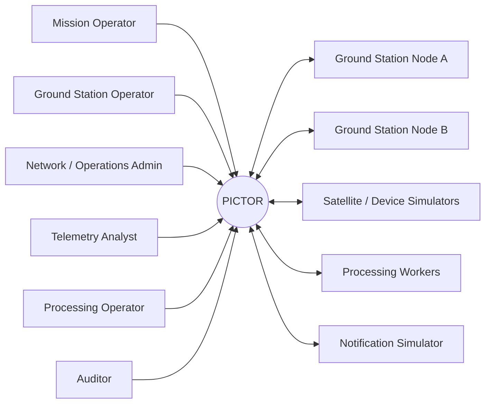
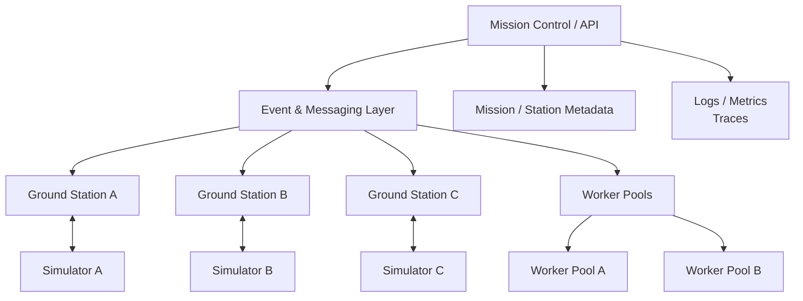
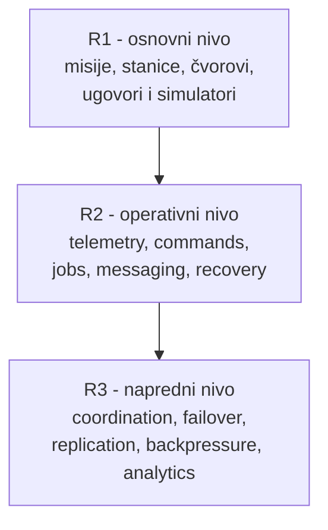
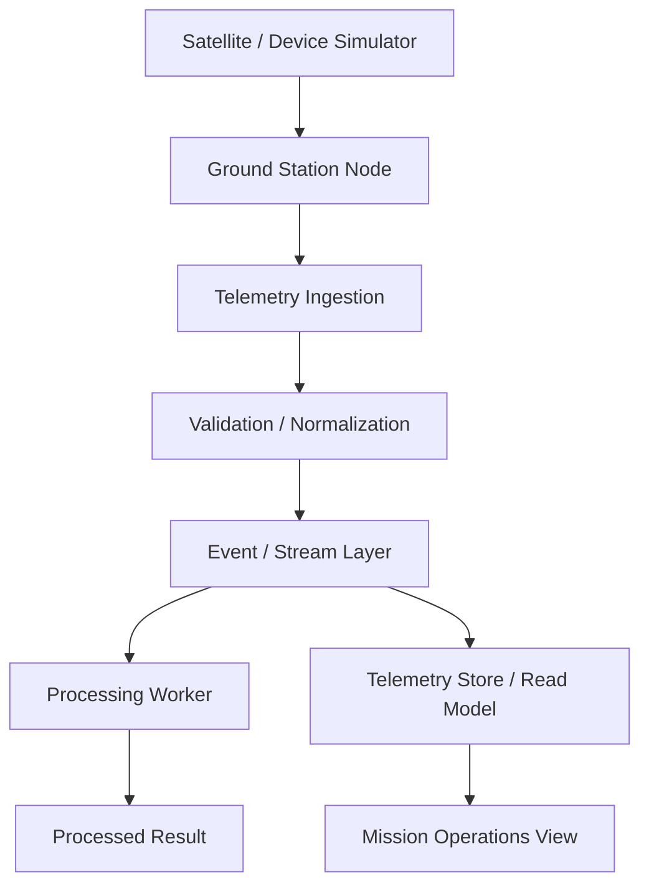
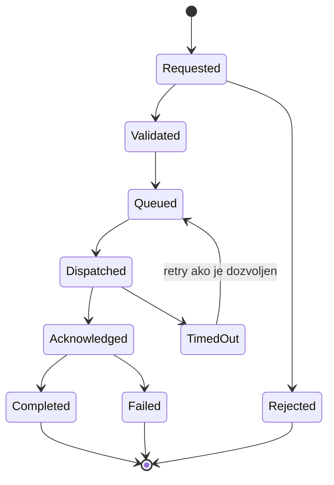
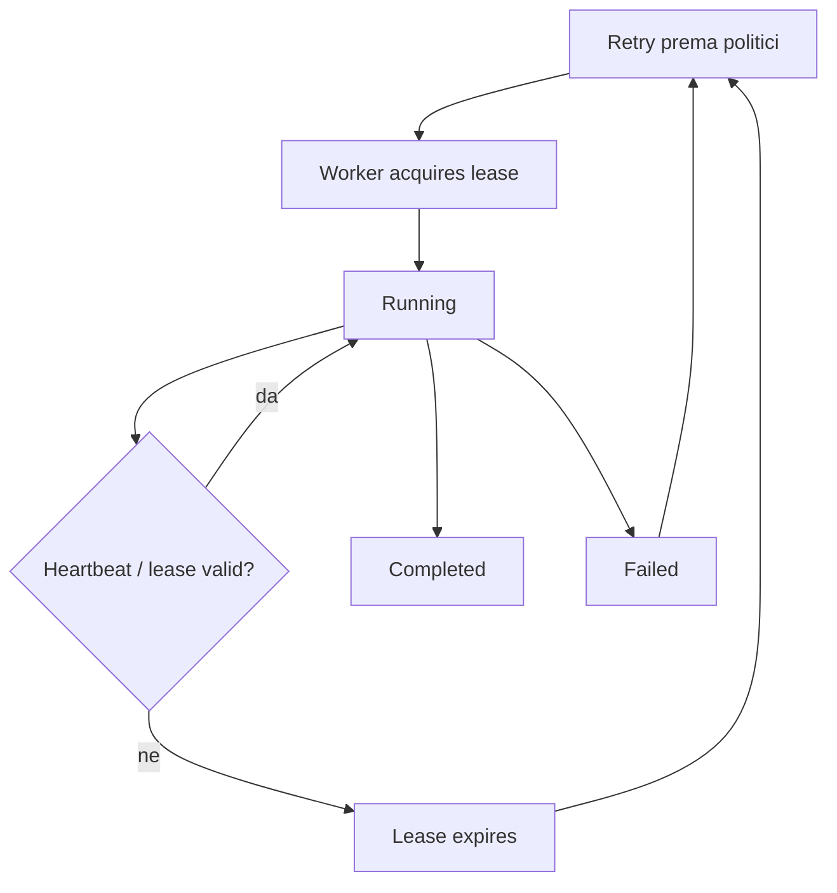
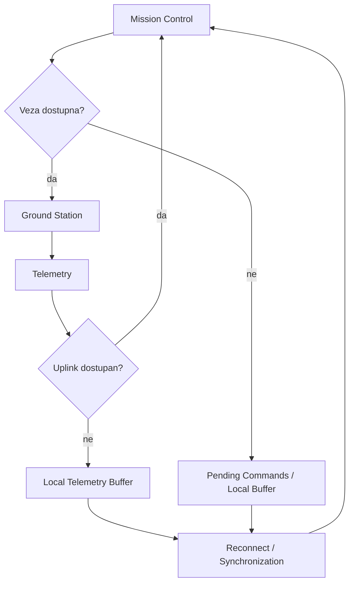
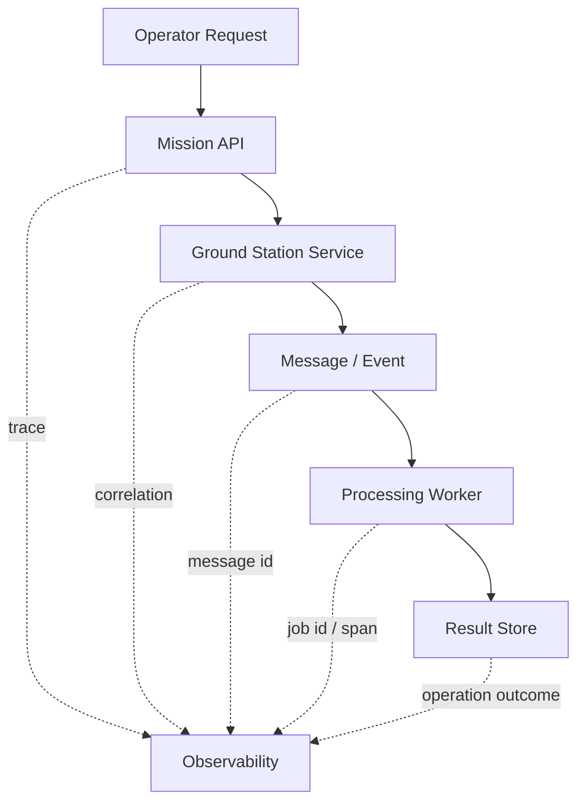
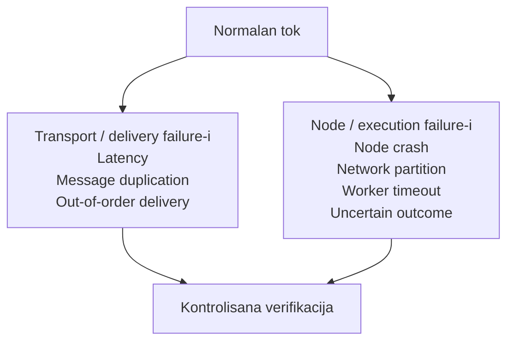

# PICTOR

## Distribuirani sistem za upravljanje zemaljskim stanicama i misijskim operacijama

**Projektna specifikacija za predmet Osnove distribuiranog programiranja**  
Fakultet tehničkih nauka - Primenjeno softversko inženjerstvo  
**Verzija 1.2 - septembar 2026.**

---

## Osnovni podaci

| Stavka | Vrednost |
|---|---|
| Naziv projekta | **PICTOR - Distribuirani sistem za upravljanje zemaljskim stanicama i misijskim operacijama** |
| Predmet | Osnove distribuiranog programiranja |
| Tip rada | Timski razvoj zajedničkog distribuiranog softverskog proizvoda |
| Veličina tima | 6-10 studenata |
| Tipičan obim izvođenja | približno 200 studenata; broj timova zavisi od formirane veličine timova |
| Referentna tehnologija | .NET / C#; druge tehnologije uz odobrenje i dokaz interoperabilnosti |
| Organizacija rada | Git, feature grane, Pull Request, code review, CI i Tapiz Boards |
| Arhitektonski principi | jasne distribuirane granice, Clean Architecture, SOLID, testabilnost, ugovori i failure-aware dizajn |

## Pregled poglavlja

1. Svrha, cilj i granice projekta
2. Kontekst sistema i korisnici
3. Distribuirani model sistema
4. Razvojni nivoi i dodela projektnih celina
5. Opšti tehnički i procesni zahtevi
6. Ključni distribuirani tokovi i failure model
7. Projektne celine nivoa R1
8. Projektne celine nivoa R2
9. Projektne celine nivoa R3
10. Integracija, testiranje i kriterijumi završetka
11. Predaja, dokumentacija i kriterijumi ocenjivanja
12. Rečnik ključnih pojmova

---

# 1. Svrha, cilj i granice projekta

PICTOR je distribuirani informacioni sistem namenjen upravljanju mrežom udaljenih zemaljskih stanica, komunikacionim sesijama, telemetry tokovima, komandama i računarskim poslovima koji se izvršavaju kroz više nezavisnih procesa i čvorova. Sistem je projektovan tako da problemi distribucije budu sastavni deo poslovnog scenarija, a ne dodatak uveden samo radi arhitektonske forme.

Sateliti i drugi udaljeni uređaji modeluju se simulatorima. Nije potrebno poznavanje orbitalne mehanike niti stvarnih radio-komunikacionih protokola. Dovoljan je konzistentan model komunikacionih prozora, udaljenih čvorova, poruka i failure situacija koji omogućava proučavanje distribuiranog ponašanja.

> **Cilj projektnog okvira.** Sistem mora stvarati realistične situacije u kojima poruka može kasniti, stići više puta ili van redosleda, čvor može nestati, mrežna veza može biti prekinuta, a ishod udaljene operacije može ostati privremeno nepoznat. Studenti rešavaju takve probleme kroz eksplicitne ugovore, testove i kontrolisane failure scenarije.

## 1.1. Obuhvat

- mreža zemaljskih stanica i udaljenih station node-ova;
- simulirani sateliti i drugi udaljeni uređaji;
- kontaktni prozori i komunikacione sesije;
- telemetry prijem, validacija, routing, obrada i read modeli;
- komande, delivery status i acknowledgement;
- event/message komunikacija;
- distribuirani job queue i worker pool;
- retry, idempotency, deduplikacija, lease i recovery;
- disconnected operation i naknadna sinhronizacija;
- observability, correlation i distributed tracing;
- napredniji coordination, failover, replication, backpressure i replay scenariji;
- message contract versioning, clock observability i topology registry;
- transactional outbox/inbox, windowed stream processing i versioned configuration rollout;
- distributed rate limiting, checkpoint/recovery i locality-aware multi-region routing.

## 1.2. Van obuhvata

- stvarna orbitalna mehanika i proračun putanje;
- upravljanje pravim antenama, satelitima ili radio opremom;
- implementacija realnog message broker-a, baze ili mrežnog protokola od nule;
- real-time hard deadline sistemi gde promašaj roka predstavlja fizičku opasnost;
- bezbednosni penetration-testing kao centralni cilj projekta; osnovna autentikacija, autorizacija i zaštita podataka ostaju obavezni kvalitet sistema.

<!-- diagram:context -->


*Slika 1. Kontekst sistema PICTOR: korisnici, udaljeni čvorovi i spoljni simulatori.*


# 2. Kontekst sistema i korisnici

PICTOR se posmatra kao sistem u kome centralne i regionalne komponente koordiniraju veći broj udaljenih station node-ova i processing worker-a. Nijedna komponenta ne sme implicitno pretpostaviti da su mreža, redosled poruka ili udaljeni procesi savršeno pouzdani.

## 2.1. Primarne uloge

| Uloga | Tipične odgovornosti |
|---|---|
| Mission Operator | misije, kontaktne sesije, komande, pregled telemetry toka |
| Ground Station Operator | stanje stanice, lokalne sesije, node health i oporavak |
| Network / Operations Administrator | konfiguracija čvorova, routing, dostupnost i operativni parametri |
| Telemetry Analyst | pregled telemetry podataka, processing rezultati i kvalitet događaja |
| Processing Operator | worker-i, job queue, retry/recovery i kapacitet obrade |
| Auditor / Read-only Operator | kontrolisan pregled audit i correlation podataka |

## 2.2. Misije kao granica vlasništva

Sistem može istovremeno podržati više nezavisnih misija ili korisničkih organizacija. Operativni resursi mogu biti zajednički, dok podaci, komande i pristup moraju imati jasno definisan mission scope.

## 2.3. Simulatori

Simulatore, kada ih projektna celina zahteva, implementiraju studenti. Simulator je spoljni sistem: ne sme preuzeti poslovnu logiku PICTOR-a, već samo reprodukovati ponašanje udaljenog uređaja, mreže ili izvršnog okruženja.

| Simulator | Primer ponašanja |
|---|---|
| Satellite / Device Simulator | generiše telemetry i prima komande |
| Ground Station Link Simulator | latency, prekid veze, reconnect |
| Workload / Worker Simulator | sporo izvršavanje, pad procesa, restart |
| Notification Simulator | uspešna/neuspešna isporuka obaveštenja |
| Failure Simulator | duplikacija, reorder, timeout, partition, crash |

<!-- diagram:topology -->


*Slika 2. Pojednostavljena distribuirana topologija sistema.*


# 3. Distribuirani model sistema

PICTOR nije definisan kao obavezna mikroservisna arhitektura niti je broj servisa kriterijum kvaliteta. Projektne celine moraju biti razdvojene tako da komunikacione i ownership granice budu jasne, a nezavisno pokretljive komponente uvode se kada poslovni ili nastavni scenario zahteva udaljenu komunikaciju, parcijalni failure ili nezavisno izvršavanje.

## 3.1. Osnovne pretpostavke

- udaljeni poziv može kasniti ili neuspeti;
- timeout ne dokazuje da udaljena operacija nije izvršena;
- ista poruka može biti dostavljena više puta ako izabrana infrastruktura to dozvoljava;
- redosled prijema može biti različit od redosleda slanja;
- process/node failure može nastati između dva naizgled povezana koraka;
- lokalna memorija udaljenog procesa nije pouzdan izvor globalnog stanja;
- sat i timestamp nisu automatski globalni dokaz redosleda događaja;
- sistem mora eksplicitno dokumentovati koju consistency i delivery semantiku očekuje od svake bitne granice.

## 3.2. Vlasništvo nad podacima

- komponenta ne pristupa privatnoj bazi druge nezavisno pokretljive komponente;
- cross-team komunikacija koristi eksplicitne API/message ugovore;
- shared paket sadrži ugovore i tehničke primitive, ne proizvoljnu poslovnu logiku;
- promena ugovora zahteva koordinaciju consumer i provider tima;
- read model sme biti eventualno konzistentan samo ako je to vidljivo i prihvatljivo za use-case.

<!-- diagram:levels -->


*Slika 3. Razvojni nivoi projektnih celina; oznake predstavljaju funkcionalne preduslove.*


# 4. Razvojni nivoi i dodela projektnih celina

Oznake R1, R2 i R3 predstavljaju funkcionalne preduslove i zrelost celine. Ne predstavljaju akademsku godinu niti pravo studenata da sami izaberu temu. Projektne celine dodeljuje nastavni tim.

| Nivo | Značenje | Tipični sadržaj |
|---|---|---|
| R1 - Osnovni | stabilizuje identitete, ugovore, simulatore i čvorove potrebne ostalim celinama | misije, stanice, station node, schema, command katalog, observability |
| R2 - Operativni | uvodi stvarne distribuirane tokove i recovery situacije | telemetry, commands, messaging, jobs, lease, DLQ, reconnect |
| R3 - Napredni | uvodi koordinaciju i složenije posledice distribucije | backpressure, ownership, failover, replication, conflict resolution, replay |

> **Dodela projektnih celina.** Tim može razvijati novu celinu, nadograditi postojeću ili refaktorisati postojeće rešenje kada je to potrebno za novi zahtev. Nastavni tim može aktivirati celinu višeg nivoa ranije ako su njeni preduslovi već dostupni ili kontrolisano simulirani.

## 4.1. Timovi

Tim ima 6-10 studenata. Jedna projektna celina je zamišljena kao primarna odgovornost jednog tima, ali velika celina može biti podeljena na jasno razdvojene epike kada broj timova to zahteva.

Svaki tim treba tokom semestra da ima kombinaciju sledećeg rada:

- implementacija novih funkcionalnosti;
- izmena ili evolucija postojećeg ponašanja;
- najmanje jedna cross-team integracija kada domen to omogućava;
- testiranje normalnih i failure scenarija;
- refaktorisanje kada postojeći dizajn otežava bezbednu promenu.

# 5. Opšti tehnički i procesni zahtevi

## 5.1. Tehnološki okvir

Podrazumevana i preporučena tehnologija je .NET / C#. Druga tehnologija može biti odobrena kada postoji jasan razlog i kada tim obezbedi interoperabilnost sa ostatkom sistema. Izbor tehnologije ne menja zahteve za komunikacione ugovore, testove, failure handling i observability.

## 5.2. Arhitektura i kvalitet

- Clean Architecture ili ekvivalentno jasno razdvajanje poslovnog jezgra, aplikacionih use-case-ova i infrastrukture;
- SOLID principi tamo gde smanjuju spregnutost i olakšavaju testiranje;
- ne uvoditi servis, queue ili broker samo da bi sistem izgledao distribuirano;
- timeout, retry i recovery su deo dizajna use-case-a, ne post-produkciona dopuna;
- svaki udaljeni ugovor mora imati definisane uspešne i failure ishode;
- značajne distribuirane odluke dokumentuju se kratkim ADR zapisom.

## 5.3. Testiranje

Framework zavisi od tehnologije: NUnit/Moq za .NET, Vitest/Jest za TypeScript ili odgovarajući ekvivalent. Obavezni su testovi koji dokazuju ponašanje, ne samo dostupnost endpoint-a.

- unit testovi poslovnih pravila;
- integration testovi udaljenih adaptera i infrastrukture;
- contract testovi za cross-team granice;
- failure testovi: timeout, duplicate, reconnect, node crash ili drugi relevantan scenario;
- regression test za stvarno otkriven problem kada je razumno reprodukovati ga automatizovano.

## 5.4. Git, Pull Request i Tapiz Boards

```text
Tapiz task -> feature branch -> commits -> Pull Request -> CI + review -> VERIFY / QA -> DONE
```

- direktan push na main nije dozvoljen;
- svaka značajna promena ima Tapiz task i acceptance kriterijume;
- cross-team contract promena traži review pogođenog tima;
- CI najmanje izvršava build, statičke provere i relevantne testove;
- commit istorija mora omogućiti rekonstrukciju rada i individualnog doprinosa.

## 5.5. Definition of Done

- acceptance kriterijumi su ispunjeni;
- normalan tok je demonstriran;
- relevantan failure/recovery tok je demonstriran;
- timeout/retry/idempotency semantika je dokumentovana gde je primenljivo;
- automatizovani testovi prolaze;
- CI prolazi;
- observability omogućava praćenje ključnog izvršnog toka;
- PR je pregledan i komentari rešeni;
- ugovori i ADR zapisi su ažurirani;
- članovi tima mogu da objasne posledice parcijalnog failure-a.

<div class="page-break"></div>

# 6. Ključni distribuirani tokovi i failure model

## 6.1. Telemetry tok

Telemetry nastaje u simulatoru udaljenog uređaja, prolazi kroz ground station node i više distribuiranih komponenti pre nego što postane dostupan operateru ili processing worker-u.

<!-- diagram:telemetry-flow -->


*Slika 4. Referentni tok telemetry podataka kroz distribuirani sistem.*


## 6.2. Komanda udaljenom uređaju

Slanje komande je primer neizvesne udaljene operacije. Timeout ne mora značiti da komanda nije stigla ili nije izvršena, pa sistem mora imati eksplicitan model statusa i retry politike.

<!-- diagram:command-flow -->


*Slika 5. Pojednostavljen životni ciklus komande.*


## 6.3. Distribuirani posao i lease

Processing worker može nestati nakon što je preuzeo posao. Lease model omogućava oporavak bez pretpostavke da je process failure isto što i sigurno neizvršavanje posla.

<!-- diagram:job-lease -->


*Slika 6. Primer lease modela za distribuisanu obradu poslova.*


<div class="page-break"></div>

## 6.4. Privremeno odsečena zemaljska stanica

Udaljeni node može određeni period izgubiti vezu sa centralnim sistemom. Sistem mora imati definisano šta se lokalno čuva, šta se odbija i kako se ponovna sinhronizacija ponaša.

<!-- diagram:disconnected-station -->


*Slika 7. Rad udaljenog čvora tokom privremenog prekida veze i naknadna sinhronizacija.*


## 6.5. Observability i correlation

<!-- diagram:observability -->


*Slika 8. Korelacija distribuiranog izvršnog toka kroz više komponenti.*


## 6.6. Referentni failure model

<!-- diagram:failure-model -->


*Slika 9. Referentni failure model koji simulatori mogu kontrolisano da izazovu.*


> **Napomena.** Nije svaki failure scenario relevantan za svaku projektnu celinu. Tim mora jasno da identifikuje koji failure-i mogu promeniti poslovni ishod njegove celine i kako se takva situacija verifikuje.

## Pregled projektnih celina

| Oznaka | Projektna celina | Nivo | Glavni preduslovi |
|---|---|---|---|
| R1-01 | Misije i korisničke organizacije | R1 | nema obaveznih |
| R1-02 | Registry zemaljskih stanica | R1 | nema obaveznih |
| R1-03 | Station Node / Edge Agent | R1 | R1-02 |
| R1-04 | Simulator satelita i udaljenih uređaja | R1 | nema obaveznih |
| R1-05 | Kontaktni prozori i komunikacione sesije | R1 | R1-02, R1-04 |
| R1-06 | Telemetry schema i katalog metrika | R1 | R1-04 |
| R1-07 | Katalog komandi | R1 | R1-04 |
| R1-08 | Identitet, uloge i ovlašćenja | R1 | R1-01 |
| R1-09 | Referentna konfiguracija sistema | R1 | nema obaveznih |
| R1-10 | Audit i correlation evidencija | R1 | R1-08 |
| R1-11 | Notification i operativna eskalacija | R1 | R1-01, R1-08 |
| R1-12 | Failure i latency simulator | R1 | R1-03, R1-04 |
| R1-13 | Observability osnova | R1 | R1-10 |
| R1-14 | Message/event contract registry i verzionisanje | R1 | R1-09 |
| R1-15 | Time model i clock observability | R1 | R1-03, R1-13 |
| R1-16 | Node topology i connectivity registry | R1 | R1-02, R1-03 |
| R1-17 | Service endpoint i discovery registry | R1 | R1-09, R1-13 |
| R1-18 | Capability i protocol compatibility registry | R1 | R1-03, R1-04, R1-14 |
| R1-19 | Link profili i komunikaciona ograničenja | R1 | R1-02, R1-05, R1-16 |
| R1-20 | Software artifact i node release registry | R1 | R1-03, R1-14, R1-18 |
| R2-01 | Telemetry ingestion gateway | R2 | R1-03, R1-06, R1-13 |
| R2-02 | Telemetry validacija i normalizacija | R2 | R2-01 |
| R2-03 | Telemetry routing i subscriptions | R2 | R2-02 |
| R2-04 | Telemetry storage i read modeli | R2 | R2-02 |
| R2-05 | Command request i validacija | R2 | R1-05, R1-07, R1-08 |
| R2-06 | Command dispatch i acknowledgement | R2 | R2-05, R1-03, R1-13 |
| R2-07 | Izvršavanje kontaktne sesije | R2 | R1-05, R1-03, R1-04 |
| R2-08 | Distribuirani job queue | R2 | R2-03 |
| R2-09 | Worker registry i heartbeat | R2 | R2-08 |
| R2-10 | Worker lease i recovery | R2 | R2-08, R2-09 |
| R2-11 | Dead-letter i replay | R2 | R2-03 |
| R2-12 | Retry, idempotency i deduplikacija | R2 | R2-01, R2-06, R2-08 |
| R2-13 | Disconnected station buffer i sinhronizacija | R2 | R1-03, R2-01, R2-06 |
| R2-14 | Transactional outbox/inbox delivery | R2 | R1-14, R2-03, R2-12 |
| R2-15 | Stream agregacije i windowed processing | R2 | R2-02, R2-03, R1-15 |
| R2-16 | Distribuirani configuration rollout | R2 | R1-03, R1-09, R1-14 |
| R2-17 | Dinamički service discovery i health-aware routing | R2 | R1-17, R1-18, R2-09 |
| R2-18 | Rolling deployment i progressive delivery ka edge čvorovima | R2 | R1-20, R2-16, R1-13 |
| R2-19 | Distribuirani workflow i saga orkestracija | R2 | R2-05, R2-06, R2-08, R2-14 |
| R2-20 | Distribuirani cache i invalidacija | R2 | R2-04, R2-14, R1-14 |
| R3-01 | Priority scheduling i admission control | R3 | R2-07, R2-08, R2-09 |
| R3-02 | Backpressure i kontrola protoka | R3 | R2-03, R2-08 |
| R3-03 | Coordination i ekskluzivno vlasništvo | R3 | R2-10 |
| R3-04 | Regionalni failover | R3 | R3-03, R1-13 |
| R3-05 | Replicirani read modeli i eventual consistency | R3 | R2-04, R1-13 |
| R3-06 | Out-of-order i conflict resolution | R3 | R2-02, R2-04 |
| R3-07 | Event replay i rekonstrukcija izvršenja | R3 | R2-04, R2-11 |
| R3-08 | Chaos/failure campaign i recovery verifikacija | R3 | R1-12, R1-13 |
| R3-09 | Throughput, lag i kapacitetna analitika | R3 | R1-13, R2-03, R2-08 |
| R3-10 | Distribuirani rate limiting i fairness | R3 | R2-03, R2-08, R3-02 |
| R3-11 | Checkpointing i rolling recovery stateful procesora | R3 | R2-04, R2-08, R3-07 |
| R3-12 | Locality-aware multi-region routing | R3 | R1-16, R3-04, R3-05 |
| R3-13 | Sharding, consistent hashing i online rebalans | R3 | R2-09, R3-03, R2-04 |
| R3-14 | Elastično skaliranje worker pool-a | R3 | R2-08, R2-09, R3-09 |
| R3-15 | Circuit breaker, bulkhead i adaptivni retry | R3 | R2-12, R3-02, R1-13 |
| R3-16 | SLO, error budget i reliability control | R3 | R1-13, R3-09, R2-18 |
| R3-17 | Causal tracing i graf distribuiranog izvršenja | R3 | R1-10, R1-13, R2-19 |
| R3-18 | Partition recovery i reconciliation posle dugog prekida | R3 | R2-13, R3-06, R3-03 |
| R3-19 | Multi-stream correlation i event-time join | R3 | R2-15, R2-03, R1-15 |
| R3-20 | Graceful degradation i load shedding | R3 | R3-02, R3-10, R3-16 |

<div class="page-break"></div>

# 7. Projektne celine nivoa R1

Celine R1 formiraju osnovni model misija, stanica, udaljenih čvorova, ugovora, simulatora i observability pravila. Pogodne su za paralelan rad većeg broja timova.

## R1-01. Misije i korisničke organizacije

Evidencija misija/projekata i organizacija koje koriste mrežu zemaljskih stanica.

| Element | Specifikacija |
|---|---|
| Ključni pojmovi | Mission, Organization, MissionStatus, Owner, MissionPriority |
| Preduslovi | Nema obaveznih funkcionalnih preduslova. |

### Obavezni use-case-ovi

- kreiranje i aktiviranje misije
- povezivanje organizacije sa misijom
- dodela operativnih korisnika
- suspenzija i zatvaranje misije
- pregled resursa i aktivnosti po misiji

### Ključna poslovna i distribuirana pravila

- svaka operativna aktivnost mora imati jasan mission kontekst
- zatvorena misija ne može praviti nove komande ili sesije
- promena vlasništva mora ostati sledljiva

### Moguća proširenja

- više organizacija na jednoj misiji
- mission quota profil
- arhiviranje istorijskih misija

> **Dokaz završetka.** Celina mora imati izvršive ključne use-case-ove, automatizovane testove, dokumentovanu javnu granicu prema drugim celinama i najmanje jedan kontrolisan failure ili recovery scenario kada je relevantan za domen.
## R1-02. Registry zemaljskih stanica

Centralna evidencija fizičkih ili simuliranih zemaljskih stanica i njihovih osnovnih sposobnosti.

| Element | Specifikacija |
|---|---|
| Ključni pojmovi | GroundStation, Location, StationCapability, OperationalStatus, AntennaProfile |
| Preduslovi | Nema obaveznih funkcionalnih preduslova. |

### Obavezni use-case-ovi

- registracija stanice
- promena statusa
- evidencija podržanih komunikacionih profila
- pregled aktivnih stanica
- deaktivacija stanice

### Ključna poslovna i distribuirana pravila

- identifikator stanice mora biti jedinstven
- neaktivna stanica ne prihvata nove operativne sesije
- promena sposobnosti ne sme retroaktivno menjati istorijske sesije

### Moguća proširenja

- više lokacija po operatoru
- station tags
- rezervne/standby stanice

> **Dokaz završetka.** Celina mora imati izvršive ključne use-case-ove, automatizovane testove, dokumentovanu javnu granicu prema drugim celinama i najmanje jedan kontrolisan failure ili recovery scenario kada je relevantan za domen.
## R1-03. Station Node / Edge Agent

Model lokalnog softverskog čvora koji predstavlja udaljenu stanicu i održava vezu sa centralnim sistemom.

| Element | Specifikacija |
|---|---|
| Ključni pojmovi | StationNode, NodeInstance, Heartbeat, ConnectionState, NodeVersion |
| Preduslovi | R1-02 |

### Obavezni use-case-ovi

- registracija node instance
- periodični heartbeat
- detekcija online/offline statusa
- promena verzije/agenta
- kontrolisana ponovna registracija nakon prekida

### Ključna poslovna i distribuirana pravila

- dve aktivne instance ne smeju nekontrolisano preuzeti isto ekskluzivno vlasništvo
- istekao heartbeat mora imati eksplicitan operativni ishod
- node identitet mora biti stabilan kroz reconnect

### Moguća proširenja

- više procesa po stanici
- local health summary
- controlled reconnect backoff

> **Dokaz završetka.** Celina mora imati izvršive ključne use-case-ove, automatizovane testove, dokumentovanu javnu granicu prema drugim celinama i najmanje jedan kontrolisan failure ili recovery scenario kada je relevantan za domen.
## R1-04. Simulator satelita i udaljenih uređaja

Simulirani udaljeni izvori telemetry podataka i primaoci komandi bez potrebe za stvarnom orbitalnom fizikom.

| Element | Specifikacija |
|---|---|
| Ključni pojmovi | DeviceSimulator, SimulatorProfile, TelemetrySource, CommandEndpoint, SimulationState |
| Preduslovi | Nema obaveznih funkcionalnih preduslova. |

### Obavezni use-case-ovi

- pokretanje simuliranog uređaja
- generisanje telemetry događaja
- prijem simulirane komande
- promena režima rada
- zaustavljanje i restart simulatora

### Ključna poslovna i distribuirana pravila

- simulator ne sme sadržati poslovnu logiku centralnog sistema
- isti scenario mora biti ponovljiv uz poznatu konfiguraciju
- simulator mora moći da proizvede normalne i greške/failure situacije

### Moguća proširenja

- više profila uređaja
- scripted scenario
- deterministički seed

> **Dokaz završetka.** Celina mora imati izvršive ključne use-case-ove, automatizovane testove, dokumentovanu javnu granicu prema drugim celinama i najmanje jedan kontrolisan failure ili recovery scenario kada je relevantan za domen.
## R1-05. Kontaktni prozori i komunikacione sesije

Model perioda u kome određena stanica može da komunicira sa određenim simuliranim uređajem.

| Element | Specifikacija |
|---|---|
| Ključni pojmovi | ContactWindow, ContactSession, StationRef, DeviceRef, TimeWindow |
| Preduslovi | R1-02, R1-04 |

### Obavezni use-case-ovi

- definisanje kontaktnog prozora
- rezervacija stanice za sesiju
- otkazivanje sesije
- aktiviranje/završetak sesije
- pregled konflikata

### Ključna poslovna i distribuirana pravila

- interval mora imati validan početak i kraj
- ista ekskluzivna sposobnost stanice ne može biti dvostruko rezervisana
- sesija ne može početi na neoperativnoj stanici

### Moguća proširenja

- recurring windows
- prioritet misije
- preklapanje više antena

> **Dokaz završetka.** Celina mora imati izvršive ključne use-case-ove, automatizovane testove, dokumentovanu javnu granicu prema drugim celinama i najmanje jedan kontrolisan failure ili recovery scenario kada je relevantan za domen.
## R1-06. Telemetry schema i katalog metrika

Centralni ugovor o vrstama telemetry poruka i metrika koje udaljeni čvorovi mogu da šalju.

| Element | Specifikacija |
|---|---|
| Ključni pojmovi | TelemetrySchema, MetricDefinition, FieldDefinition, Unit, SchemaVersion |
| Preduslovi | R1-04 |

### Obavezni use-case-ovi

- registracija schema-e
- dodavanje verzije
- validacija kompatibilnosti
- pregled polja i jedinica
- deaktivacija stare verzije

### Ključna poslovna i distribuirana pravila

- objavljena verzija se ne menja u mestu
- poruka mora navesti ili implicitno determinisati schema verziju
- jedinice i tipovi moraju biti konzistentni

### Moguća proširenja

- schema compatibility policy
- custom metadata
- schema migration report

> **Dokaz završetka.** Celina mora imati izvršive ključne use-case-ove, automatizovane testove, dokumentovanu javnu granicu prema drugim celinama i najmanje jedan kontrolisan failure ili recovery scenario kada je relevantan za domen.
## R1-07. Katalog komandi

Definisanje dozvoljenih komandi, parametara i očekivanih odgovora za različite simulirane uređaje.

| Element | Specifikacija |
|---|---|
| Ključni pojmovi | CommandDefinition, CommandParameter, CommandCategory, CommandVersion, ExpectedOutcome |
| Preduslovi | R1-04 |

### Obavezni use-case-ovi

- registracija komande
- verzionisanje komande
- validacija parametara
- ograničenje komande na podržan uređaj
- deaktivacija komande

### Ključna poslovna i distribuirana pravila

- nepoznata komanda ne sme biti dispatch-ovana
- objavljena verzija ugovora se ne menja bez nove verzije
- parametri moraju biti validirani pre slanja

### Moguća proširenja

- command templates
- safety class
- approval-required command flag

> **Dokaz završetka.** Celina mora imati izvršive ključne use-case-ove, automatizovane testove, dokumentovanu javnu granicu prema drugim celinama i najmanje jedan kontrolisan failure ili recovery scenario kada je relevantan za domen.
## R1-08. Identitet, uloge i ovlašćenja

Upravljanje identitetima i osnovnim pristupom misijama, stanicama i operativnim komandama.

| Element | Specifikacija |
|---|---|
| Ključni pojmovi | User, Role, Permission, MissionMembership, Scope |
| Preduslovi | R1-01 |

### Obavezni use-case-ovi

- kreiranje/aktiviranje korisnika
- dodela uloge
- povezivanje sa misijom
- provera dozvole
- ukidanje pristupa

### Ključna poslovna i distribuirana pravila

- dozvola se proverava serverski
- korisnik ne dobija pristup tuđoj misiji samo poznajući identifikator
- privilegovane promene moraju biti auditovane

### Moguća proširenja

- station-scoped role
- privremeno ovlašćenje
- delegacija dežurstva

> **Dokaz završetka.** Celina mora imati izvršive ključne use-case-ove, automatizovane testove, dokumentovanu javnu granicu prema drugim celinama i najmanje jedan kontrolisan failure ili recovery scenario kada je relevantan za domen.
## R1-09. Referentna konfiguracija sistema

Centralni katalog timeout, retry i drugih referentnih operativnih parametara koji nisu poslovni podaci jedne misije.

| Element | Specifikacija |
|---|---|
| Ključni pojmovi | ConfigKey, ConfigValue, EnvironmentProfile, EffectivePeriod, Version |
| Preduslovi | Nema obaveznih funkcionalnih preduslova. |

### Obavezni use-case-ovi

- upravljanje konfiguracionim vrednostima
- verzionisanje
- validacija opsega
- pregled aktivne vrednosti
- kontrolisana promena

### Ključna poslovna i distribuirana pravila

- kritična konfiguracija ne menja se bez sledljivog zapisa
- nevažeća vrednost se odbija pre primene
- tajne se ne čuvaju kao obične konfiguracione vrednosti

### Moguća proširenja

- feature flags
- config rollout
- station override policy

> **Dokaz završetka.** Celina mora imati izvršive ključne use-case-ove, automatizovane testove, dokumentovanu javnu granicu prema drugim celinama i najmanje jedan kontrolisan failure ili recovery scenario kada je relevantan za domen.
## R1-10. Audit i correlation evidencija

Sledljiva evidencija važnih poslovnih i operativnih aktivnosti u distribuiranom sistemu.

| Element | Specifikacija |
|---|---|
| Ključni pojmovi | AuditEvent, Actor, Action, ResourceRef, CorrelationId, Outcome |
| Preduslovi | R1-08 |

### Obavezni use-case-ovi

- beleženje kritične operacije
- pretraga po correlation id-u
- pregled aktivnosti korisnika
- pregled aktivnosti nad resursom
- izvoz ograničenog audit pregleda

### Ključna poslovna i distribuirana pravila

- audit se ne menja nakon upisa
- tajne i raw credential-i se ne zapisuju
- correlation id mora omogućiti povezivanje relevantnih događaja bez oslanjanja na vreme kao jedini signal

### Moguća proširenja

- event hash chain
- retention politika
- audit po misiji

> **Dokaz završetka.** Celina mora imati izvršive ključne use-case-ove, automatizovane testove, dokumentovanu javnu granicu prema drugim celinama i najmanje jedan kontrolisan failure ili recovery scenario kada je relevantan za domen.
## R1-11. Notification i operativna eskalacija

Slanje operativnih obaveštenja kroz simulirani gateway.

| Element | Specifikacija |
|---|---|
| Ključni pojmovi | Notification, Recipient, Channel, Template, DeliveryStatus |
| Preduslovi | R1-01, R1-08 |

### Obavezni use-case-ovi

- kreiranje obaveštenja
- slanje kroz simulator
- praćenje statusa
- ponovni pokušaj
- eskalacija kritičnog događaja

### Ključna poslovna i distribuirana pravila

- failure notification servisa ne sme automatski rušiti osnovni use-case
- duplikat poslovnog događaja ne treba nekontrolisano da proizvede duplo obaveštenje
- obaveštenje mora zadržati mission kontekst

### Moguća proširenja

- više kanala
- digest
- suppression window

> **Dokaz završetka.** Celina mora imati izvršive ključne use-case-ove, automatizovane testove, dokumentovanu javnu granicu prema drugim celinama i najmanje jedan kontrolisan failure ili recovery scenario kada je relevantan za domen.
## R1-12. Failure i latency simulator

Kontrolisano uvođenje kašnjenja, gubitka, duplikacije i prekida veze radi testiranja distribuiranih komponenti.

| Element | Specifikacija |
|---|---|
| Ključni pojmovi | FailureScenario, LatencyProfile, DropRule, DuplicateRule, PartitionRule |
| Preduslovi | R1-03, R1-04 |

### Obavezni use-case-ovi

- definisanje failure scenarija
- uvođenje kašnjenja
- duplikacija poruke
- privremeni prekid veze
- restart simuliranog čvora
- ponavljanje scenarija

### Ključna poslovna i distribuirana pravila

- failure scenario mora biti ponovljiv
- testni failure ne sme biti nasumičan bez mogućnosti reprodukcije
- simulator mora jasno odvojiti fault injection od poslovne logike

### Moguća proširenja

- packet reordering abstraction
- clock skew simulation
- scripted failure campaign

> **Dokaz završetka.** Celina mora imati izvršive ključne use-case-ove, automatizovane testove, dokumentovanu javnu granicu prema drugim celinama i najmanje jedan kontrolisan failure ili recovery scenario kada je relevantan za domen.
## R1-13. Observability osnova

Zajednička pravila za strukturisane logove, metrike, correlation i trace podatke kroz više komponenti.

| Element | Specifikacija |
|---|---|
| Ključni pojmovi | TraceContext, SpanRef, Metric, LogEvent, ServiceIdentity |
| Preduslovi | R1-10 |

### Obavezni use-case-ovi

- propagacija correlation id-a
- strukturisani log događaj
- evidencija trajanja operacije
- pregled health metrike
- povezivanje greške sa komponentom

### Ključna poslovna i distribuirana pravila

- trace/correlation kontekst mora se propagirati kroz dogovorene granice
- log ne sme sadržati tajne
- uspeh i failure moraju biti razlikovani eksplicitnim poljima

### Moguća proširenja

- distributed trace UI
- SLO metrike
- sampling politika

> **Dokaz završetka.** Celina mora imati izvršive ključne use-case-ove, automatizovane testove, dokumentovanu javnu granicu prema drugim celinama i najmanje jedan kontrolisan failure ili recovery scenario kada je relevantan za domen.


<div class="page-break"></div>

## R1-14. Message/event contract registry i verzionisanje

Centralni katalog javnih message i event ugovora koji omogućava kontrolisano verzionisanje između nezavisnih producenata i konzumenata.

| Element | Specifikacija |
|---|---|
| Ključni pojmovi | MessageContract, SchemaVersion, CompatibilityRule, Producer, Consumer, ContractStatus |
| Preduslovi | R1-09 |

### Obavezni use-case-ovi

- registracija message/event ugovora i vlasničke komponente
- objavljivanje nove verzije schema-e
- provera backward/forward compatibility pravila
- povezivanje poznatih producenata i konzumenata
- depreciranje stare verzije uz datum i plan migracije
- pregled promena ugovora i zavisnih komponenti

### Ključna poslovna i distribuirana pravila

- objavljena verzija ugovora je nepromenljiva; promena sadržaja zahteva novu verziju
- breaking promena mora biti eksplicitno klasifikovana i ne sme se predstaviti kao kompatibilna
- nepoznato ili neslaganje schema verzije mora imati definisan failure ishod
- registry opisuje ugovor, ali ne pretpostavlja pouzdanu dostavu poruke

### Moguća proširenja

- automatska compatibility provera u CI-u
- schema fingerprint
- consumer-driven contract testovi

> **Dokaz završetka.** Celina mora imati izvršive ključne use-case-ove, automatizovane testove, dokumentovanu javnu granicu prema drugim celinama i najmanje jedan kontrolisan failure ili recovery scenario kada je relevantan za domen.


## R1-15. Time model i clock observability

Eksplicitno modelovanje izvora vremena, clock skew-a i semantike timestamp-a kako sistem ne bi koristio lokalni sat kao implicitni globalni redosled.

| Element | Specifikacija |
|---|---|
| Ključni pojmovi | TimeSource, NodeClock, ClockOffset, TimestampPolicy, EventTime, ProcessingTime |
| Preduslovi | R1-03, R1-13 |

### Obavezni use-case-ovi

- registracija time source-a i node clock identiteta
- periodično prijavljivanje procenjenog clock offset-a
- definisanje timestamp semantike za odabrane događaje
- detekcija node-a sa prevelikim clock skew-om
- pregled clock stanja po station node-u i worker-u
- simulacija ubrzanog, usporenog ili pomerenog lokalnog sata

### Ključna poslovna i distribuirana pravila

- timestamp sam po sebi ne dokazuje kauzalni ili globalni redosled događaja
- clock skew iznad dozvoljene granice mora biti vidljiv operateru i telemetry-u
- event time i processing time moraju biti razlikovani kada utiču na rezultat
- promena sistemskog sata ne sme nekontrolisano produžiti lease ili timeout koji koristi monotonic mehanizam

### Moguća proširenja

- NTP/PTP simulator
- logical/sequence clock za odabrane tokove
- clock-skew alert correlation

> **Dokaz završetka.** Celina mora imati izvršive ključne use-case-ove, automatizovane testove, dokumentovanu javnu granicu prema drugim celinama i najmanje jedan kontrolisan failure ili recovery scenario kada je relevantan za domen.


## R1-16. Node topology i connectivity registry

Evidencija regiona, centralnih servisa, station node-ova, worker-a i logičkih komunikacionih veza relevantnih za distribuirane scenarije.

| Element | Specifikacija |
|---|---|
| Ključni pojmovi | Region, NodeEndpoint, NetworkLink, Route, ConnectivityState, TopologyVersion |
| Preduslovi | R1-02, R1-03 |

### Obavezni use-case-ovi

- registracija node endpoint-a i regiona
- evidencija dozvoljenih ili očekivanih komunikacionih linkova
- promena connectivity statusa i vremena poslednje potvrde
- pregled topologije po regionu ili misiji
- označavanje preferiranog route-a bez garancije dostave
- istorijski pregled promene topologije

### Ključna poslovna i distribuirana pravila

- topology registry ne sme tretirati konfigurisan link kao dokaz trenutne dostupnosti
- stari health/connectivity signal mora biti označen kao stale
- node endpoint identitet mora ostati stabilan kroz reconnect kada predstavlja isti logički node
- promena topologije mora biti verzionisana ili auditovana

### Moguća proširenja

- vizuelni topology graph
- simulator network partition-a po linkovima
- region affinity tagovi

> **Dokaz završetka.** Celina mora imati izvršive ključne use-case-ove, automatizovane testove, dokumentovanu javnu granicu prema drugim celinama i najmanje jedan kontrolisan failure ili recovery scenario kada je relevantan za domen.


## R1-17. Service endpoint i discovery registry

Centralna evidencija logičkih servisa, njihovih instanci, endpoint-a i discovery metapodataka u distribuiranom sistemu.

| Element | Specifikacija |
|---|---|
| Ključni pojmovi | ServiceDefinition, ServiceInstance, Endpoint, HealthState, DiscoveryRecord, Capability |
| Preduslovi | R1-09, R1-13 |

### Obavezni use-case-ovi

- registracija servisne definicije i javnog endpoint ugovora
- registracija i deregistracija instance servisa
- heartbeat/health ažuriranje instance
- pretraga aktivnih instanci po servisu, regionu i capability-ju
- označavanje instance kao draining ili unavailable
- pregled istorije članstva i health promena
- izvoz discovery snapshot-a za simulirani consumer

### Ključna poslovna pravila

- istekla health informacija ne sme se tretirati kao sigurno aktivna instanca
- instance id mora biti jedinstven u okviru servisne definicije
- draining instanca ne prima novi rad kada politika to zahteva
- discovery odgovor mora razlikovati active, suspect i unavailable stanje
- promene članstva moraju biti observabilne i auditabilne

### Moguća proširenja

- TTL-based registracija
- weighted endpoint metadata
- simulator nestabilnog service registry-ja

| **Dokaz završetka:** Celina mora imati izvršive ključne use-case-ove, automatizovane testove poslovnih pravila, dokumentovanu javnu granicu prema drugim celinama i najmanje jedan reprezentativan demo scenario. |
|-------------------------------------------------------------------------------------------------------------------------------------------------------------------------------------------------------------------|


## R1-18. Capability i protocol compatibility registry

Katalog verzija protokola, capability-ja i kompatibilnosti između Station Node-a, simulatora i centralnih servisa.

| Element | Specifikacija |
|---|---|
| Ključni pojmovi | Capability, ProtocolVersion, CompatibilityRule, FeatureFlag, NodeProfile, NegotiatedProfile |
| Preduslovi | R1-03, R1-04, R1-14 |

### Obavezni use-case-ovi

- definisanje capability-ja i verzije protokola
- registracija capability profila čvora ili udaljenog uređaja
- definisanje kompatibilnosti producer/consumer verzija
- provera da li dve strane mogu uspostaviti traženu operaciju
- izbor zajedničkog podržanog profila za sesiju
- označavanje deprecated capability-ja sa rokom podrške
- pregled nekompatibilnih čvorova nakon promene ugovora

### Ključna poslovna pravila

- kompatibilnost mora biti eksplicitna i verzionisana
- novija verzija ne sme se automatski smatrati backward compatible bez pravila
- negotiation mora dati deterministički ishod za isti skup capability-ja
- deprecated capability može ostati čitljiv ali ne mora biti dozvoljen za nove konfiguracije
- promena compatibility pravila mora imati audit/contract trag

### Moguća proširenja

- semantic-version policy
- canary capability rollout
- matrix prikaz kompatibilnosti

| **Dokaz završetka:** Celina mora imati izvršive ključne use-case-ove, automatizovane testove poslovnih pravila, dokumentovanu javnu granicu prema drugim celinama i najmanje jedan reprezentativan demo scenario. |
|-------------------------------------------------------------------------------------------------------------------------------------------------------------------------------------------------------------------|


## R1-19. Link profili i komunikaciona ograničenja

Model komunikacionih linkova prema udaljenim stanicama i uređajima sa propusnošću, latencijom, dostupnošću i drugim ograničenjima.

| Element | Specifikacija |
|---|---|
| Ključni pojmovi | LinkProfile, Bandwidth, LatencyBudget, AvailabilityWindow, CostClass, LinkState |
| Preduslovi | R1-02, R1-05, R1-16 |

### Obavezni use-case-ovi

- definisanje link profila za stanicu ili komunikacioni kanal
- evidencija nominalne propusnosti i latency budžeta
- promena operativnog stanja linka
- povezivanje kontaktne sesije sa odgovarajućim link profilom
- pregled dostupnih linkova za vremenski prozor
- evidencija merenog link quality snapshot-a
- označavanje degradiranog linka i razloga

### Ključna poslovna pravila

- link profil mora imati poznate jedinice i period važenja
- neaktivan link ne sme biti ponuđen kao potpuno raspoloživ kandidat
- merena i konfigurisana vrednost moraju biti jasno razdvojene
- kontaktna sesija mora poštovati hard komunikaciona ograničenja
- zastareo quality snapshot ne sme se predstavljati kao aktuelno stanje

### Moguća proširenja

- više linkova po stanici
- troškovna klasa prenosa
- simulator varijabilne propusnosti

| **Dokaz završetka:** Celina mora imati izvršive ključne use-case-ove, automatizovane testove poslovnih pravila, dokumentovanu javnu granicu prema drugim celinama i najmanje jedan reprezentativan demo scenario. |
|-------------------------------------------------------------------------------------------------------------------------------------------------------------------------------------------------------------------|


## R1-20. Software artifact i node release registry

Evidencija build artefakata, release verzija i softverskog stanja distribuiranih station/worker čvorova.

| Element | Specifikacija |
|---|---|
| Ključni pojmovi | SoftwareArtifact, Release, NodeVersion, DeploymentTarget, Compatibility, ReleaseStatus |
| Preduslovi | R1-03, R1-14, R1-18 |

### Obavezni use-case-ovi

- registracija build/release artefakta i njegove verzije
- dodela release statusa draft/approved/deprecated
- evidencija trenutno instalirane verzije po čvoru
- provera kompatibilnosti release-a sa node capability profilom
- definisanje ciljne verzije za grupu čvorova
- pregled version skew-a između čvorova
- arhiviranje release-a uz očuvanje istorije

### Ključna poslovna pravila

- odobren release mora imati stabilan identitet i checksum/metapodatak integriteta
- čvor ne sme dobiti release koji je označen kao nekompatibilan
- version skew mora biti eksplicitno vidljiv
- arhiviranje ne sme ukloniti istorijsku vezu sa prethodnim deployment-ima
- promena approval statusa mora biti sledljiva

### Moguća proširenja

- release channels stable/beta/canary
- artifact provenance metadata
- simulator neuspešnog download-a artefakta

| **Dokaz završetka:** Celina mora imati izvršive ključne use-case-ove, automatizovane testove poslovnih pravila, dokumentovanu javnu granicu prema drugim celinama i najmanje jedan reprezentativan demo scenario. |
|-------------------------------------------------------------------------------------------------------------------------------------------------------------------------------------------------------------------|


# 8. Projektne celine nivoa R2

Celine R2 koriste stabilne R1 ugovore i uvode operativne distribuirane tokove, asinhronu obradu, retry/recovery i situacije u kojima ishod udaljene operacije nije trivijalan.

## R2-01. Telemetry ingestion gateway

Prijem telemetry poruka sa udaljenih station node-ova uz jasne komunikacione i failure ugovore.

| Element | Specifikacija |
|---|---|
| Ključni pojmovi | TelemetryEnvelope, MessageId, SourceNode, ReceivedAt, SchemaRef |
| Preduslovi | R1-03, R1-06, R1-13 |

### Obavezni use-case-ovi

- prijem telemetry poruke
- autentikacija/identifikacija izvora
- validacija envelope-a
- prosleđivanje u obradu
- evidencija odbijene poruke

### Ključna poslovna i distribuirana pravila

- message id mora omogućiti detekciju duplikata gde je potrebno
- gateway ne sme pretpostaviti da udaljeni čvor nikad ne šalje ponovo
- nepoznata schema daje eksplicitan ishod

### Moguća proširenja

- batch ingestion
- compression metadata
- rate metrics

> **Dokaz završetka.** Celina mora imati izvršive ključne use-case-ove, automatizovane testove, dokumentovanu javnu granicu prema drugim celinama i najmanje jedan kontrolisan failure ili recovery scenario kada je relevantan za domen.
## R2-02. Telemetry validacija i normalizacija

Pretvaranje validnih telemetry poruka u normalizovan interni događaj bez gubitka porekla i vremena.

| Element | Specifikacija |
|---|---|
| Ključni pojmovi | NormalizedTelemetry, ValidationIssue, SourceTimestamp, ReceiveTimestamp, QualityFlag |
| Preduslovi | R2-01 |

### Obavezni use-case-ovi

- validacija payload-a
- normalizacija jedinica
- označavanje quality statusa
- razlikovanje source i receive vremena
- prosleđivanje validne poruke

### Ključna poslovna i distribuirana pravila

- neispravna poruka ne sme neprimetno postati validna
- clock skew se evidentira umesto da se sakrije
- originalni message id i izvor moraju ostati sledljivi

### Moguća proširenja

- normalization pipeline
- quality score
- schema migration adapter

> **Dokaz završetka.** Celina mora imati izvršive ključne use-case-ove, automatizovane testove, dokumentovanu javnu granicu prema drugim celinama i najmanje jedan kontrolisan failure ili recovery scenario kada je relevantan za domen.
## R2-03. Telemetry routing i subscriptions

Distribuiranje telemetry događaja različitim consumer-ima prema tipovima poruka i subscriptions pravilima.

| Element | Specifikacija |
|---|---|
| Ključni pojmovi | Topic, Subscription, ConsumerGroup, DeliveryAttempt, RoutingKey |
| Preduslovi | R2-02 |

### Obavezni use-case-ovi

- kreiranje subscription-a
- rutiranje događaja
- više nezavisnih consumer-a
- praćenje delivery pokušaja
- pauziranje consumer-a

### Ključna poslovna i distribuirana pravila

- delivery semantics moraju biti dokumentovane
- consumer ne sme pretpostaviti exactly-once bez dokaza
- subscription promena ne sme proizvoljno izgubiti već prihvaćene događaje

### Moguća proširenja

- consumer groups
- filter subscriptions
- subscription replay

> **Dokaz završetka.** Celina mora imati izvršive ključne use-case-ove, automatizovane testove, dokumentovanu javnu granicu prema drugim celinama i najmanje jedan kontrolisan failure ili recovery scenario kada je relevantan za domen.
## R2-04. Telemetry storage i read modeli

Čuvanje telemetry istorije i izgradnja read modela pogodnih za operativni pregled.

| Element | Specifikacija |
|---|---|
| Ključni pojmovi | TelemetryRecord, TimeSeriesView, LatestValue, ReadModel, RetentionWindow |
| Preduslovi | R2-02 |

### Obavezni use-case-ovi

- upis događaja
- pretraga po uređaju i vremenu
- latest-value pregled
- agregat po intervalu
- retention obrada

### Ključna poslovna i distribuirana pravila

- duplikat se mora tretirati u skladu sa deklarisanom semantikom
- read model može kasniti u odnosu na izvor ali to mora biti prihvaćeno i dokumentovano
- source timestamp i receive timestamp se ne smeju pomešati

### Moguća proširenja

- time-bucket agregati
- cold archive
- eventual consistency indicator

> **Dokaz završetka.** Celina mora imati izvršive ključne use-case-ove, automatizovane testove, dokumentovanu javnu granicu prema drugim celinama i najmanje jedan kontrolisan failure ili recovery scenario kada je relevantan za domen.
## R2-05. Command request i validacija

Kreiranje zahteva za slanje komande određenom uređaju kroz odgovarajuću ground station sesiju.

| Element | Specifikacija |
|---|---|
| Ključni pojmovi | CommandRequest, CommandDefinitionRef, TargetDevice, MissionRef, CommandStatus |
| Preduslovi | R1-05, R1-07, R1-08 |

### Obavezni use-case-ovi

- podnošenje komande
- validacija parametara
- provera ovlašćenja
- provera aktivnog kontakta/stanice
- odbijanje nevalidne komande

### Ključna poslovna i distribuirana pravila

- komanda pripada tačno jednoj misiji
- nevalidna komanda se ne stavlja u delivery queue
- operater mora dobiti eksplicitan razlog odbijanja

### Moguća proširenja

- approval workflow
- scheduled command
- command batch

> **Dokaz završetka.** Celina mora imati izvršive ključne use-case-ove, automatizovane testove, dokumentovanu javnu granicu prema drugim celinama i najmanje jedan kontrolisan failure ili recovery scenario kada je relevantan za domen.
## R2-06. Command dispatch i acknowledgement

Pouzdano slanje validirane komande udaljenom čvoru i praćenje neizvesnog ishoda.

| Element | Specifikacija |
|---|---|
| Ključni pojmovi | DispatchAttempt, Ack, ExternalCommandId, Timeout, DeliveryStatus |
| Preduslovi | R2-05, R1-03, R1-13 |

### Obavezni use-case-ovi

- stavljanje komande u queue
- dispatch do station node-a
- prijem acknowledgement-a
- timeout
- kontrolisani retry
- završetak sa poznatim ili neizvesnim ishodom

### Ključna poslovna i distribuirana pravila

- retry je dozvoljen samo uz dokumentovanu idempotency/command semantiku
- timeout ne znači automatski da komanda nije izvršena
- isti acknowledgement ne sme duplirati tranziciju stanja

### Moguća proširenja

- command cancellation
- late acknowledgement
- operator reconciliation

> **Dokaz završetka.** Celina mora imati izvršive ključne use-case-ove, automatizovane testove, dokumentovanu javnu granicu prema drugim celinama i najmanje jedan kontrolisan failure ili recovery scenario kada je relevantan za domen.
## R2-07. Izvršavanje kontaktne sesije

Koordinacija stanja jedne komunikacione sesije između mission control-a, ground station node-a i simulatora.

| Element | Specifikacija |
|---|---|
| Ključni pojmovi | SessionRun, SessionState, StationLease, DeviceLink, SessionEvent |
| Preduslovi | R1-05, R1-03, R1-04 |

### Obavezni use-case-ovi

- aktiviranje planirane sesije
- potvrda spremnosti stanice
- otvaranje simulirane veze
- zatvaranje sesije
- evidencija failure-a

### Ključna poslovna i distribuirana pravila

- samo jedna aktivna ekskluzivna sesija može koristiti isti resurs kada je tako definisano
- session start mora tolerisati delimičan failure
- završetak mora osloboditi rezervisane resurse čak i nakon kontrolisanog oporavka

### Moguća proširenja

- session handover
- pre-session checklist
- automatic abort policy

> **Dokaz završetka.** Celina mora imati izvršive ključne use-case-ove, automatizovane testove, dokumentovanu javnu granicu prema drugim celinama i najmanje jedan kontrolisan failure ili recovery scenario kada je relevantan za domen.
## R2-08. Distribuirani job queue

Red poslova za obradu telemetry podataka ili drugih asinhronih zadataka.

| Element | Specifikacija |
|---|---|
| Ključni pojmovi | Job, JobPayload, JobState, Priority, Attempt |
| Preduslovi | R2-03 |

### Obavezni use-case-ovi

- kreiranje job-a
- preuzimanje raspoloživog posla
- promena queued/running/completed/failed
- retry
- otkazivanje

### Ključna poslovna i distribuirana pravila

- job identitet mora biti stabilan kroz retry
- dupli delivery ne sme automatski proizvesti duplu poslovnu posledicu
- failed job mora imati sledljiv razlog

### Moguća proširenja

- priority queue
- delayed jobs
- job dependency

> **Dokaz završetka.** Celina mora imati izvršive ključne use-case-ove, automatizovane testove, dokumentovanu javnu granicu prema drugim celinama i najmanje jedan kontrolisan failure ili recovery scenario kada je relevantan za domen.
## R2-09. Worker registry i heartbeat

Evidencija processing worker-a i njihove trenutne dostupnosti/sposobnosti.

| Element | Specifikacija |
|---|---|
| Ključni pojmovi | Worker, WorkerInstance, Capability, Heartbeat, WorkerState |
| Preduslovi | R2-08 |

### Obavezni use-case-ovi

- registracija worker-a
- heartbeat
- detekcija nestanka
- oglašavanje capability-ja
- kontrolisano gašenje worker-a

### Ključna poslovna i distribuirana pravila

- istekao heartbeat ne znači da prethodni posao sigurno nije izvršen
- worker identity mora razlikovati logički worker i konkretnu instancu
- nedostupan worker se ne bira za novi posao

### Moguća proširenja

- worker labels
- capacity slots
- draining mode

> **Dokaz završetka.** Celina mora imati izvršive ključne use-case-ove, automatizovane testove, dokumentovanu javnu granicu prema drugim celinama i najmanje jedan kontrolisan failure ili recovery scenario kada je relevantan za domen.
## R2-10. Worker lease i recovery

Lease mehanizam koji omogućava vraćanje posla u red nakon pada worker-a bez oslanjanja na trajni lock.

| Element | Specifikacija |
|---|---|
| Ključni pojmovi | Lease, LeaseOwner, ExpiresAt, Renewal, RecoveryDecision |
| Preduslovi | R2-08, R2-09 |

### Obavezni use-case-ovi

- preuzimanje lease-a
- periodično obnavljanje
- istek lease-a
- ponovno stavljanje posla u red
- završetak lease-a nakon uspeha

### Ključna poslovna i distribuirana pravila

- istek lease-a ne dokazuje da stari worker nije završio posao
- completion mora biti idempotentno obrađen
- dva worker-a ne smeju nekontrolisano finalizovati isti posao

### Moguća proširenja

- lease fencing token
- max processing time
- manual recovery

> **Dokaz završetka.** Celina mora imati izvršive ključne use-case-ove, automatizovane testove, dokumentovanu javnu granicu prema drugim celinama i najmanje jedan kontrolisan failure ili recovery scenario kada je relevantan za domen.
## R2-11. Dead-letter i replay

Izolovanje događaja/poruka koje se ne mogu obraditi i kontrolisana ponovna obrada.

| Element | Specifikacija |
|---|---|
| Ključni pojmovi | DeadLetter, FailureReason, ReplayRequest, OriginalMessageId, ReplayAttempt |
| Preduslovi | R2-03 |

### Obavezni use-case-ovi

- slanje neobradive poruke u DLQ
- pregled razloga
- ispravka konfiguracije/podatka
- replay pojedinačne poruke
- batch replay

### Ključna poslovna i distribuirana pravila

- DLQ ne sme biti tiho skladište bez vlasnika
- replay čuva originalni identitet i istoriju pokušaja
- replay mora proći kroz iste sigurnosne i validacione granice

### Moguća proširenja

- quarantine queue
- replay rate limit
- DLQ metrics

> **Dokaz završetka.** Celina mora imati izvršive ključne use-case-ove, automatizovane testove, dokumentovanu javnu granicu prema drugim celinama i najmanje jedan kontrolisan failure ili recovery scenario kada je relevantan za domen.
## R2-12. Retry, idempotency i deduplikacija

Zajednički obrasci za kontrolisano ponavljanje operacija i zaštitu od dupliranih poruka.

| Element | Specifikacija |
|---|---|
| Ključni pojmovi | RetryPolicy, IdempotencyKey, DedupRecord, Backoff, OperationOutcome |
| Preduslovi | R2-01, R2-06, R2-08 |

### Obavezni use-case-ovi

- definisanje retry politike
- određivanje idempotency ključa
- detekcija ponovljene operacije
- vraćanje prethodnog ishoda
- istek dedup evidencije

### Ključna poslovna i distribuirana pravila

- retry se ne primenjuje na svaku grešku automatski
- idempotency mora biti poslovno vezan za efekat, ne samo HTTP zahtev
- backoff mora imati gornju granicu

### Moguća proširenja

- jitter
- operation-specific policies
- dedup metrics

> **Dokaz završetka.** Celina mora imati izvršive ključne use-case-ove, automatizovane testove, dokumentovanu javnu granicu prema drugim celinama i najmanje jedan kontrolisan failure ili recovery scenario kada je relevantan za domen.
## R2-13. Disconnected station buffer i sinhronizacija

Nastavak ograničenog lokalnog rada stanice tokom prekida veze i naknadna sinhronizacija.

| Element | Specifikacija |
|---|---|
| Ključni pojmovi | LocalBuffer, PendingCommand, BufferedTelemetry, SyncCursor, ReconnectSession |
| Preduslovi | R1-03, R2-01, R2-06 |

### Obavezni use-case-ovi

- lokalno baferovanje telemetry podataka
- čuvanje pending komande prema politici
- detekcija reconnect-a
- sinhronizacija bafera
- razrešavanje već obrađene poruke

### Ključna poslovna i distribuirana pravila

- bafer ima ograničen kapacitet i mora imati overflow politiku
- reconnect ne sme proizvesti nekontrolisanu duplikaciju
- redosled sinhronizacije mora biti dokumentovan

### Moguća proširenja

- store-and-forward
- prioritet bafera
- partial sync resume

> **Dokaz završetka.** Celina mora imati izvršive ključne use-case-ove, automatizovane testove, dokumentovanu javnu granicu prema drugim celinama i najmanje jedan kontrolisan failure ili recovery scenario kada je relevantan za domen.


<div class="page-break"></div>

## R2-14. Transactional outbox/inbox delivery

Pouzdan obrazac publikovanja i prijema poruka koji razdvaja lokalnu transakciju od nepouzdane mrežne dostave i omogućava deduplikaciju.

| Element | Specifikacija |
|---|---|
| Ključni pojmovi | OutboxEntry, InboxEntry, DeliveryAttempt, MessageKey, PublicationState, ConsumerResult |
| Preduslovi | R1-14, R2-03, R2-12 |

### Obavezni use-case-ovi

- upis poslovne promene i outbox zapisa u jednoj lokalnoj transakciji
- periodično publikovanje neisporučenih outbox poruka
- evidencija delivery attempt-a i poslednje greške
- inbox deduplikacija već obrađene message instance
- ponovna isporuka nakon timeout-a ili pada publish procesa
- operativni pregled stuck outbox/inbox zapisa i kontrolisani replay

### Ključna poslovna i distribuirana pravila

- lokalna poslovna promena ne sme zavisiti od trenutne dostupnosti udaljenog consumer-a
- ponovljena isporuka iste message instance ne sme nekontrolisano ponoviti poslovni efekat
- status publish-a mora razlikovati pokušaj od potvrđene lokalne predaje broker/transport adapteru
- outbox cleanup je dozvoljen tek nakon definisane retention politike

### Moguća proširenja

- batch publishing
- poison-message izolacija
- metrics za outbox lag

> **Dokaz završetka.** Celina mora imati izvršive ključne use-case-ove, automatizovane testove, dokumentovanu javnu granicu prema drugim celinama i najmanje jedan kontrolisan failure ili recovery scenario kada je relevantan za domen.


## R2-15. Stream agregacije i windowed processing

Obrada telemetry toka kroz vremenske prozore, agregacije i eksplicitnu politiku za zakasnele i out-of-order događaje.

| Element | Specifikacija |
|---|---|
| Ključni pojmovi | StreamWindow, AggregationKey, Watermark, LateEventPolicy, AggregateResult, EventTime |
| Preduslovi | R2-02, R2-03, R1-15 |

### Obavezni use-case-ovi

- definisanje tumbling/sliding prozora za odabranu telemetry metriku
- agregacija po station/device/mission ključu
- napredovanje watermark-a prema dokumentovanoj politici
- obrada događaja koji stigne nakon nominalnog kraja prozora
- kontrolisana korekcija ili finalizacija agregata
- pregled window lag-a i broja late događaja

### Ključna poslovna i distribuirana pravila

- event time i processing time moraju imati jasno različitu ulogu
- late-event politika mora biti deterministička i testabilna
- out-of-order ulaz ne sme zavisiti od slučajnog redosleda thread-ova
- finalizovan agregat se menja samo kroz dokumentovanu correction/revision politiku

### Moguća proširenja

- session windows
- event-time join dva telemetry toka
- persisted window state i recovery

> **Dokaz završetka.** Celina mora imati izvršive ključne use-case-ove, automatizovane testove, dokumentovanu javnu granicu prema drugim celinama i najmanje jedan kontrolisan failure ili recovery scenario kada je relevantan za domen.


## R2-16. Distribuirani configuration rollout

Verzionisano i postepeno distribuiranje konfiguracije udaljenim station node-ovima uz acknowledgement, offline čvorove i kontrolisan rollback.

| Element | Specifikacija |
|---|---|
| Ključni pojmovi | ConfigRelease, TargetGroup, RolloutBatch, NodeAck, Rollback, ReleaseStatus |
| Preduslovi | R1-03, R1-09, R1-14 |

### Obavezni use-case-ovi

- kreiranje nepromenljive config release verzije
- odabir target grupe node-ova
- staged/canary rollout po batch-evima
- prijem acknowledgement-a i stvarno primenjene verzije po node-u
- pauziranje ili rollback rollout-a nakon detektovanog problema
- sinhronizacija node-a koji se vrati online nakon dužeg prekida

### Ključna poslovna i distribuirana pravila

- objavljena release verzija ne menja sadržaj naknadno
- centralni sistem mora razlikovati desired od actually applied konfiguracije
- offline node ne blokira beskonačno završetak rollout-a; dobija eksplicitan pending/stale ishod
- rollback je nova kontrolisana tranzicija, ne brisanje istorije release-a

### Moguća proširenja

- percentage-based rollout
- automatski halt na health metric pragu
- config diff i signed manifest

> **Dokaz završetka.** Celina mora imati izvršive ključne use-case-ove, automatizovane testove, dokumentovanu javnu granicu prema drugim celinama i najmanje jedan kontrolisan failure ili recovery scenario kada je relevantan za domen.


## R2-17. Dinamički service discovery i health-aware routing

Operativno otkrivanje aktivnih instanci servisa i izbor odredišta na osnovu health-a, regiona i capability-ja.

| Element | Specifikacija |
|---|---|
| Ključni pojmovi | DiscoveryClient, RoutingCandidate, HealthPolicy, EndpointSelection, MembershipChange, CacheTtl |
| Preduslovi | R1-17, R1-18, R2-09 |

### Obavezni use-case-ovi

- periodično osvežavanje lokalnog discovery pogleda
- filtriranje instanci po health-u i potrebnom capability-ju
- izbor endpoint-a prema dokumentovanoj routing politici
- reakcija na nestanak ili pojavu instance
- ograničeno keširanje discovery odgovora sa TTL-om
- fallback na alternativnu instancu nakon transportnog failure-a
- observability odluke: izabrani kandidat, razlog i starost discovery podataka

### Ključna poslovna pravila

- consumer ne sme beskonačno koristiti endpoint čiji je lease/TTL istekao
- fallback ne sme zaobići compatibility ograničenje
- routing odluka mora imati konačan broj pokušaja
- health-aware izbor mora razlikovati transportni kvar od poslovnog odbijanja
- lokalni cache mora imati definisanu politiku zastarelosti

### Moguća proširenja

- weighted routing
- zone affinity
- simulator registry particije

| **Dokaz završetka:** Celina mora imati izvršive ključne use-case-ove, automatizovane testove poslovnih pravila, dokumentovanu javnu granicu prema drugim celinama i najmanje jedan reprezentativan demo scenario. |
|-------------------------------------------------------------------------------------------------------------------------------------------------------------------------------------------------------------------|


## R2-18. Rolling deployment i progressive delivery ka edge čvorovima

Distribuirani rollout nove software verzije na station/worker čvorove uz kontrolisane batch-eve, health proveru i rollback.

| Element | Specifikacija |
|---|---|
| Ključni pojmovi | DeploymentPlan, RolloutBatch, DesiredVersion, NodeUpdate, HealthGate, Rollback |
| Preduslovi | R1-20, R2-16, R1-13 |

### Obavezni use-case-ovi

- kreiranje deployment plana za grupu čvorova
- podela rollout-a u batch/canary talase
- slanje desired verzije online čvorovima
- evidencija pending stanja za offline čvor
- health provera nakon ažuriranja
- pauziranje ili rollback rollout-a nakon neuspeha
- nastavak rollout-a nakon eksplicitne odluke operatora

### Ključna poslovna pravila

- čvor ne sme preskočiti obaveznu compatibility proveru
- rollout mora imati gornju granicu paralelnih ažuriranja kada je definisana
- offline node ne sme biti lažno označen kao uspešno ažuriran
- rollback mora referencirati prethodnu proverenu verziju
- deployment status mora biti idempotentan prema dupliranim acknowledgement porukama

### Moguća proširenja

- percentage rollout
- automatski health gate
- maintenance-window aware deployment

| **Dokaz završetka:** Celina mora imati izvršive ključne use-case-ove, automatizovane testove poslovnih pravila, dokumentovanu javnu granicu prema drugim celinama i najmanje jedan reprezentativan demo scenario. |
|-------------------------------------------------------------------------------------------------------------------------------------------------------------------------------------------------------------------|


## R2-19. Distribuirani workflow i saga orkestracija

Koordinacija višekoračnih operacija koje prelaze granice više servisa i udaljenih čvorova bez oslanjanja na jednu ACID transakciju.

| Element | Specifikacija |
|---|---|
| Ključni pojmovi | Workflow, SagaStep, Compensation, WorkflowState, StepAttempt, CorrelationId |
| Preduslovi | R2-05, R2-06, R2-08, R2-14 |

### Obavezni use-case-ovi

- definisanje workflow instance sa uređenim koracima
- pokretanje udaljenog koraka i čuvanje njegovog ishoda
- nastavak nakon asinhronog acknowledgement-a ili event-a
- retry bez dupliranja već potvrđenog koraka
- pokretanje compensation akcije za podržane korake
- recovery workflow-a nakon pada orkestratora
- pregled timeline-a i correlation podataka celog workflow-a

### Ključna poslovna pravila

- svaki korak mora imati eksplicitan status i idempotency/correlation identitet
- compensation nije isto što i rollback i mora imati dokumentovanu semantiku
- terminalno uspešan korak se ne ponavlja bez eksplicitne politike
- recovery mora razlikovati unknown outcome od sigurnog failure-a
- workflow ne sme ostati beskonačno u waiting stanju bez timeout/eskalacione politike

### Moguća proširenja

- parallel branches
- human approval korak
- workflow definition versioning

| **Dokaz završetka:** Celina mora imati izvršive ključne use-case-ove, automatizovane testove poslovnih pravila, dokumentovanu javnu granicu prema drugim celinama i najmanje jedan reprezentativan demo scenario. |
|-------------------------------------------------------------------------------------------------------------------------------------------------------------------------------------------------------------------|


## R2-20. Distribuirani cache i invalidacija

Keširanje često korišćenih read podataka između servisa uz eksplicitnu politiku svežine, invalidacije i tolerisanog stale stanja.

| Element | Specifikacija |
|---|---|
| Ključni pojmovi | CacheEntry, CacheKey, Ttl, InvalidationEvent, ConsistencyPolicy, StaleRead |
| Preduslovi | R2-04, R2-14, R1-14 |

### Obavezni use-case-ovi

- upis i čitanje cache entry-ja sa TTL-om
- cache-aside dohvat iz izvornog read modela
- invalidacija nakon relevantne promene
- obrada dupliranog ili zakasnelog invalidation događaja
- kontrolisani stale-read režim kada je izvor privremeno nedostupan
- praćenje hit/miss/stale metrika
- oporavak ili zagrevanje cache-a nakon restarta

### Ključna poslovna pravila

- cache se ne sme tretirati kao autoritativni izvor ako nije tako projektovan
- TTL i invalidation pravilo moraju biti eksplicitni po tipu podatka
- zakasnela invalidacija ne sme vratiti stariju verziju preko novije kada postoji version metadata
- failure cache-a ne sme automatski značiti gubitak izvornog podatka
- stale odgovor mora biti označen kada može uticati na poslovnu odluku

### Moguća proširenja

- distributed cache simulator
- cache stampede zaštita
- version-token invalidacija

| **Dokaz završetka:** Celina mora imati izvršive ključne use-case-ove, automatizovane testove poslovnih pravila, dokumentovanu javnu granicu prema drugim celinama i najmanje jedan reprezentativan demo scenario. |
|-------------------------------------------------------------------------------------------------------------------------------------------------------------------------------------------------------------------|


# 9. Projektne celine nivoa R3

Celine R3 uvode složenije distribuirane probleme: koordinaciju, overload, failover, eventual consistency, conflict resolution i replay. Zahtevaju da tim jasno obrazloži trade-off izabrane strategije.

## R3-01. Priority scheduling i admission control

Kontrolisano prihvatanje i raspoređivanje posla kada je više zahteva nego dostupnih stanica ili worker-a.

| Element | Specifikacija |
|---|---|
| Ključni pojmovi | AdmissionPolicy, PriorityClass, QueueCapacity, SchedulingDecision, RejectedReason |
| Preduslovi | R2-07, R2-08, R2-09 |

### Obavezni use-case-ovi

- provera kapaciteta pre prihvatanja
- prioritetno rangiranje
- odbijanje/preusmeravanje zahteva
- rezervacija slot-a
- objašnjenje scheduling odluke

### Ključna poslovna i distribuirana pravila

- prioritet ne sme zaobići hard constraint
- sistem mora imati definisano ponašanje kada je queue pun
- odluka mora biti testabilna za iste ulaze

### Moguća proširenja

- weighted fair scheduling
- mission quotas
- deadline-aware scheduling

> **Dokaz završetka.** Celina mora imati izvršive ključne use-case-ove, automatizovane testove, dokumentovanu javnu granicu prema drugim celinama i najmanje jedan kontrolisan failure ili recovery scenario kada je relevantan za domen.
## R3-02. Backpressure i kontrola protoka

Zaštita sistema kada producer generiše događaje brže nego što downstream komponente mogu da ih obrade.

| Element | Specifikacija |
|---|---|
| Ključni pojmovi | BackpressureSignal, BufferCapacity, ThrottlePolicy, DropPolicy, LagMetric |
| Preduslovi | R2-03, R2-08 |

### Obavezni use-case-ovi

- detekcija lag-a
- usporavanje producer-a gde je moguće
- ograničavanje queue-a
- kontrolisano odbacivanje po politici
- oporavak nakon normalizacije

### Ključna poslovna i distribuirana pravila

- neograničena memorijska queue nije prihvatljivo rešenje
- drop mora biti eksplicitna i merljiva politika
- sistem mora razlikovati prolazni burst od trajnog overload-a

### Moguća proširenja

- adaptive batching
- consumer autoscale signal
- priority backpressure

> **Dokaz završetka.** Celina mora imati izvršive ključne use-case-ove, automatizovane testove, dokumentovanu javnu granicu prema drugim celinama i najmanje jedan kontrolisan failure ili recovery scenario kada je relevantan za domen.
## R3-03. Coordination i ekskluzivno vlasništvo

Koordinacija više instanci kada samo jedna sme da upravlja određenim resursom ili odgovornošću.

| Element | Specifikacija |
|---|---|
| Ključni pojmovi | OwnershipLease, Coordinator, FencingToken, OwnerEpoch, LeadershipState |
| Preduslovi | R2-10 |

### Obavezni use-case-ovi

- sticanje vlasništva
- obnova lease-a
- gubitak vlasništva
- preuzimanje od druge instance
- odbijanje zastarele instance

### Ključna poslovna i distribuirana pravila

- distributed lock bez isteka nije prihvatljiv za failure-sensitive tok
- stara instanca nakon partition-a ne sme nekontrolisano da nastavi kritičnu operaciju
- ownership mora imati jasno definisan scope

### Moguća proširenja

- leader election
- per-station ownership
- fencing token

> **Dokaz završetka.** Celina mora imati izvršive ključne use-case-ove, automatizovane testove, dokumentovanu javnu granicu prema drugim celinama i najmanje jedan kontrolisan failure ili recovery scenario kada je relevantan za domen.
## R3-04. Regionalni failover

Preusmeravanje operativne odgovornosti kada servisni ili regionalni čvor postane nedostupan.

| Element | Specifikacija |
|---|---|
| Ključni pojmovi | Region, FailoverTarget, HealthDecision, FailoverState, RecoveryPlan |
| Preduslovi | R3-03, R1-13 |

### Obavezni use-case-ovi

- detekcija nedostupne regije/instance
- izbor failover cilja
- kontrolisano preuzimanje
- povratak primarne regije
- audit failover događaja

### Ključna poslovna i distribuirana pravila

- failover ne sme automatski značiti da je stari čvor prestao sa radom
- podaci potrebni za preuzimanje moraju imati definisanu konzistentnost
- failback mora biti zasebna odluka

### Moguća proširenja

- active/passive
- regional station group
- manual override

> **Dokaz završetka.** Celina mora imati izvršive ključne use-case-ove, automatizovane testove, dokumentovanu javnu granicu prema drugim celinama i najmanje jedan kontrolisan failure ili recovery scenario kada je relevantan za domen.
## R3-05. Replicirani read modeli i eventual consistency

Izgradnja read modela na više lokacija ili komponenti uz eksplicitno prihvatanje kašnjenja propagacije.

| Element | Specifikacija |
|---|---|
| Ključni pojmovi | Replica, ReplicationOffset, ReadModelVersion, Staleness, SyncStatus |
| Preduslovi | R2-04, R1-13 |

### Obavezni use-case-ovi

- propagacija promene
- čitanje lokalne replike
- praćenje replication lag-a
- rebuild replike
- obeležavanje stale prikaza

### Ključna poslovna i distribuirana pravila

- read model ne sme tvrditi snažnu konzistentnost ako je nema
- redosled događaja mora imati definisanu strategiju
- rebuild mora biti ponovljiv

### Moguća proširenja

- multi-region read model
- snapshot + replay
- read-your-writes opcija

> **Dokaz završetka.** Celina mora imati izvršive ključne use-case-ove, automatizovane testove, dokumentovanu javnu granicu prema drugim celinama i najmanje jedan kontrolisan failure ili recovery scenario kada je relevantan za domen.
## R3-06. Out-of-order i conflict resolution

Obrada događaja koji stižu van očekivanog redosleda ili sa kontradiktornim stanjem.

| Element | Specifikacija |
|---|---|
| Ključni pojmovi | EventSequence, SourceClock, Conflict, ResolutionPolicy, LateEvent |
| Preduslovi | R2-02, R2-04 |

### Obavezni use-case-ovi

- detekcija late event-a
- upoređivanje verzije/sequence-a
- ignorisanjem zastarelog događaja po politici
- kontrolisano ponovno računanje read modela
- evidencija konflikta

### Ključna poslovna i distribuirana pravila

- wall-clock vreme samo po sebi nije dovoljan dokaz redosleda
- resolution pravilo mora biti determinističko
- gubitak događaja zbog reorder-a ne sme biti tih

### Moguća proširenja

- per-source sequence
- logical clock kao proširenje
- windowed reordering

> **Dokaz završetka.** Celina mora imati izvršive ključne use-case-ove, automatizovane testove, dokumentovanu javnu granicu prema drugim celinama i najmanje jedan kontrolisan failure ili recovery scenario kada je relevantan za domen.
## R3-07. Event replay i rekonstrukcija izvršenja

Ponovna izgradnja stanja ili analize događaja na osnovu sačuvane istorije poruka/događaja.

| Element | Specifikacija |
|---|---|
| Ključni pojmovi | EventLog, ReplayCursor, Snapshot, ReplayMode, RebuildResult |
| Preduslovi | R2-04, R2-11 |

### Obavezni use-case-ovi

- izbor opsega događaja
- replay u izolovanom režimu
- rebuild read modela
- poređenje rezultata
- zaustavljanje/nastavak replay-a

### Ključna poslovna i distribuirana pravila

- replay ne sme slučajno ponovo izvršiti spoljne side-effect-e
- isti skup događaja mora dati isti deterministički read model gde je to cilj
- snapshot verzija mora biti kompatibilna sa događajima

### Moguća proširenja

- time-travel diagnostics
- snapshot policy
- dry-run replay

> **Dokaz završetka.** Celina mora imati izvršive ključne use-case-ove, automatizovane testove, dokumentovanu javnu granicu prema drugim celinama i najmanje jedan kontrolisan failure ili recovery scenario kada je relevantan za domen.
## R3-08. Chaos/failure campaign i recovery verifikacija

Koordinisana kampanja distribuiranih failure scenarija radi empirijske provere ponašanja sistema.

| Element | Specifikacija |
|---|---|
| Ključni pojmovi | ChaosScenario, FaultStep, ExpectedInvariant, Observation, RecoveryResult |
| Preduslovi | R1-12, R1-13 |

### Obavezni use-case-ovi

- definisanje scenarija
- sekvencijalno uvođenje fault-a
- praćenje ključnih invarianti
- oporavak
- generisanje izveštaja

### Ključna poslovna i distribuirana pravila

- scenario mora biti ponovljiv
- očekivane invarijante se definišu pre eksperimenta
- test okruženje mora biti izolovano od realnih spoljnih sistema

### Moguća proširenja

- scenario library
- failure matrix
- automatski regression run

> **Dokaz završetka.** Celina mora imati izvršive ključne use-case-ove, automatizovane testove, dokumentovanu javnu granicu prema drugim celinama i najmanje jedan kontrolisan failure ili recovery scenario kada je relevantan za domen.
## R3-09. Throughput, lag i kapacitetna analitika

Merenje performansi distribuiranih tokova i identifikacija uskih grla bez mešanja poslovne i tehničke metrike.

| Element | Specifikacija |
|---|---|
| Ključni pojmovi | ThroughputMetric, QueueLag, ProcessingLatency, CapacitySnapshot, Saturation |
| Preduslovi | R1-13, R2-03, R2-08 |

### Obavezni use-case-ovi

- agregacija throughput-a
- merenje end-to-end latency
- queue lag pregled
- identifikacija saturacije
- poređenje pre/posle optimizacije

### Ključna poslovna i distribuirana pravila

- tehnička metrika mora imati jasno definisanu jedinicu i period
- average bez percentila ne mora biti dovoljan za latency analizu
- optimizacija se ne prihvata bez merljivog efekta

### Moguća proširenja

- percentili
- capacity forecast
- performance budget

> **Dokaz završetka.** Celina mora imati izvršive ključne use-case-ove, automatizovane testove, dokumentovanu javnu granicu prema drugim celinama i najmanje jedan kontrolisan failure ili recovery scenario kada je relevantan za domen.


<div class="page-break"></div>

## R3-10. Distribuirani rate limiting i fairness

Kontrola prijema telemetry, command ili job opterećenja kroz raspodeljene limite i fairness pravila između misija i izvora.

| Element | Specifikacija |
|---|---|
| Ključni pojmovi | RateLimitPolicy, QuotaKey, TokenBucket, FairShare, AdmissionDecision, LimitWindow |
| Preduslovi | R2-03, R2-08, R3-02 |

### Obavezni use-case-ovi

- definisanje limita po mission, station ili message tipu
- donošenje admission odluke na više instanci
- raspodela fair-share kapaciteta između konkurentnih izvora
- ponašanje pri kratkom network partition-u ili nedostupnom coordination storage-u
- promena limita bez restartovanja svih instanci
- merenja odbijenih/odloženih zahteva i iskorišćenosti limita

### Ključna poslovna i distribuirana pravila

- sistem mora dokumentovati da li je limit strogo globalan ili aproksimativan
- partition ne sme dovesti do nekontrolisanog neograničenog prijema
- fairness politika mora imati deterministički tie-break ili dovoljno jasan cilj
- rate-limit odluka mora biti observabilna bez logovanja osetljivog payload-a

### Moguća proširenja

- hierarchical limits
- weighted fairness po mission prioritetu
- adaptive limit na osnovu downstream lag-a

> **Dokaz završetka.** Celina mora imati izvršive ključne use-case-ove, automatizovane testove, dokumentovanu javnu granicu prema drugim celinama i najmanje jedan kontrolisan failure ili recovery scenario kada je relevantan za domen.


## R3-11. Checkpointing i rolling recovery stateful procesora

Kontrolisano čuvanje stanja i processing pozicije kako stateful obrada može da se oporavi nakon pada ili rolling deployment-a.

| Element | Specifikacija |
|---|---|
| Ključni pojmovi | Checkpoint, ProcessingOffset, StateSnapshot, RecoveryEpoch, StateVersion, RestoreAttempt |
| Preduslovi | R2-04, R2-08, R3-07 |

### Obavezni use-case-ovi

- periodično kreiranje checkpoint-a sa processing pozicijom
- simulacija pada procesa neposredno pre i posle checkpoint-a
- oporavak nove instance iz poslednjeg validnog checkpoint-a
- verifikacija kompatibilnosti state verzije pri deployment-u
- fallback na stariji checkpoint kada je noviji korumpiran
- merenja recovery vremena i replay obima

### Ključna poslovna i distribuirana pravila

- checkpoint mora imati definisanu atomsku vezu sa processing pozicijom ili dokumentovanu kompenzaciju
- recovery ne sme preskočiti događaje izvan deklarisane delivery semantike
- state schema migration mora biti verzionisana i testirana
- stari checkpoint se uklanja tek prema retention politici i nakon postojanja validne novije tačke

### Moguća proširenja

- incremental checkpoints
- externalized state store
- rolling upgrade sa dual-read state verzijama

> **Dokaz završetka.** Celina mora imati izvršive ključne use-case-ove, automatizovane testove, dokumentovanu javnu granicu prema drugim celinama i najmanje jedan kontrolisan failure ili recovery scenario kada je relevantan za domen.


## R3-12. Locality-aware multi-region routing

Usmeravanje rada prema preferiranom regionu uz health, data-locality i failover ograničenja, bez implicitnog split-brain ponašanja.

| Element | Specifikacija |
|---|---|
| Ključni pojmovi | Region, LocalityAffinity, RouteDecision, HealthSignal, SpilloverPolicy, RegionState |
| Preduslovi | R1-16, R3-04, R3-05 |

### Obavezni use-case-ovi

- definisanje preferred region-a za mission, station ili dataset
- routing zahteva prema lokalnom zdravom regionu
- kontrolisani spillover kada lokalni region nema kapacitet
- promena rute nakon regionalnog failover-a
- postepeni povratak prometa nakon oporavka regiona
- praćenje cross-region prometa i razloga route odluke

### Ključna poslovna i distribuirana pravila

- stale health signal ne sme biti tretiran kao siguran dokaz dostupnosti
- routing ne sme dati dve instance ekskluzivnog owner-a bez važećeg coordination pravila
- data locality ograničenje mora imati prioritet ili eksplicitno definisan exception
- povratak primarnom regionu mora biti kontrolisan da ne izazove traffic oscillation

### Moguća proširenja

- latency-aware routing
- cost-aware spillover
- regionalni circuit breaker

> **Dokaz završetka.** Celina mora imati izvršive ključne use-case-ove, automatizovane testove, dokumentovanu javnu granicu prema drugim celinama i najmanje jedan kontrolisan failure ili recovery scenario kada je relevantan za domen.


## R3-13. Sharding, consistent hashing i online rebalans

Distribucija particionisanog skupa podataka ili poslova kroz više čvorova uz stabilnu mapu vlasništva i kontrolisano premeštanje particija.

| Element | Specifikacija |
|---|---|
| Ključni pojmovi | Shard, PartitionKey, HashRing, VirtualNode, RebalancePlan, OwnershipEpoch |
| Preduslovi | R2-09, R3-03, R2-04 |

### Obavezni use-case-ovi

- definisanje partition key strategije
- mapiranje ključa na shard/worker pomoću consistent hash pristupa
- dodavanje ili uklanjanje čvora uz izračunavanje rebalansa
- kontrolisani transfer ownership-a particije
- obrada zahteva tokom prelaznog stanja rebalansa
- detekcija i sprečavanje dvostrukog aktivnog ownership-a
- merenja količine pomerenih podataka i neravnoteže

### Ključna poslovna pravila

- isti ring snapshot mora dati isti mapping
- ownership mora imati verziju/epoch koji sprečava prihvatanje zastarele odluke
- rebalans ne sme nekontrolisano izgubiti dostupne particije
- partition key mora biti stabilan i dokumentovan
- sistem mora imati politiku za hot shard

### Moguća proširenja

- virtual nodes
- weighted capacity nodes
- anti-affinity po regionu

| **Dokaz završetka:** Celina mora imati izvršive ključne use-case-ove, automatizovane testove poslovnih pravila, dokumentovanu javnu granicu prema drugim celinama i najmanje jedan reprezentativan demo scenario. |
|-------------------------------------------------------------------------------------------------------------------------------------------------------------------------------------------------------------------|


## R3-14. Elastično skaliranje worker pool-a

Automatsko ili poluautomatsko prilagođavanje broja worker-a na osnovu queue depth-a, lag-a, throughput-a i stabilizacionih pravila.

| Element | Specifikacija |
|---|---|
| Ključni pojmovi | ScalingPolicy, WorkerPool, QueueDepth, LagMetric, ScaleDecision, Cooldown |
| Preduslovi | R2-08, R2-09, R3-09 |

### Obavezni use-case-ovi

- prikupljanje skalirajućih metrika po worker pool-u
- izračunavanje scale-out odluke kada opterećenje prelazi prag
- izračunavanje scale-in odluke nakon stabilnog perioda
- registracija novih simuliranih worker-a
- draining i kontrolisano gašenje worker-a
- primena cooldown/hysteresis pravila
- objašnjenje svake scale odluke kroz metric snapshot

### Ključna poslovna pravila

- scale-in ne sme ugasiti worker koji drži neprenešen lease/rad
- jednokratni spike ne mora proizvesti skaliranje ako politika koristi prozor
- broj worker-a mora poštovati minimum i maksimum
- odluka mora biti reprodukovljiva za isti snapshot i policy
- autoscaling failure mora biti observabilan i ne sme nekontrolisano petljati odluke

### Moguća proširenja

- predictive warm-up bez obaveznog ML-a
- capacity class po worker-u
- cost-aware scaling

| **Dokaz završetka:** Celina mora imati izvršive ključne use-case-ove, automatizovane testove poslovnih pravila, dokumentovanu javnu granicu prema drugim celinama i najmanje jedan reprezentativan demo scenario. |
|-------------------------------------------------------------------------------------------------------------------------------------------------------------------------------------------------------------------|


## R3-15. Circuit breaker, bulkhead i adaptivni retry

Koordinisana zaštita distribuiranih poziva od kaskadnih failure-a kroz circuit breaker, izolaciju kapaciteta i kontrolisan retry.

| Element | Specifikacija |
|---|---|
| Ključni pojmovi | CircuitBreaker, Bulkhead, RetryBudget, FailureRate, OpenState, HalfOpenProbe |
| Preduslovi | R2-12, R3-02, R1-13 |

### Obavezni use-case-ovi

- praćenje ishoda udaljenih poziva po dependency-ju
- otvaranje circuit breaker-a nakon definisanog failure obrasca
- fail-fast ponašanje dok je breaker otvoren
- half-open probe i kontrolisano zatvaranje breaker-a
- ograničavanje konkurentnih poziva kroz bulkhead
- dodela retry budget-a po operaciji ili dependency-ju
- observability prelaza stanja i odbačenih poziva

### Ključna poslovna pravila

- retry se primenjuje samo na ishode koji su bezbedni za ponavljanje
- circuit breaker ne sme tumačiti poslovno odbijanje kao transportni kvar bez politike
- half-open broj proba mora biti ograničen
- bulkhead mora sprečiti da jedan dependency potroši sav raspoloživ kapacitet
- sve zaštitne politike moraju imati verzionisane pragove

### Moguća proširenja

- adaptive timeout
- per-tenant retry budget
- simulator kaskadnog failure-a

| **Dokaz završetka:** Celina mora imati izvršive ključne use-case-ove, automatizovane testove poslovnih pravila, dokumentovanu javnu granicu prema drugim celinama i najmanje jedan reprezentativan demo scenario. |
|-------------------------------------------------------------------------------------------------------------------------------------------------------------------------------------------------------------------|


## R3-16. SLO, error budget i reliability control

Praćenje pouzdanosti distribuiranih servisa kroz SLI/SLO definicije i donošenje operativnih odluka na osnovu error budget-a.

| Element | Specifikacija |
|---|---|
| Ključni pojmovi | SLI, SLO, ErrorBudget, BurnRate, ReliabilityWindow, PolicyDecision |
| Preduslovi | R1-13, R3-09, R2-18 |

### Obavezni use-case-ovi

- definisanje SLI formule i izvora metrika
- definisanje SLO cilja i obračunskog prozora
- izračunavanje preostalog error budget-a
- detekcija ubrzanog burn rate-a
- generisanje upozorenja ili blokade risky rollout-a prema politici
- periodični reliability izveštaj po servisu
- verzionisanje SLO politike bez izmene istorijskog rezultata

### Ključna poslovna pravila

- SLI mora imati precizno definisan numerator/denominator ili ekvivalentnu formulu
- nedostajući monitoring podaci moraju imati eksplicitnu politiku
- istorijski SLO obračun koristi tada važeću definiciju
- error budget nije automatski ekvivalentan incidentu
- policy odluka mora biti objašnjiva i auditabilna

### Moguća proširenja

- multi-window burn rate
- SLO po misiji/regionu
- release gate na osnovu error budget-a

| **Dokaz završetka:** Celina mora imati izvršive ključne use-case-ove, automatizovane testove poslovnih pravila, dokumentovanu javnu granicu prema drugim celinama i najmanje jedan reprezentativan demo scenario. |
|-------------------------------------------------------------------------------------------------------------------------------------------------------------------------------------------------------------------|


## R3-17. Causal tracing i graf distribuiranog izvršenja

Rekonstrukcija uzročno-posledičnog toka zahteva kroz asinhrone poruke, servise, job-ove i udaljene čvorove.

| Element | Specifikacija |
|---|---|
| Ključni pojmovi | Trace, Span, CausalLink, CorrelationId, ExecutionGraph, CriticalPath |
| Preduslovi | R1-10, R1-13, R2-19 |

### Obavezni use-case-ovi

- prikupljanje trace/span događaja iz više servisa
- povezivanje asinhronih send/receive događaja kroz correlation metadata
- izgradnja grafa izvršenja za jedan poslovni tok
- detekcija nedostajuće karike ili prekinutog trace konteksta
- izračunavanje kritične putanje i najsporijih koraka
- poređenje normalnog i neuspelog izvršenja
- pretraga trace-a po misiji, command-u ili job-u

### Ključna poslovna pravila

- causal veza mora biti zasnovana na eksplicitnom identitetu ili dokumentovanoj heuristici
- clock skew se mora uzeti u obzir i ne sme proizvesti lažnu strogu globalnu hronologiju
- trace podaci ne smeju sadržati tajne payload-e
- nedostajući span mora biti označen kao gap
- agregacija ne sme menjati izvorne operativne događaje

### Moguća proširenja

- service dependency map
- latency contribution analiza
- trace sampling policy

| **Dokaz završetka:** Celina mora imati izvršive ključne use-case-ove, automatizovane testove poslovnih pravila, dokumentovanu javnu granicu prema drugim celinama i najmanje jedan reprezentativan demo scenario. |
|-------------------------------------------------------------------------------------------------------------------------------------------------------------------------------------------------------------------|


## R3-18. Partition recovery i reconciliation posle dugog prekida

Kontrolisano spajanje stanja nakon mrežne particije ili višesatne offline faze kada su različite strane nastavile ograničen rad.

| Element | Specifikacija |
|---|---|
| Ključni pojmovi | PartitionSession, DivergentState, ReconciliationPlan, ConflictSet, MergeDecision, RecoveryEpoch |
| Preduslovi | R2-13, R3-06, R3-03 |

### Obavezni use-case-ovi

- detekcija da je čvor radio u odvojenoj partition epohi
- razmena summary/version informacija nakon reconnect-a
- identifikacija divergentnih zapisa i konflikata
- primena determinističkih auto-merge pravila gde su bezbedna
- izdvajanje konflikata koji zahtevaju operativnu odluku
- replay prihvaćenih lokalnih događaja u kontrolisanom redosledu
- zatvaranje recovery sesije tek nakon provere konvergencije

### Ključna poslovna pravila

- reconnect ne znači automatski da je centralno ili lokalno stanje uvek ispravno
- svaka merge odluka mora imati verziju pravila i izvorne konkurentne vrednosti
- nepoznat outcome komande se ne sme pretvoriti u siguran retry bez idempotency pravila
- recovery mora imati konačan kriterijum konvergencije
- stari recovery epoch ne sme prepisati noviju završenu rekonsilijaciju

### Moguća proširenja

- operator-assisted merge
- CRDT za odabrani tip stanja
- bandwidth-limited reconciliation

| **Dokaz završetka:** Celina mora imati izvršive ključne use-case-ove, automatizovane testove poslovnih pravila, dokumentovanu javnu granicu prema drugim celinama i najmanje jedan reprezentativan demo scenario. |
|-------------------------------------------------------------------------------------------------------------------------------------------------------------------------------------------------------------------|


## R3-19. Multi-stream correlation i event-time join

Korelacija više nezavisnih tokova događaja prema event-time semantici radi formiranja višeg nivoa operativnog rezultata.

| Element | Specifikacija |
|---|---|
| Ključni pojmovi | EventTime, StreamJoin, Watermark, CorrelationWindow, LateEvent, DerivedEvent |
| Preduslovi | R2-15, R2-03, R1-15 |

### Obavezni use-case-ovi

- definisanje join/correlation pravila između dva ili više stream-a
- povezivanje događaja po correlation ključu i vremenskom prozoru
- obrada događaja prema event time-u umesto arrival time-u
- primena watermark politike
- kontrolisana obrada late događaja
- emitovanje verzionisanog derived događaja
- recovery korelacionog state-a iz checkpoint-a ili replay-a

### Ključna poslovna pravila

- correlation prozor i late-event politika moraju biti eksplicitni
- dupliran izvorni događaj ne sme nekontrolisano duplirati derived rezultat
- state mora imati retention granicu
- rezultat mora biti reprodukovljiv za isti event skup i watermark politiku
- promena pravila ne sme retroaktivno promeniti stare rezultate bez eksplicitnog reprocess procesa

### Moguća proširenja

- više join strategija
- temporal pattern detection
- side output za prekasne događaje

| **Dokaz završetka:** Celina mora imati izvršive ključne use-case-ove, automatizovane testove poslovnih pravila, dokumentovanu javnu granicu prema drugim celinama i najmanje jedan reprezentativan demo scenario. |
|-------------------------------------------------------------------------------------------------------------------------------------------------------------------------------------------------------------------|


## R3-20. Graceful degradation i load shedding

Očuvanje ključnih funkcija sistema tokom preopterećenja kroz prioritete, ograničavanje rada i kontrolisano odbacivanje manje važnih zahteva.

| Element | Specifikacija |
|---|---|
| Ključni pojmovi | DegradationMode, LoadShedPolicy, PriorityClass, AdmissionDecision, CapacitySignal, RecoveryThreshold |
| Preduslovi | R3-02, R3-10, R3-16 |

### Obavezni use-case-ovi

- definisanje prioritetnih klasa operacija i poruka
- detekcija overload stanja iz queue/lag/capacity signala
- aktiviranje degradacionog režima prema politici
- odbijanje ili odlaganje manje prioritetnog rada sa eksplicitnim ishodom
- očuvanje minimalnog kapaciteta za kritične komande/telemetry
- postepeni povratak u normalan režim nakon stabilizacije
- merenja količine shedovanog rada i posledica po SLO

### Ključna poslovna pravila

- load shedding mora biti deterministički vezan za prioritet/policy, ne slučajan osim ako je to eksplicitna strategija
- kritična klasa ne sme biti izgladnjena radom nižeg prioriteta
- odbačen zahtev mora dobiti poznat ishod ili telemetry trag
- recovery mora koristiti hysteresis/cooldown da spreči oscilaciju režima
- degradation ne sme sakriti gubitak funkcionalnosti od observability sistema

### Moguća proširenja

- adaptive sampling telemetry-ja
- per-mission quotas
- brownout funkcije po servisu

| **Dokaz završetka:** Celina mora imati izvršive ključne use-case-ove, automatizovane testove poslovnih pravila, dokumentovanu javnu granicu prema drugim celinama i najmanje jedan reprezentativan demo scenario. |
|-------------------------------------------------------------------------------------------------------------------------------------------------------------------------------------------------------------------|


# 10. Integracija, testiranje i kriterijumi završetka

## 10.1. Preporučeni integracioni scenariji

| Scenario | Uključene oblasti | Očekivani rezultat |
|---|---|---|
| Telemetry burst | Simulator + Station Node + Ingestion + Routing + Workers | sistem ne gubi kontrolu nad queue-ovima i daje merljiv lag/backpressure ishod |
| Duplirana telemetry poruka | Ingestion + Normalization + Storage | isti message id ne proizvodi nekontrolisanu duplu poslovnu posledicu |
| Command timeout | Command Request + Dispatch + Station Node | sistem razlikuje timeout od sigurnog failure-a i ne radi opasan retry bez politike |
| Worker pad tokom posla | Job Queue + Worker + Lease | posao se kontrolisano vraća u obradu bez nekontrolisanog duplog finalizovanja |
| Station offline | Station Node + Buffer + Telemetry + Commands | lokalno ponašanje i reconnect imaju determinističku politiku |
| Out-of-order događaji | Telemetry + Storage + Conflict Handling | stanje ostaje konzistentno prema dokumentovanom resolution pravilu |
| Regionalni failover | Ownership + Health + Failover + Replication | nova instanca preuzima samo uz važeći ownership i poznatu konzistentnost podataka |
| Config rollout tokom prekida | Config Rollout + Station Node + Audit/Observability | offline node dobija konzistentnu desired verziju po reconnect-u bez gubitka istorije |
| Late telemetry u prozoru | Telemetry + Time Model + Window Processing + Storage | kasni događaj dobija deterministički ishod prema watermark/late-event politici |
| Burst sa rate limitom | Routing + Workers + Backpressure + Rate Limiting | sistem ograničava ulaz bez nekontrolisanog queue rasta i meri fairness ishod |
| Rolling release na edge čvorove | Release Registry + Config Rollout + Deployment + Discovery | canary/batch rollout se zaustavlja ili vraća nakon health failure-a bez lažnog uspeha offline čvora |
| Service registry particija | Discovery + Health + Routing + Circuit Breaker | consumer koristi ograničeno stale stanje ili fail-fast prema politici bez beskonačnog retry-ja |
| Reconciliation posle višesatnog prekida | Offline Buffer + Conflict Resolution + Partition Recovery | divergentno stanje konvergira prema poznatoj merge/replay politici |
| Overload sa prioritetnim komandama | Backpressure + Rate Limiting + Autoscaling + Load Shedding | sistem čuva kritične operacije i eksplicitno odbacuje/odlaže niži prioritet |

## 10.2. Minimalni testni portfolio po timu

| Vrsta | Minimalno očekivanje |
|---|---|
| Unit | ključna pravila i state tranzicije |
| Application/use-case | pozitivni i negativni ishodi |
| Integration | udaljeni adapter, persistence ili messaging granica |
| Contract | javni cross-team ugovor kada ga drugi tim koristi |
| Failure | najmanje jedan relevantan distribuirani failure/recovery scenario |
| Regression | test za stvarno otkriven problem ili visokorizično ponašanje |

## 10.3. Pravila verifikacije

- failure test mora biti ponovljiv;
- simulator mora omogućiti kontrolisano izazivanje uslova;
- test ne sme zavisiti od slučajne brzine lokalnog računara bez vremenske margine/politike;
- retry test mora imati gornju granicu;
- eventual consistency test mora imati definisan kriterijum konvergencije;
- concurrency test mora jasno razlikovati očekivane i nedozvoljene ishode.

# 11. Predaja, dokumentacija i kriterijumi ocenjivanja

## 11.1. Obavezna dokumentacija celine

- opis odgovornosti i granice projektne celine;
- glavni use-case-ovi i acceptance kriterijumi u Tapiz-u;
- javni API/message contracts;
- opis delivery/consistency/failure pretpostavki;
- ADR zapisi za značajne odluke;
- uputstvo za lokalno pokretanje i testiranje;
- reprezentativan normalni i failure demo scenario;
- poznata ograničenja i tehnički dug.

## 11.2. Ocenjivanje

| Oblast | Šta se vrednuje |
|---|---|
| Funkcionalna ispravnost | obavezni use-case-ovi i poslovni ishodi |
| Distribuirani model | razumevanje parcijalnog failure-a, komunikacije i neizvesnog ishoda |
| Arhitektura i dizajn | granice, SOLID/Clean, kontrolisane zavisnosti |
| Pouzdanost | timeout, retry, idempotency, recovery gde su relevantni |
| Testiranje | relevantni testovi i failure verifikacija |
| Observability | mogućnost rekonstrukcije ključnog izvršnog toka |
| Proces | Tapiz, Git, PR, review, CI i kontinuitet rada |
| Integracija | stabilni ugovori i saradnja sa drugim timovima |
| Odbrana | student ume da objasni sopstveni doprinos i trade-off odluka |

> **Individualna odgovornost.** Timski projekat ne ukida individualnu proveru znanja. Svaki student mora imati vidljiv doprinos i biti sposoban da objasni najmanje jedan distribuirani use-case, jedan failure scenario, testove i jednu cross-team granicu.

## 11.3. Nije prihvatljivo

- više izolovanih aplikacija bez stvarne integracije;
- broj servisa kao cilj sam po sebi;
- udaljeni poziv bez definisanog timeout/failure ponašanja;
- beskonačan retry;
- pretpostavka exactly-once bez infrastrukturnog i poslovnog dokaza;
- korišćenje samo timestamp-a kao univerzalnog redosleda događaja;
- worker crash tretiran kao siguran dokaz da posao nije izvršen;
- direktan pristup privatnoj bazi druge nezavisne komponente;
- testovi koji ne mogu ponovljivo da reprodukuju failure;
- projekat koji radi samo na računaru jednog člana tima.

# 12. Rečnik ključnih pojmova

| Pojam | Značenje u okviru projekta |
|---|---|
| Ground Station | udaljena stanica koja posreduje između centralnog sistema i simuliranog uređaja |
| Station Node | softverski proces/agent koji predstavlja stanicu u distribuiranom sistemu |
| Mission | poslovni/operativni scope kome pripadaju sesije, telemetry i komande |
| Contact Window | vremenski interval u kome je komunikaciona sesija dozvoljena |
| Telemetry | događaji i merenja koje udaljeni uređaj šalje sistemu |
| Command | zahtev da udaljeni uređaj izvrši definisanu operaciju |
| Acknowledgement | potvrda prijema ili prihvatanja udaljene komande |
| Message ID | stabilan identitet poruke koji omogućava sledljivost i deduplikaciju |
| Idempotency | svojstvo da ponavljanje iste logičke operacije ne proizvodi dodatni neželjeni efekat |
| Retry | ponovni pokušaj operacije prema eksplicitnoj politici |
| Backoff | povećavanje vremena između ponovnih pokušaja |
| Lease | vremenski ograničeno pravo instance da obrađuje posao ili poseduje odgovornost |
| Heartbeat | periodični signal da je node/worker aktivan |
| Dead-letter queue | mesto za poruke koje nisu uspešno obrađene nakon definisane politike |
| Replay | kontrolisana ponovna obrada ranije sačuvanih događaja |
| Backpressure | signal/strategija za usporavanje ulaza kada downstream ne može da prati opterećenje |
| Eventual consistency | model u kome replike/read modeli mogu privremeno da se razlikuju, ali konvergiraju prema definisanoj politici |
| Correlation ID | identifikator koji povezuje događaje jednog poslovnog toka kroz više komponenti |
| Network partition | stanje u kome deo čvorova međusobno ne može da komunicira dok pojedinačni procesi i dalje rade |
| Message Contract | verzionisan javni ugovor strukture i semantike poruke između nezavisnih komponenti |
| Clock Skew | razlika između lokalnih satova čvorova koja može uticati na timestamp i timeout tumačenje |
| Outbox / Inbox | obrazac lokalno trajnog slanja i deduplikovanog prijema poruka kroz nepouzdan transport |
| Watermark | procena granice event-time napretka korišćena pri windowed obradi kasnih događaja |
| Checkpoint | trajno stanje procesora povezano sa poznatom processing pozicijom radi oporavka |
| ADR | kratak zapis konteksta, odluke, alternativa i posledica značajne arhitektonske odluke |
| Service Discovery | mehanizam pronalaženja trenutno dostupnih instanci distribuiranog servisa |
| Shard | horizontalna particija podataka ili posla sa definisanim vlasništvom |
| Error Budget | količina dozvoljenog odstupanja od SLO cilja u posmatranom periodu |
| Load Shedding | kontrolisano odbacivanje ili odlaganje dela rada radi zaštite ključnih funkcija tokom preopterećenja |

# Završna napomena

PICTOR je projektovan kao dugoročni distribuirani softverski proizvod. Nije očekivano da sve projektne celine budu realizovane u jednom izvođenju predmeta. Nastavni tim održava stabilnu referentnu verziju, dodeljuje aktivne celine i definiše prioritet novih funkcionalnosti, proširenja i refaktorisanja u skladu sa trenutnim stanjem sistema.

Nova iteracija može obuhvatiti novu celinu, izmenu komunikacionog ugovora, novi failure zahtev, refaktorisanje postojećeg toka ili unapređenje pouzdanosti. Svaka promena mora sačuvati sledljivost kroz zahtev, Tapiz task, Git istoriju, Pull Request, testove, observability i dokumentaciju.
